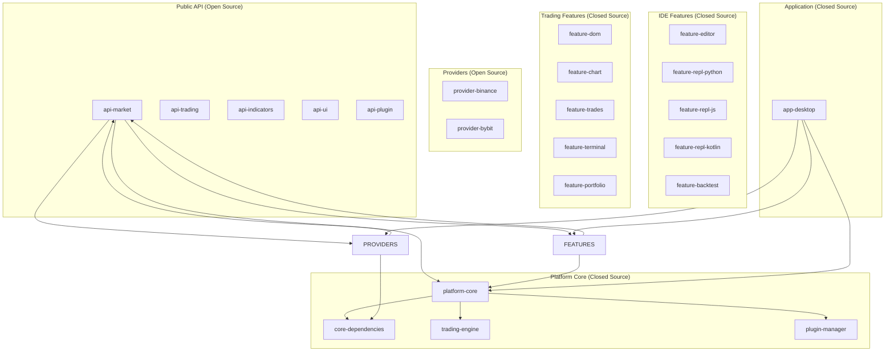
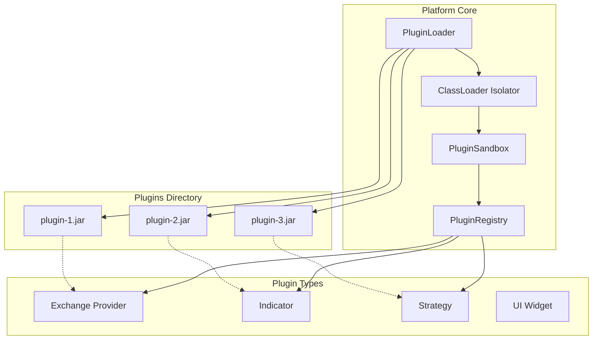

# Техническое Задание: Nous Platform v1.0
## Профессиональная платформа для криптотрейдинга с интегрированной средой разработки

**Статус документа:** Утверждено
**Версия:** 2.0 (с учетом обсужденных фич)
**Дата:** Март 2026

---

## Оглавление
1. [Введение и видение продукта](#1)
2. [Бизнес-требования и целевая аудитория](#2)
3. [Ключевые фичи, выходящие за рамки стандартных терминалов](#3)
4. [Этапы развития (Roadmap)](#4)
5. [Архитектура платформы](#5)
6. [Функциональные требования](#6)
7. [Нефункциональные требования](#7)
8. [Технический стек](#8)
9. [Модульная структура проекта](#9)
10. [Плагинная система и экосистема](#10)
11. [Требования к безопасности](#11)
12. [Требования к интерфейсу](#12)
13. [Требования к данным и хранилищам](#13)
14. [Интеграция с внешними системами](#14)
15. [Монетизация и бизнес-модель](#15)
16. [План разработки и оценка](#16)
17. [Риски и пути их минимизации](#17)

---

## 1. Введение и видение продукта <a name="1"></a>

### 1.1. Миссия
Создать **профессиональную интегрированную среду разработки (IDE) для трейдинга**, объединяющую мощь анализа Order Flow с возможностями полноценной разработки торговых алгоритмов. Nous Platform — это не просто терминал, а **рабочее место трейдера-программиста**, где анализ рынка и создание стратегий происходят в едином пространстве.

### 1.2. Видение
Nous Platform — это экосистема, построенная вокруг **трёх китов**:

1. **Аналитическое ядро** — профессиональные инструменты для анализа Order Flow: стакан (DOM), лента сделок (Time & Sales), Volume Profile, кластерные графики, дельта-бары.
2. **Среда разработки (IDE)** — встроенный редактор кода, REPL-консоли для Python, JavaScript и Kotlin, DSL для индикаторов и стратегий.
3. **Плагинная экосистема** — открытое API для сообщества, маркетплейс плагинов, возможность создавать и продавать свои индикаторы, стратегии и даже целые торговые роботы.

### 1.3. Ключевые отличия от конкурентов

| Конкурент | Недостатки | Наше преимущество |
|-----------|------------|-------------------|
| **ATAS / CScalp** | Не оптимизированы для крипты, закрытая архитектура, нет API для разработки | Родная поддержка криптобирж, открытое API, возможность писать свои индикаторы |
| **TradingView** | Недостаточно глубок для Order Flow, нет прямой торговли, Pine Script ограничен | Полноценный стакан, лента сделок, REPL на Python/JS/Kotlin, прямая торговля |
| **MetaTrader** | Устаревший стек, MQL4/5, сложность интеграции с криптой | Современный Kotlin, REPL, мультиязычность, крипто-ориентированность |
| **Jupyter + Binance API** | Нет готового UI, нужно всё собирать самому | Готовый интерфейс с графиками, стаканом, интеграция "из коробки" |

---

## 2. Бизнес-требования и целевая аудитория <a name="2"></a>

### 2.1. Целевая аудитория

#### Сегмент A: Профессиональные криптотрейдеры
- **Характеристики:** Торгуют на споте и фьючерсах, используют Volume Profile, Cluster Charts, DOM, Delta
- **Потребности:** Высокая производительность, стабильность, прямой доступ к рынку, кастомизация интерфейса
- **Боли:** ATAS не оптимизирован для крипты, TradingView недостаточно глубок для Order Flow анализа

#### Сегмент B: Алготрейдеры и разработчики
- **Характеристики:** Пишут на Kotlin, Python, JS; создают и тестируют стратегии
- **Потребности:** Понятный API, возможность быстрой проверки гипотез, бэктестинг
- **Боли:** Нет единой среды, где можно одновременно смотреть график и писать код

#### Сегмент C: Технические аналитики
- **Характеристики:** Глубоко анализируют рынок, создают сложные индикаторы
- **Потребности:** Доступ к сырым данным (стакан, лента), возможность быстро прототипировать индикаторы
- **Боли:** Jupyter неудобен для real-time, готовые терминалы не дают сырых данных

### 2.2. Ключевые пользовательские сценарии

1. **Сценарий аналитика:** Открыл стакан, ленту, график → настроил отображение → анализирует рыночную микроструктуру
2. **Сценарий разработчика:** Открыл редактор → написал индикатор на Python → проверил в REPL → добавил на график
3. **Сценарий алготрейдера:** Написал стратегию на Kotlin → запустил бэктест → увидел результаты на графике → запустил в paper trading
4. **Сценарий исследователя:** Открыл REPL → запросил исторические данные → построил модель → визуализировал на графике

### 2.3. Бизнес-цели
- **Краткосрочные (2026):** Запуск MVP с поддержкой Binance и Bybit, привлечение первых 1000 активных пользователей
- **Среднесрочные (2027):** Создание экосистемы плагинов, запуск маркетплейса, выход на самоокупаемость
- **Долгосрочные (2028+):** Стать стандартом для крипто-алготрейдинга, поддержка всех основных бирж через плагины сообщества

---

## 3. Ключевые фичи, выходящие за рамки стандартных терминалов <a name="3"></a>

### 3.1. Интегрированная среда разработки (IDE)

#### 3.1.1. Редактор кода с подсветкой синтаксиса
- На базе **Monaco Editor** (ядро VS Code)
- Поддержка Kotlin, Python, JavaScript
- Автодополнение, навигация, рефакторинг
- Подсветка ошибок в реальном времени

#### 3.1.2. REPL-консоли для трёх языков
- **Python REPL** на базе Jupyter Kernel (xeus-python)
- **JavaScript REPL** на базе Node.js + VM2
- **Kotlin REPL** на базе Kotlin Scripting
- Общий интерфейс, история команд, экспорт
- Доступ к текущим рыночным данным прямо из консоли

#### 3.1.3. DSL для индикаторов и стратегий
```kotlin
indicator("Volume Profile") {
    val period = parameter("period", 14)
    val levels = parameter("levels", 12)
    
    calculate {
        val poc = findPointOfControl(period)
        val valueArea = findValueArea(levels)
        plot("POC", poc)
        plot("VA High", valueArea.high)
        plot("VA Low", valueArea.low)
    }
}
```

### 3.2. Профессиональный Order Flow анализ

#### 3.2.1. Кластерные графики (Cluster Charts)
- Отображение объёмов в каждой свече по ценовым уровням
- Цветовое кодирование дельты
- Настраиваемая глубина кластеризации

#### 3.2.2. Дельта-бары (Delta Bars)
- Бары, построенные на основе дельты, а не времени
- Возможность задать целевое значение дельты

#### 3.2.3. Объёмный профиль (Volume Profile)
- Горизонтальные объёмы за период
- Точка контроля (POC)
- Зона справедливой стоимости (Value Area)
- Возможность наложения нескольких профилей

### 3.3. Плагинная система как основа экосистемы

#### 3.3.1. Типы плагинов
- **Биржевые провайдеры** — добавляют поддержку новых бирж
- **Индикаторы** — кастомные индикаторы для графиков
- **Стратегии** — торговые стратегии для бэктестинга и live trading
- **UI-виджеты** — кастомные окна и панели
- **Торговые роботы** — полностью автоматизированные системы

#### 3.3.2. Пример плагина-индикатора
```kotlin
class SuperTrend : Indicator {
    override val name = "SuperTrend"
    override val parameters = listOf(
        Parameter.int("period", 10, 5, 50),
        Parameter.float("multiplier", 3.0f, 1.0f, 5.0f)
    )
    
    override fun calculate(context: IndicatorContext): IndicatorResult {
        val atr = calculateATR(context.candles, context.period)
        // ... расчёт SuperTrend
        return IndicatorResult.line(values, color = when {
            isUptrend -> Color.GREEN
            else -> Color.RED
        })
    }
}
```

### 3.4. Бэктестинг с визуализацией

#### 3.4.1. Загрузка исторических данных
- Автоматическая загрузка с бирж
- Локальное кэширование в SQLDelight
- Поддержка любых таймфреймов

#### 3.4.2. Запуск стратегий на истории
- Настраиваемые комиссии и проскальзывание
- Детальный отчёт: все сделки, кривая капитала, просадки
- Визуализация сделок прямо на графике

#### 3.4.3. Оптимизация параметров
- Grid search по заданным диапазонам
- Визуализация поверхности результатов
- Автоматический выбор лучших параметров

### 3.5. Торговый дневник нового поколения

#### 3.5.1. Автоматический импорт сделок
- Все сделки автоматически сохраняются
- Привязка к скриншотам графиков
- Добавление заметок и тегов

#### 3.5.2. Расширенная статистика
- Винрейт, профит-фактор, Sharpe ratio
- Распределение по времени, дням недели
- Анализ эффективности стратегий

#### 3.5.3. Экспорт отчётов
- PDF с графиками
- CSV для анализа в Excel
- JSON для внешних систем

---

## 4. Этапы развития (Roadmap) <a name="4"></a>

### 4.1. Этап 0: Фундамент (Q1-Q2 2026) — **ТЕКУЩИЙ**
- Настройка модульной архитектуры согласно утверждённой структуре
- Создание `public-api` модулей с базовыми интерфейсами и моделями
- Реализация `platform-core` с бизнес-логикой
- Разработка первых feature-модулей (`feature-dom`, `feature-chart`, `feature-trades`)
- Миграция существующего кода в новые модули

### 4.2. Этап 1: MVP — Чтение данных и базовый UI (Q2-Q3 2026)
- **Цель:** Рабочее приложение для анализа рынка в реальном времени
- **Функционал:**
    - Подключение к Binance и Bybit (WebSocket + REST)
    - Отображение стакана (DOM) с визуализацией объёмов
    - Отображение ленты сделок (Time & Sales)
    - Отображение свечного графика с базовыми индикаторами (SMA, EMA, VWAP)
    - Перетаскиваемые и изменяемые в размере окна
    - Сохранение настроек интерфейса

### 4.3. Этап 2: IDE и плагинная система (Q4 2026 - Q1 2027)
- **Цель:** Создание среды разработки и экосистемы для разработчиков
- **Функционал:**
    - Интеграция Monaco Editor с подсветкой Kotlin/Python/JS
    - Python REPL (Jupyter kernel)
    - JavaScript REPL (Node.js + VM2)
    - Kotlin REPL (Kotlin Scripting)
    - Загрузка внешних плагинов
    - SDK и документация для разработчиков
    - Примеры плагинов (индикаторы, стратегии)

### 4.4. Этап 3: DSL и бэктестинг (Q2-Q4 2027)
- **Цель:** Полноценная платформа для разработки и тестирования стратегий
- **Функционал:**
    - Предметно-ориентированный язык (DSL) для индикаторов и стратегий
    - Встроенный редактор с подсветкой синтаксиса
    - Бэктестинг на исторических данных
    - Визуализация сделок на графике
    - Торговый дневник с автоматическим импортом сделок

### 4.5. Этап 4: Live Trading и экосистема (2028+)
- **Цель:** Полноценная торговая платформа с маркетплейсом
- **Функционал:**
    - Live Trading с реальными ордерами
    - Управление рисками (стоп-лосс, тейк-профит)
    - Маркетплейс плагинов с системой рейтингов
    - Монетизация (комиссия с продаж плагинов)
    - Поддержка новых бирж через плагины сообщества

---

## 5. Архитектура платформы <a name="5"></a>

### 5.1. Общая архитектура



### 5.2. Ключевые архитектурные решения

#### 5.2.1. Модульность как основа
- Каждая фича — отдельный Gradle-модуль
- Чёткое разделение на публичные API и закрытые реализации
- Возможность замены любой фичи без изменения ядра

#### 5.2.2. Единый источник правды для моделей
Все модели данных живут **только в `public-api` модулях**. Это обеспечивает:
- Консистентность данных во всей платформе
- Возможность использования одних и тех же моделей в плагинах
- Отсутствие дублирования и маппинга

#### 5.2.3. Инверсия зависимостей
- Feature-модули зависят только от `public-api` и `platform-core`
- Providers реализуют интерфейсы из `public-api`
- App модуль собирает всё вместе через DI

#### 5.2.4. Мультиплатформенность с фокусом на десктоп
- `commonMain` — бизнес-логика, модели, интерфейсы
- `jvmMain` — платформозависимый код (сеть, файловая система)
- iOS и Android — в будущем, только для просмотра данных

---

## 6. Функциональные требования <a name="6"></a>

### 6.1. Модуль подключения к данным (Data Providers)

#### 6.1.1. Базовые требования
- Поддержка публичных WebSocket и REST API
- Автоматическое переподключение при обрывах связи
- Обработка rate limits бирж
- Кэширование данных для снижения нагрузки

#### 6.1.2. Поддерживаемые биржи (MVP)
- **Binance** (Spot & Futures)
    - WebSocket: стакан, сделки, свечи
    - REST: исторические свечи, информация об инструментах
- **Bybit** (Spot & Futures)
    - Аналогичный функционал

#### 6.1.3. API провайдеров (интерфейсы в `public-api`)
```kotlin
interface MarketDataProvider {
    fun getSymbols(): Flow<List<Symbol>>
    fun getCandles(symbol: String, interval: Interval, limit: Int): Flow<List<Candle>>
    fun getOrderBook(symbol: String, limit: Int): Flow<OrderBook>
    fun getTrades(symbol: String): Flow<List<Trade>>
    fun getBestPrices(symbol: String): Flow<BestPrices>
}
```

### 6.2. Модуль редактора кода (`feature-editor`)

#### 6.2.1. Техническая реализация
- Встраивание Monaco Editor через WebView
- Двусторонняя коммуникация через JavaScript Bridge
- Сохранение файлов в локальной файловой системе

#### 6.2.2. Функциональность
- Подсветка синтаксиса для Kotlin, Python, JavaScript
- Автодополнение для встроенных API
- Навигация по коду (переход к определению)
- Подсветка ошибок
- Несколько вкладок
- Сохранение/загрузка файлов
- Настраиваемая тема (светлая/тёмная)

#### 6.2.3. Интеграция с платформой
- Доступ к текущим рыночным данным через глобальные переменные
- Возможность запуска кода в REPL прямо из редактора
- Шаблоны для индикаторов и стратегий

### 6.3. Модуль REPL-консолей (`feature-repl-*`)

#### 6.3.1. Общие требования
- Единый интерфейс для всех трёх языков
- История команд (с сохранением между сессиями)
- Подсветка синтаксиса
- Автодополнение
- Таймаут выполнения (защита от бесконечных циклов)
- Изоляция выполнения (песочница)

#### 6.3.2. Python REPL
- Базовый интерпретатор на основе Jupyter Kernel (xeus-python)
- Поддержка matplotlib для вывода графиков
- Доступ к рыночным данным через встроенные переменные

#### 6.3.3. JavaScript REPL
- Node.js с изоляцией через VM2
- Поддержка асинхронного кода
- Доступ к тем же данным

#### 6.3.4. Kotlin REPL
- Kotlin Scripting с ограничением reflection и доступа к файловой системе
- Поддержка корутин
- Доступ к встроенным API

### 6.4. Модуль отображения (UI Features)

#### 6.4.1. Модульное окно "График" (`feature-chart`)
- Отображение свечного графика с поддержкой таймфреймов: 1m, 5m, 15m, 30m, 1h, 4h, 1d, 1w
- Масштабирование и панорамирование
- Отображение дельта-баров
- Базовые индикаторы (SMA, EMA, VWAP, Volume Profile)
- Кроссхаир с информацией о свече
- Рисование трендовых линий и уровней

#### 6.4.2. Модульное окно "Стакан" (DOM) (`feature-dom`)
- Отображение бидов и асков с динамическим обновлением
- Визуализация объёмов (горизонтальные бары)
- Настройка глубины стакана (10-50 уровней)
- Выделение лучших цен
- Отображение спреда

#### 6.4.3. Модульное окно "Order Flow" (`feature-trades`)
- Таблица потока сделок в реальном времени
- Цветовое кодирование: покупки (зелёный), продажи (красный)
- Выделение крупных сделок
- Агрегация сделок по секундам/минутам

### 6.5. Модуль бэктестинга (`feature-backtest`)

#### 6.5.1. Загрузка данных
- Автоматическая загрузка исторических свечей с биржи
- Локальное кэширование в SQLDelight
- Поддержка любых таймфреймов

#### 6.5.2. Запуск стратегий
- Загрузка стратегии из файла
- Настройка комиссий и проскальзывания
- Прогресс выполнения
- Детальный отчёт

#### 6.5.3. Визуализация результатов
- Отображение сделок на графике
- Кривая капитала
- Таблица всех сделок
- Статистика (винрейт, профит-фактор, просадка)

---

## 7. Нефункциональные требования <a name="7"></a>

### 7.1. Производительность
- **Задержка от события на бирже до UI:** < 100 мс (в идеале < 50 мс)
- **FPS графика:** 60 FPS при нормальной нагрузке
- **Обновление стакана:** каждое обновление должно отображаться не более чем за 16 мс
- **Память:** не более 512 MB RAM при стандартной нагрузке
- **Запуск приложения:** не более 5 секунд
- **Запуск REPL:** не более 2 секунд до готовности

### 7.2. Надёжность
- **Uptime:** 99.9% (исключая проблемы бирж и интернет-соединения)
- **WebSocket соединения:** автоматическое переподключение с экспоненциальной задержкой
- **Обработка ошибок:** все ошибки должны логироваться и не приводить к падению приложения
- **Graceful degradation:** при отказе одного компонента остальные должны продолжать работу

### 7.3. Безопасность
- **Плагины:** изоляция в песочнице, проверка цифровых подписей
- **API-ключи:** хранятся только локально в зашифрованном виде (AES-256)
- **Сеть:** все соединения только по HTTPS/WSS с certificate pinning
- **REPL:** таймауты выполнения, запрет на доступ к файловой системе вне песочницы

### 7.4. Масштабируемость
- **Горизонтальная:** возможность добавления новых провайдеров без изменения ядра
- **Вертикальная:** возможность добавления новых фич через плагины
- **Нагрузка:** поддержка до 100 одновременно открытых окон с данными

---

## 8. Технический стек <a name="8"></a>

### 8.1. Клиентская часть

| Компонент | Технология | Обоснование |
|-----------|------------|-------------|
| **Язык** | Kotlin Multiplatform | Единый код для всех платформ, безопасность, корутины |
| **UI** | JetBrains Compose Desktop | Современный реактивный UI, единый код |
| **Архитектура** | Clean Architecture + MVI | Чёткое разделение ответственности |
| **DI** | Koin Annotations | Простота и производительность |
| **Асинхронность** | Kotlin Coroutines + Flow | Встроенная поддержка |
| **Сеть** | Ktor Client | Мультиплатформенность, простота |
| **WebSocket** | Ktor Client WebSockets | Единый API с HTTP |
| **Сериализация** | kotlinx.serialization | Мультиплатформенность, типобезопасность |
| **Локальное хранение** | SQLDelight | Типобезопасные SQL-запросы |
| **Редактор кода** | Monaco Editor (через WebView) | Ядро VS Code, мощнейший редактор |
| **Python REPL** | Jupyter Kernel (xeus-python) | Стандарт, проверенное решение |
| **JavaScript REPL** | Node.js + VM2 | Изоляция, производительность |
| **Kotlin REPL** | Kotlin Scripting | Официальный API |

### 8.2. Лицензирование (всё совместимо с закрытым ядром)

| Компонент | Лицензия | Условия |
|-----------|----------|---------|
| Kotlin | Apache 2.0 | Можно закрывать |
| Compose Desktop | Apache 2.0 | Можно закрывать |
| Monaco Editor | MIT | Можно закрывать |
| Jupyter Kernels | BSD-3 | Можно закрывать |
| VM2 | MIT | Можно закрывать |
| Kotlin Scripting | Apache 2.0 | Можно закрывать |

---

## 9. Модульная структура проекта <a name="9"></a>

### 9.1. Полная структура

```
Nous-Platform/
├── gradle/
│   └── libs.versions.toml
│
├── build-logic/
│   ├── build.gradle.kts
│   └── src/main/kotlin/conventions/
│       ├── KmpLibraryConvention.kt
│       ├── KmpFeatureConvention.kt
│       └── KmpApplicationConvention.kt
│
├── public-api/
│   ├── api-market/
│   ├── api-trading/
│   ├── api-indicators/
│   ├── api-ui/
│   └── api-plugin/
│
├── platform-core/
│   ├── build.gradle.kts
│   └── src/
│       ├── commonMain/kotlin/com/aandios/nous/core/
│       │   ├── domain/
│       │   ├── network/
│       │   ├── plugin/
│       │   └── di/
│       └── jvmMain/
│
├── features/
│   ├── feature-terminal/
│   ├── feature-dom/
│   ├── feature-chart/
│   ├── feature-trades/
│   ├── feature-portfolio/
│   ├── feature-editor/
│   ├── feature-repl-python/
│   ├── feature-repl-js/
│   ├── feature-repl-kotlin/
│   └── feature-backtest/
│
├── providers/
│   ├── provider-binance/
│   ├── provider-bybit/
│   └── provider-template/
│
├── app-desktop/
│   ├── build.gradle.kts
│   └── src/jvmMain/
│       ├── Main.kt
│       ├── di/
│       └── theme/
│
├── plugins/                    # Папка для JAR-плагинов (runtime)
│
├── docs/
│   ├── api/
│   ├── architecture/
│   └── decisions/
│
├── build.gradle.kts
├── settings.gradle.kts
└── gradle.properties
```

### 9.2. Convention plugins

```kotlin
// KmpLibraryConvention.kt
class KmpLibraryConvention : Plugin<Project> {
    override fun apply(target: Project) {
        with(target) {
            plugins.apply("org.jetbrains.kotlin.multiplatform")
            kotlin {
                jvm()
                sourceSets {
                    commonMain.dependencies {
                        implementation(libs.findLibrary("kotlinx-coroutines-core").get())
                    }
                }
            }
        }
    }
}

// KmpFeatureConvention.kt
class KmpFeatureConvention : Plugin<Project> {
    override fun apply(target: Project) {
        with(target) {
            plugins.apply("com.aandios.nous.library")
            dependencies {
                "commonMainImplementation"(project(":public-api:api-market"))
                "commonMainImplementation"(project(":platform-core"))
            }
        }
    }
}
```

---

## 10. Плагинная система и экосистема <a name="10"></a>

### 10.1. Архитектура плагинной системы



### 10.2. Процесс загрузки плагина
1. Сканирование папки `/plugins` при запуске
2. Проверка цифровой подписи (если требуется)
3. Создание изолированного ClassLoader'а
4. Загрузка классов плагина
5. Поиск классов, реализующих интерфейсы из `public-api`
6. Регистрация плагина в реестре
7. Инициализация плагина в песочнице

### 10.3. SDK для разработчиков

#### 10.3.1. Документация
- Полное описание всех API в `public-api`
- Примеры для каждого типа плагинов
- Гайд по публикации в маркетплейсе

#### 10.3.2. Инструменты
- Шаблон проекта для нового плагина
- Локальный тестовый раннер
- Инструмент для подписи JAR

#### 10.3.3. Пример индикатора (готовый к публикации)
```kotlin
// build.gradle.kts
plugins {
    id("com.aandios.nous.plugin")
}

nousPlugin {
    name = "SuperTrend"
    version = "1.0.0"
    type = PluginType.INDICATOR
}

// src/main/kotlin/SuperTrend.kt
class SuperTrendPlugin : NousPlugin {
    override val id = "com.example.supertrend"
    override val name = "SuperTrend"
    override val version = "1.0.0"
    
    override fun create(): List<Any> = listOf(SuperTrendIndicator())
}

class SuperTrendIndicator : Indicator {
    override val name = "SuperTrend"
    override val parameters = listOf(
        IntParameter("period", 10),
        FloatParameter("multiplier", 3.0f)
    )
    
    override fun calculate(context: IndicatorContext): IndicatorResult {
        // реализация
    }
}
```

---

## 11. Требования к безопасности <a name="11"></a>

### 11.1. Безопасность на уровне приложения
- **Шифрование данных:** Все локальные данные (API-ключи, настройки) шифруются AES-256
- **Минимальные привилегии:** Приложение не запрашивает прав, выходящих за рамки необходимости
- **Обновления:** Автоматическая проверка обновлений с верификацией подписей

### 11.2. Безопасность сети
- **TLS:** Все соединения только по HTTPS/WSS
- **Certificate pinning:** Для соединений с биржами
- **Проверка сертификатов:** Отсутствие самоподписанных сертификатов в production

### 11.3. Безопасность API-ключей
- **Хранение:** Ключи хранятся в системном хранилище ключей (Keychain на macOS, Credential Manager на Windows)
- **Использование:** Ключи никогда не передаются на серверы Nous Platform
- **Управление:** Возможность добавить/удалить/отозвать ключи

### 11.4. Безопасность REPL
| Язык | Механизм защиты |
|------|-----------------|
| **Python** | Изолированный процесс, ограничение времени выполнения, запрет на file I/O |
| **JavaScript** | VM2 с ограниченными правами, запрет на require |
| **Kotlin** | Kotlin Scripting с ограничением reflection и доступа к файловой системе |

**Запрещённые операции во всех REPL:**
- Чтение/запись файлов вне рабочей директории
- Выполнение системных команд
- Создание сетевых соединений (кроме API терминала)
- Бесконечные циклы (таймаут 5 секунд)

---

## 12. Требования к интерфейсу <a name="12"></a>

### 12.1. Общие принципы
- **Тёмная тема:** По умолчанию (как у всех профессиональных терминалов)
- **Светлая тема:** Опционально
- **Кастомизация:** Пользователь может настроить цвета, шрифты, раскладку
- **Профили:** Сохранение и загрузка нескольких профилей настроек

### 12.2. Главное окно в режиме анализа

```
┌─────────────────────────────────────────────────────────────────────┐
│ [Binance▼] [BTCUSDT▼] [1h▼] [🔍] [📊] [📈] [⚙️] [🧩]                │
├─────────────────────────────────────────────────────────────────────┤
│                                                                     │
│  ┌─────────────────────┐  ┌─────────────────────┐                  │
│  │      ГРАФИК         │  │       СТАКАН        │                  │
│  │   с индикаторами    │  │   Bid     Ask       │                  │
│  │                     │  │   45000   45001     │                  │
│  │                     │  │   44999   45002     │                  │
│  │                     │  │   44998   45003     │                  │
│  └─────────────────────┘  └─────────────────────┘                  │
│                                                                     │
│  ┌───────────────────────────────────────────────────────────────┐ │
│  │                      ЛЕНТА СДЕЛОК                              │ │
│  │  12:00:03  45001  0.12  🔴                                     │ │
│  │  12:00:02  45000  1.50  🟢                                     │ │
│  │  12:00:01  44999  0.08  🔴                                     │ │
│  └───────────────────────────────────────────────────────────────┘ │
│                                                                     │
│  Connected | Binance | 45ms                               v1.0.0   │
└─────────────────────────────────────────────────────────────────────┘
```

### 12.3. Главное окно в режиме разработки

```
┌─────────────────────────────────────────────────────────────────────┐
│ [Binance▼] [BTCUSDT▼] [1h▼] [🔍] [📊] [📈] [⚙️] [🧩]                │
├─────────────────────────────────────────────────────────────────────┤
│                                                                     │
│  ┌─────────────────────┐  ┌─────────────────────────────────────┐  │
│  │      ГРАФИК         │  │          РЕДАКТОР КОДА              │  │
│  │   с индикаторами    │  │  strategy("MA Crossover") {         │  │
│  │                     │  │      val fast = sma(close, 9)       │  │
│  │                     │  │      val slow = sma(close, 21)      │  │
│  │                     │  │      entry("Long") {                │  │
│  │                     │  │          crossover(fast, slow)      │  │
│  └─────────────────────┘  │      }                               │  │
│                           └─────────────────────────────────────┘  │
│  ┌───────────────────────────────────────────────────────────────┐ │
│  │                            REPL                                │ │
│  │  >>> sma(close, 9).last()                                     │ │
│  │  45234.56                                                     │ │
│  │  >>>                                                          │ │
│  └───────────────────────────────────────────────────────────────┘ │
│                                                                     │
│  Connected | Binance | 45ms                               v1.0.0   │
└─────────────────────────────────────────────────────────────────────┘
```

### 12.4. Цветовая схема

```kotlin
// Тёмная тема
object DarkTheme {
    val primary = Color(0xFFFF6B6B)     // Коралловый для акцентов
    val bid = Color(0xFF4CAF50)         // Зелёный для бидов
    val ask = Color(0xFFF44336)         // Красный для асков
    val deltaPositive = Color(0xFF4CAF50)
    val deltaNegative = Color(0xFFF44336)
    val background = Color(0xFF1E1E1E)  // Тёмно-серый фон
    val surface = Color(0xFF2D2D2D)     // Поверхности
    val onSurface = Color(0xFFE0E0E0)   // Текст
    val gridLines = Color(0xFF3D3D3D)   // Линии сетки
}

// Моноширинный шрифт
val editorFont = FontFamily("JetBrains Mono", "Fira Code", "Consolas")
val monospace = FontFamily.Monospace
```

---

## 13. Требования к данным и хранилищам <a name="13"></a>

### 13.1. Локальное хранилище

#### 13.1.1. Настройки
- **Формат:** JSON
- **Место:** `~/.nous/settings.json`
- **Содержит:** Настройки интерфейса, список избранных инструментов, горячие клавиши

#### 13.1.2. История сделок (дневник)
- **Технология:** SQLDelight (SQLite)
- **Таблицы:**
    - `trades` — все сделки
    - `notes` — заметки к сделкам
    - `tags` — теги для категоризации
    - `screenshots` — скриншоты графиков

#### 13.1.3. Кэш исторических данных
- **Технология:** SQLDelight с индексацией по времени
- **Хранение:** Минутные бары за последние 30 дней для всех избранных инструментов

### 13.2. Структура БД для истории

```sql
-- Сделки
CREATE TABLE trades (
    id TEXT PRIMARY KEY,
    symbol TEXT NOT NULL,
    side TEXT NOT NULL,
    quantity REAL NOT NULL,
    price REAL NOT NULL,
    timestamp INTEGER NOT NULL,
    fee REAL,
    fee_asset TEXT,
    pnl REAL,
    strategy TEXT,
    note_id TEXT
);

-- Заметки
CREATE TABLE notes (
    id TEXT PRIMARY KEY,
    content TEXT NOT NULL,
    created_at INTEGER NOT NULL,
    updated_at INTEGER NOT NULL
);

-- Теги
CREATE TABLE tags (
    id TEXT PRIMARY KEY,
    name TEXT NOT NULL UNIQUE,
    color TEXT
);

-- Связь сделок с тегами
CREATE TABLE trade_tags (
    trade_id TEXT NOT NULL,
    tag_id TEXT NOT NULL,
    FOREIGN KEY(trade_id) REFERENCES trades(id),
    FOREIGN KEY(tag_id) REFERENCES tags(id)
);

-- Кэш свечей
CREATE TABLE candles (
    symbol TEXT NOT NULL,
    interval TEXT NOT NULL,
    timestamp INTEGER NOT NULL,
    open REAL NOT NULL,
    high REAL NOT NULL,
    low REAL NOT NULL,
    close REAL NOT NULL,
    volume REAL NOT NULL,
    PRIMARY KEY (symbol, interval, timestamp)
);
```

---

## 14. Интеграция с внешними системами <a name="14"></a>

### 14.1. Биржи (MVP)
- **Binance** (Spot & Futures) — WebSocket + REST
- **Bybit** (Spot & Futures) — WebSocket + REST

### 14.2. Биржи (планируемые через плагины)
- OKX
- Kraken
- Coinbase
- KuCoin
- Bitget
- HTX (Huobi)

### 14.3. Экспорт данных
- **CSV** — сделки, свечи, индикаторы
- **JSON** — для внешних API
- **PNG/JPEG** — скриншоты графиков
- **PDF** — отчёты и статистика

### 14.4. Импорт данных
- **CSV** — исторические данные из других платформ
- **JSON** — настройки, профили, стратегии

---

## 15. Монетизация и бизнес-модель <a name="15"></a>

### 15.1. Бесплатная модель (Freemium)
- **Бесплатно:**
    - Чтение данных с Binance и Bybit
    - Базовые графики и индикаторы (SMA, EMA, VWAP)
    - Стакан (до 10 уровней)
    - Лента сделок
    - Python REPL (ограниченное время выполнения)

- **Платно (подписка "Pro"):**
    - Расширенный Volume Profile
    - Кластерные графики
    - Бэктестинг
    - Kotlin и JavaScript REPL
    - Плагинная система
    - Приоритетная поддержка

### 15.2. Маркетплейс плагинов
- **Для разработчиков:**
    - Публикация платных плагинов
    - Комиссия платформы 30%
    - Возможность бесплатных плагинов

- **Для пользователей:**
    - Покупка плагинов напрямую у разработчиков
    - Рейтинги и отзывы
    - Бесплатный пробный период

### 15.3. Корпоративные лицензии
- **Для фондов и проп-фирм:**
    - White-label решения
    - Выделенные серверы для агрегации данных
    - API для интеграции с внутренними системами
    - Приоритетная поддержка 24/7

### 15.4. Модель ценообразования
- **Pro подписка:** $29.99/месяц или $299/год
- **Комиссия с плагинов:** 30%
- **Корпоративная лицензия:** от $5000/год

---

## 16. План разработки и оценка <a name="16"></a>

### 16.1. Команда (идеальная)
- **1 Lead Developer / Architect**
- **2 Backend/Kotlin Developers**
- **1 Frontend/Compose Developer**
- **1 DevOps (частичная занятость)**
- **1 QA Engineer**

### 16.2. Оценка по этапам (человеко-часы)

| Этап | Задачи | ЧЧ |
|------|--------|-----|
| **Этап 0** | Настройка архитектуры, convention plugins, базовые модули | 200 |
| **Этап 1** | Data providers, UI фичи, стабильная работа | 600 |
| **Этап 2** | Редактор, REPL, плагинная система | 500 |
| **Этап 3** | DSL, бэктестинг, дневник | 400 |
| **Этап 4** | Live Trading, маркетплейс, масштабирование | 300 |
| **ИТОГО** | | **2000** |

### 16.3. Детальный план Этапа 2 (IDE и плагины)

| Неделя | Задачи |
|--------|--------|
| 1 | Интеграция Monaco Editor, настройка WebView |
| 2 | Создание `feature-editor`, сохранение файлов |
| 3 | Python REPL (Jupyter kernel) |
| 4 | JavaScript REPL (Node.js + VM2) |
| 5 | Kotlin REPL (Kotlin Scripting) |
| 6 | Плагинная система: загрузка JAR |
| 7 | Плагинная система: песочница и безопасность |
| 8 | SDK и документация, примеры плагинов |

---

## 17. Риски и пути их минимизации <a name="17"></a>

### 17.1. Технические риски

| Риск | Вероятность | Влияние | Митигация |
|------|-------------|---------|-----------|
| Производительность графика в Compose | Высокая | Высокое | Прототипирование, бенчмарки, fallback на легковесную библиотеку |
| Сложность интеграции Jupyter | Средняя | Среднее | Использование готовых решений (xeus-python) |
| Проблемы с WebSocket | Средняя | Среднее | Автоматические reconnect, мониторинг |
| Утечки памяти в REPL | Средняя | Высокое | Изоляция процессов, таймауты, тесты |

### 17.2. Бизнес-риски

| Риск | Вероятность | Влияние | Митигация |
|------|-------------|---------|-----------|
| Низкий спрос | Средняя | Высокое | Раннее MVP с обратной связью, фокус на нише |
| Конкуренция | Высокая | Среднее | Фокус на уникальных возможностях (IDE + плагины) |
| Изменения в API бирж | Средняя | Среднее | Абстракция провайдеров, быстрое реагирование |
| Регуляторные риски | Низкая | Высокое | Фокус на non-custodial решения |

---

## 18. Заключение

Nous Platform — это не просто очередной терминал. Это **профессиональная рабочая среда для трейдера-разработчика**, где анализ рынка и создание алгоритмов происходят в едином пространстве.

Ключевые преимущества, заложенные в архитектуре:
- **Модульность** — каждый компонент можно разрабатывать и тестировать независимо
- **Открытость** — сообщество может расширять функционал через плагины
- **Производительность** — современный стек обеспечивает высокую скорость работы
- **Гибкость** — REPL на трёх языках позволяет быстро проверять гипотезы
- **Масштабируемость** — архитектура готова к росту функционала

Данное Техническое Задание будет служить основным документом для разработки и должно регулярно обновляться по мере принятия новых архитектурных решений.

---

**Nous Platform — создан для тех, кто не просто смотрит на графики, а строит своё будущее.**

© 2026 Aandios Labs