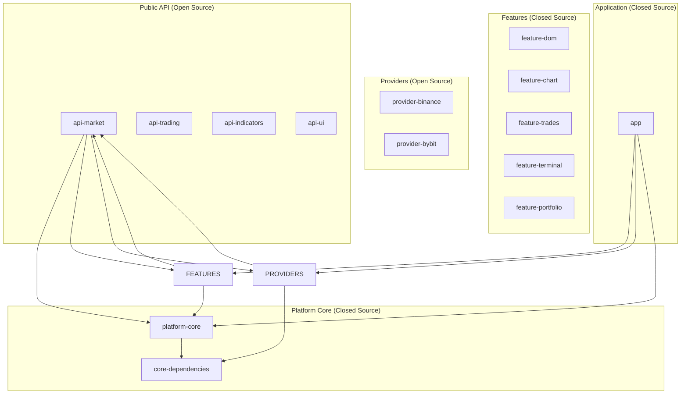

# Nous Platform v1.0 — Полная техническая спецификация (актуализированная)

**Статус документа:** Актуально (актуализировано под соло-разработку)  
**Версия:** 1.1 (полная)  
**Дата:** Апрель 2026  

---

## Оглавление

1. [Введение и видение продукта](#1)  
2. [Бизнес-требования и целевая аудитория](#2)  
3. [Этапы развития (Roadmap) — ОБНОВЛЕНО](#3)  
4. [Архитектура платформы](#4)  
5. [Функциональные требования](#5)  
6. [Нефункциональные требования](#6)  
7. [Технический стек](#7)  
8. [Модульная структура проекта](#8)  
9. [Плагинная система и экосистема — ОТЛОЖЕНО](#9)  
10. [Требования к безопасности](#10)  
11. [Требования к интерфейсу](#11)  
12. [Требования к данным и хранилищам](#12)  
13. [Интеграция с внешними системами](#13)  
14. [Монетизация и бизнес-модель](#14)  
15. [План разработки (соло, 15 дней/мес) — ОБНОВЛЕНО](#15)  
16. [Риски и пути их минимизации — РАСШИРЕНО](#16)  
17. [Заключение](#17)  

---

## 1. Введение и видение продукта <a name="1"></a>

### 1.1. Миссия
Создать современную, модульную и открытую платформу для профессионального криптотрейдинга, которая объединит лучшие практики ATAS, CScalp и MetaTrader, но с фокусом на крипторынки, предоставляя беспрецедентные возможности для кастомизации и алгоритмической торговли.

### 1.2. Видение
Nous Platform — это не просто терминал, а экосистема, состоящая из:
- **Мощного десктопного приложения** для анализа Order Flow, Volume Profile и кластерных графиков
- **Открытого API** для создания плагинов сообществом (после инвестиций)
- **Предметно-ориентированного языка (DSL)** для написания индикаторов и стратегий (после инвестиций)
- **Маркетплейса** для распространения платных и бесплатных плагинов (после инвестиций)

### 1.3. Ключевые отличия от конкурентов
1. **Live Trading с первого дня** — пользователи могут торговать сразу, а не только анализировать
2. **Фокус на крипту** — оптимизация под Binance/Bybit, индикатор ликвидаций, дельта-профиль
3. **Современный технологический стек** — Kotlin Multiplatform + Compose Desktop
4. **Кроссплатформенность** — один код для Windows, macOS и Linux
5. **Соло-френдли** — проект построен так, что один разработчик может дойти до первых 1000 пользователей

---

## 2. Бизнес-требования и целевая аудитория <a name="2"></a>

### 2.1. Целевая аудитория

#### Сегмент A: Профессиональные криптотрейдеры
- **Характеристики:** Торгуют на споте и фьючерсах, используют Volume Profile, Cluster Charts, DOM, Delta
- **Потребности:** Высокая производительность, стабильность, прямой доступ к рынку, кастомизация интерфейса
- **Боли:** ATAS не оптимизирован для крипты, TradingView недостаточно глубок для Order Flow анализа

#### Сегмент B: Трейдеры, которым нужен Live Trading
- **Характеристики:** Хотят торговать прямо из терминала, а не переключаться между биржей и графиками
- **Потребности:** Быстрое выставление ордеров, управление позициями, риск-менеджмент
- **Боли:** CScalp ограничен, ATAS сложен в настройке

### 2.2. Бизнес-цели (обновлено)
1. **Краткосрочные (2026):** Запуск Live Trading, привлечение первых 1000 активных пользователей, 50+ платных
2. **Среднесрочные (2027):** Привлечение Pre-Seed/Seed инвестиций, расширение команды до 3-4 человек
3. **Долгосрочные (2028+):** Создание экосистемы плагинов, выход на ARR $2M+

### 2.3. Ключевые показатели успеха (KPI)
- Количество активных пользователей в день (DAU) — целевые 500 к концу 2026
- **Live Trading ордеров в день** — целевые 1000 к концу 2026
- Среднее время от получения данных с биржи до отображения в UI — менее 300 мс
- Конверсия в платную подписку — 5-10%

---

## 3. Этапы развития (Roadmap) — ОБНОВЛЕНО <a name="3"></a>

**Ключевое изменение:** Live Trading на Этапе 1. Плагины, DSL, маркетплейс — только после инвестиций.

### 3.1. Этап 0: Фундамент (Q2 2026) — ТЕКУЩИЙ
- Настройка модульной архитектуры согласно утверждённой структуре
- Создание `public-api` модулей с базовыми интерфейсами и моделями
- Реализация `platform-core` с бизнес-логикой
- Разработка первых feature-модулей (`feature-dom`, `feature-chart`, `feature-trades`)
- Миграция существующего кода из `composeApp` в новые модули

### 3.2. Этап 1: MVP с Paper Trading (Q3 2026)
**Цель:** Рабочее приложение для анализа рынка в реальном времени + симуляция торговли

**Функционал:**
- Подключение к Binance и Bybit (WebSocket + REST)
- Отображение стакана (DOM) с визуализацией объёмов
- Отображение ленты сделок (Time & Sales)
- Отображение свечного графика (таймфреймы 1m, 5m, 15m, 1h, 4h, 1d)
- Базовые индикаторы: SMA, EMA, VWAP
- **Paper trading** (симуляция торговли на тестовых данных)
- Перетаскиваемые и изменяемые в размере окна
- Сохранение настроек интерфейса

### 3.3. Этап 2: Live Trading + Профессиональный анализ (Q4 2026 - Q1 2027)
**Цель:** Полноценный торговый терминал с реальными деньгами

**Функционал:**
- **Реальная торговля на Binance/Bybit** (размещение ордеров, отмена)
- **Авторизация по API-ключам** (локальное зашифрованное хранение)
- **Модуль портфеля** (балансы, открытые позиции, активные ордера, PnL)
- **Footprint / Delta** (кластерный график с дельтой по ценам)
- **Delta Profile** (профиль объёма с разделением на покупки/продажи)
- **Индикатор ликвидаций** (оценка ликвидаций по аномальным свечам)
- Улучшенная обработка ошибок и авто-переподключение WebSocket

### 3.4. Этап 3: Первые пользователи и монетизация (Q2 2027)
**Цель:** Привлечь 1000 MAU и 50+ платных подписчиков

**Функционал:**
- **Публичный релиз** (сайт, документация, onboarding)
- **Freemium модель**:
  - Бесплатно: базовый анализ, paper trading
  - Pro ($29.9/мес или $299/год): Live Trading, Footprint, Delta Profile, ликвидации
- Сбор обратной связи, быстрые итерации
- Контент-маркетинг (YouTube, Twitter, Telegram)

### 3.5. Этап 4: Привлечение инвестиций (Pre-Seed/Seed) — Q3-Q4 2027
**Цель:** Получить $100k–$500k для расширения команды

**Что дают инвестиции:**
- Найм 2-3 разработчиков (ускорение в 3-4 раза)
- Профессиональный маркетинг
- Юридическое оформление (международное)

### 3.6. Этап 5: Экосистема (2028+) — ПОСЛЕ ИНВЕСТИЦИЙ
**Цель:** Стать платформой для разработчиков

**Функционал (отложен до найма команды):**
- Плагинная система (загрузка JAR, песочница)
- SDK и документация для разработчиков
- DSL для индикаторов и стратегий (как Pine Script)
- Редактор кода с подсветкой синтаксиса
- Бэктестинг на исторических данных
- Маркетплейс плагинов
- AI-интеграции

---

## 4. Архитектура платформы <a name="4"></a>

### 4.1. Общая архитектура



### 4.2. Слои внутри модулей

Каждый feature-модуль имеет чёткое разделение на слои:

```
feature-*/src/commonMain/kotlin/com/aandios/nous/feature/xxx/
├── domain/                      # Бизнес-логика и интерфейсы
│   ├── models/                  # Модели данных (если специфичны для фичи)
│   ├── repository/              # Интерфейсы репозиториев (расширяют public-api)
│   └── usecases/                # Use cases (если сложная логика)
│
├── data/                        # Реализации репозиториев
│   ├── repository/               # Конкретные реализации
│   ├── datasource/               # Источники данных (локальные, удалённые)
│   └── mappers/                  # Мапперы между моделями
│
├── presentation/                 # UI слой
│   ├── viewmodel/                # ViewModel'и
│   ├── state/                    # Состояния UI
│   ├── components/               # UI компоненты
│   └── navigation/                # Навигация внутри фичи
│
└── di/                           # DI модуль для фичи
    └── XxxModule.kt
```

### 4.3. Ключевые архитектурные решения

#### 4.3.1. Единый источник правды для моделей
Все модели данных живут **только в `public-api` модулях**. Это обеспечивает:
- Консистентность данных во всей платформе
- Возможность использования одних и тех же моделей в плагинах
- Отсутствие дублирования и маппинга

#### 4.3.2. Разделение интерфейсов и реализаций
- **Интерфейсы** — в `public-api` (видны сообществу)
- **Реализации** — в `features/*/data` и `providers/*` (закрыты или открыты по необходимости)

#### 4.3.3. Инверсия зависимостей
- Feature-модули зависят только от `public-api` и `platform-core`
- Providers реализуют интерфейсы из `public-api`
- App модуль собирает всё вместе через DI

#### 4.3.4. Мультиплатформенность
- `commonMain` — бизнес-логика, модели, интерфейсы
- `jvmMain` — платформозависимый код (сеть, файловая система, нативные вызовы)
- В будущем: `iosMain`, `androidMain` при необходимости

---

## 5. Функциональные требования <a name="5"></a>

### 5.1. Модуль подключения к данным (Data Providers)

#### 5.1.1. Базовые требования
- Поддержка публичных WebSocket и REST API
- Автоматическое переподключение при обрывах связи
- Обработка rate limits бирж
- Кэширование данных для снижения нагрузки

#### 5.1.2. Поддерживаемые биржи (MVP)
- **Binance** (Spot & Futures)
- **Bybit** (Spot & Futures)

#### 5.1.3. API провайдеров (интерфейсы в `public-api`)

```kotlin
interface MarketDataProvider {
    fun getSymbols(): Flow<List<Symbol>>
    fun getCandles(symbol: String, interval: Interval, limit: Int): Flow<List<Candle>>
    fun getOrderBook(symbol: String, limit: Int): Flow<OrderBook>
    fun getTrades(symbol: String): Flow<List<Trade>>
    fun getBestPrices(symbol: String): Flow<BestPrices>
}

// Добавлено для Live Trading
interface TradingProvider {
    fun placeOrder(order: Order): Flow<OrderResult>
    fun cancelOrder(orderId: String): Flow<Boolean>
    fun getOpenOrders(symbol: String): Flow<List<Order>>
    fun getPositions(): Flow<List<Position>>
    fun getBalances(): Flow<List<Balance>>
}
```

### 5.2. Модуль отображения (UI Features)

#### 5.2.1. Главное окно (`feature-terminal`)
- Панель инструментов с иконками для открытия модульных окон
- Панель выбора биржи (Binance/Bybit) и типа рынка (Spot/Futures)
- Панель выбора торгового инструмента с поиском и избранным
- Панель выбора таймфрейма
- Строка состояния с информацией о подключении и задержках

#### 5.2.2. Модульное окно "График" (`feature-chart`)
- Отображение свечного графика с поддержкой таймфреймов: 1m, 5m, 15m, 30m, 1h, 4h, 1d, 1w
- Масштабирование и панорамирование графика
- **Footprint / Delta** (кластерный режим)
- **Delta Profile** (профиль объёма с дельтой)
- **Индикатор ликвидаций** (маркеры на свечах)
- Базовые индикаторы: SMA, EMA, VWAP
- Переключение между режимами: свечи, дельта-бары, кластеры
- Кроссхаир с отображением информации о свече
- Рисование трендовых линий и уровней

#### 5.2.3. Модульное окно "Стакан" (DOM) (`feature-dom`)
- Отображение бидов и асков с динамическим обновлением
- Визуализация объёмов (горизонтальные бары)
- Настройка глубины стакана (10-50 уровней)
- Выделение лучших цен (best bid/ask)
- Отображение спреда в процентах и абсолютном значении
- **Возможность быстрого выставления ордера** (клик по цене)

#### 5.2.4. Модульное окно "Order Flow / Time & Sales" (`feature-trades`)
- Таблица потока сделок в реальном времени
- Цветовое кодирование: покупки (зелёный), продажи (красный)
- Выделение крупных сделок (блоков)
- Фильтрация по минимальному объёму

#### 5.2.5. Модульное окно "Портфель" (`feature-portfolio`) — Этап 2
- Отображение балансов по активам
- Список открытых позиций с PnL
- Список активных ордеров с возможностью отмены
- История сделок
- Графики PnL и статистика

### 5.3. Модуль Live Trading (добавлен)

#### 5.3.1. Выставление ордеров
- Лимитные ордера (цена + количество)
- Рыночные ордера (количество)
- Стоп-лосс и тейк-профит (прикреплённые к позиции)

#### 5.3.2. Управление рисками
- Максимальный размер позиции
- Дневной лимит убытка
- Подтверждение перед отправкой ордера

#### 5.3.3. Безопасность
- API-ключи хранятся в системном хранилище (Keychain/Credential Manager)
- Ключи никогда не передаются на серверы Nous Platform
- Возможность удалить/отозвать ключи

---

## 6. Нефункциональные требования <a name="6"></a>

### 6.1. Производительность
- **Задержка от события на бирже до UI:** < 300 мс (в идеале < 100 мс)
- **FPS графика:** 60 FPS при нормальной нагрузке
- **Обновление стакана:** каждое обновление должно отображаться не более чем за 16 мс
- **Память:** не более 512 MB RAM при стандартной нагрузке
- **Запуск приложения:** не более 5 секунд

### 6.2. Надежность
- **Uptime:** 99.9% (исключая проблемы бирж и интернет-соединения)
- **WebSocket соединения:** автоматическое переподключение с экспоненциальной задержкой
- **Обработка ошибок:** все ошибки должны логироваться и не приводить к падению приложения
- **Graceful degradation:** при отказе одного компонента остальные должны продолжать работу

### 6.3. Масштабируемость
- **Горизонтальная:** возможность добавления новых провайдеров без изменения ядра
- **Вертикальная:** возможность добавления новых фич через плагины
- **Нагрузка:** поддержка до 100 одновременно открытых окон с данными

### 6.4. Безопасность
- **Плагины:** изоляция в песочнице, проверка цифровых подписей
- **API-ключи:** хранятся только локально в зашифрованном виде
- **Сеть:** все соединения только по HTTPS/WSS
- **Данные пользователя:** никакой телеметрии без согласия

### 6.5. Юзабилити
- **Интерфейс:** настраиваемый, с возможностью сохранения профилей
- **Горячие клавиши:** полная поддержка для всех действий
- **Интернационализация:** поддержка как минимум английского и русского языков
- **Документация:** встроенная контекстная помощь

### 6.6. Качество кода
- **Тестовое покрытие:** не менее 70% для core-модулей
- **Code style:** единый стандарт (ktlint)
- **Документация:** все публичные API должны быть документированы
- **CI/CD:** автоматическая сборка и тестирование при каждом коммите

---

## 7. Технический стек <a name="7"></a>

### 7.1. Клиентская часть

| Компонент | Технология | Обоснование |
|-----------|------------|-------------|
| Язык | Kotlin Multiplatform | Единый код для всех платформ |
| UI | JetBrains Compose Multiplatform | Современный реактивный UI |
| Архитектура | Clean Architecture + MVI | Чёткое разделение ответственности |
| DI | Koin (Koin Annotations для performance) | Простота и интеграция с Compose |
| Асинхронность | Kotlin Coroutines + Flow | Встроенная поддержка в Kotlin |
| Сеть (клиент) | Ktor | Мультиплатформенность, простота |
| WebSocket | Ktor Client WebSockets | Единый API с HTTP |
| Сериализация | kotlinx.serialization | Мультиплатформенность, типобезопасность |
| Локальное хранение | SQLDelight | Типобезопасные SQL-запросы |
| Логирование | Napier | Мультиплатформенное логирование |

### 7.2. Серверная часть (для будущих этапов)

| Компонент | Технология | Обоснование |
|-----------|------------|-------------|
| Бэкенд | Ktor | Единый стек с клиентом |
| База данных | PostgreSQL + TimescaleDB | Оптимизация для временных рядов |
| Кэш | Redis | Высокая производительность |
| Очереди | RabbitMQ / Kafka | Для обработки потоковых данных |

### 7.3. Инструменты разработки

| Инструмент | Назначение |
|------------|------------|
| Gradle | Сборка проекта |
| Version Catalog | Централизованное управление версиями |
| Convention plugins | Переиспользуемые конфигурации сборки |
| ktlint | Статический анализ кода |
| detekt | Дополнительный анализ |
| GitHub Actions | CI/CD |

---

## 8. Модульная структура проекта <a name="8"></a>

### 8.1. Полная структура

```
Nous-Platform/
├── gradle/
│   └── libs.versions.toml
│
├── build-logic/
│   ├── build.gradle.kts
│   └── src/main/kotlin/conventions/
│       ├── KmpLibraryConvention.kt
│       ├── KmpFeatureConvention.kt
│       └── KmpApplicationConvention.kt
│
├── public-api/
│   ├── api-market/
│   │   ├── build.gradle.kts
│   │   └── src/commonMain/kotlin/com/aandios/nous/api/market/
│   │       ├── models/
│   │       │   ├── Candle.kt
│   │       │   ├── OrderBook.kt
│   │       │   ├── Trade.kt
│   │       │   ├── BestPrices.kt
│   │       │   └── ...
│   │       ├── repository/
│   │       │   ├── ChartRepository.kt
│   │       │   ├── DomRepository.kt
│   │       │   ├── TradesRepository.kt
│   │       │   └── BestPricesRepository.kt
│   │       └── provider/
│   │           ├── MarketDataProvider.kt
│   │           └── MarketDataSubscriber.kt
│   │
│   ├── api-trading/
│   ├── api-indicators/
│   └── api-ui/
│
├── platform-core/
│   ├── build.gradle.kts
│   └── src/
│       ├── commonMain/kotlin/com/aandios/nous/core/
│       │   ├── domain/
│       │   │   ├── services/
│       │   │   ├── usecases/
│       │   │   └── validators/
│       │   ├── network/
│       │   ├── base/
│       │   └── di/
│       └── jvmMain/kotlin/com/aandios/nous/core/
│           ├── network/
│           └── plugin/
│
├── core/
│   └── core-dependencies/
│
├── features/
│   ├── feature-dom/
│   ├── feature-chart/
│   ├── feature-trades/
│   ├── feature-terminal/
│   └── feature-portfolio/
│
├── providers/
│   ├── provider-binance/
│   ├── provider-bybit/
│   └── provider-template/
│
├── app/
│   ├── build.gradle.kts
│   └── src/
│       ├── commonMain/
│       ├── jvmMain/
│       │   ├── Main.kt
│       │   ├── di/
│       │   ├── theme/
│       │   └── components/
│       └── androidMain/
│
├── plugins/                                        # Папка для JAR-плагинов (runtime)
│
├── docs/
│   ├── api/
│   ├── architecture/
│   ├── decisions/
│   └── vision/
│
├── build.gradle.kts
├── settings.gradle.kts
└── gradle.properties
```

### 8.2. Описание модулей

#### 8.2.1. `public-api/*` (Open Source)
- **Назначение:** Единственное место, где живут публичные интерфейсы и модели
- **Видимость:** Полностью открыт для сообщества
- **Содержит:** Модели данных, интерфейсы репозиториев, интерфейсы провайдеров
- **Зависимости:** Только Kotlin Multiplatform и kotlinx.serialization

#### 8.2.2. `platform-core` (Closed Source)
- **Назначение:** Ядро платформы с бизнес-логикой
- **Содержит:** Сервисы, use cases, сетевые утилиты, DI контейнер
- **Зависимости:** `public-api`, `core-dependencies`

#### 8.2.3. `features/*` (Closed Source)
- **Назначение:** Конкретные функциональные модули
- **Содержит:** UI, ViewModel'и, реализацию специфичных для фичи репозиториев
- **Зависимости:** `public-api`, `platform-core`

#### 8.2.4. `providers/*` (Open Source)
- **Назначение:** Адаптеры для конкретных бирж
- **Содержит:** HTTP/WebSocket клиенты, мапперы, реализацию провайдеров
- **Зависимости:** `public-api`, `core-dependencies`

#### 8.2.5. `app` (Closed Source)
- **Назначение:** Точка входа, сборка всех модулей
- **Содержит:** `main.kt`, общие UI компоненты, тему, DI для всего приложения
- **Зависимости:** Все feature-модули, все provider-модули

---

## 9. Плагинная система и экосистема — ОТЛОЖЕНО <a name="9"></a>

**Статус:** Перенесено на пост-инвестиционный этап (2028+)

**Причина:** Сложность реализации (изоляция ClassLoader, безопасность, API-дизайн) неоправданно задержит выход Live Trading. Сначала нужно доказать спрос и получить первых платных пользователей.

---

## 10. Требования к безопасности <a name="10"></a>

### 10.1. Безопасность на уровне приложения
- **Шифрование данных:** Все локальные данные (API-ключи, настройки) шифруются
- **Минимальные привилегии:** Приложение не запрашивает прав, выходящих за рамки необходимости

### 10.2. Безопасность сети
- **TLS:** Все соединения только по HTTPS/WSS
- **Проверка сертификатов:** Отсутствие самоподписанных сертификатов

### 10.3. Безопасность API-ключей (критично для Live Trading)
- **Хранение:** Ключи хранятся в системном хранилище ключей (Keychain на macOS, Credential Manager на Windows)
- **Использование:** Ключи никогда не передаются на серверы Nous Platform
- **Управление:** Возможность добавить/удалить/отозвать ключи

### 10.4. GDPR и конфиденциальность
- **Согласие:** Пользователь должен явно согласиться на сбор любой аналитики
- **Минимизация данных:** Собираем только необходимые данные
- **Право на забвение:** Возможность удалить все данные

---

## 11. Требования к интерфейсу <a name="11"></a>

### 11.1. Общие принципы
- **Тёмная тема:** По умолчанию, с возможностью переключения
- **Кастомизация:** Пользователь может настроить цвета, шрифты, раскладку
- **Профили:** Сохранение и загрузка нескольких профилей настроек

### 11.2. Главное окно

```
┌─────────────────────────────────────────────────────────────┐
│ [Binance▼] [BTCUSDT▼] [1h▼] [ ] [ ] [ ] [ ] [ ] [ ] [ ]    │
├─────────────────────────────────────────────────────────────┤
│                                                             │
│  ┌───────────────┐  ┌───────────────┐  ┌───────────────┐  │
│  │    ГРАФИК     │  │    СТАКАН     │  │ ORDER FLOW    │  │
│  │               │  │               │  │               │  │
│  │               │  │               │  │               │  │
│  │               │  │               │  │               │  │
│  └───────────────┘  └───────────────┘  └───────────────┘  │
│                                                             │
│  Connected | Binance | 45ms                       v1.0.0   │
└─────────────────────────────────────────────────────────────┘
```

### 11.3. Модульные окна
- Все окна можно открепить от главного окна
- Окна можно перетаскивать и менять размер
- Окна можно сворачивать в панель инструментов
- Состояние окон сохраняется между сессиями

### 11.4. Цветовая схема

```kotlin
// Основные цвета
primary = "#00C853"      // Зелёный (бычий)
secondary = "#D32F2F"    // Красный (медвежий)
background = "#0A0A0A"   // Почти чёрный
surface = "#121212"      // Тёмно-серый
onSurface = "#CCCCCC"    // Светло-серый текст
```

### 11.5. Типографика
- **Моноширинный шрифт:** JetBrains Mono (по умолчанию)
- **Размеры:** 
  - Заголовки: 16-20px
  - Основной текст: 13-14px
  - Вспомогательный: 11-12px

### 11.6. Горячие клавиши
- `Ctrl+N` - Новый график
- `Ctrl+D` - Новый стакан
- `Ctrl+T` - Новый Order Flow
- `Ctrl+Tab` - Переключение между окнами
- `F1` - Помощь
- Полная кастомизация горячих клавиш

---

## 12. Требования к данным и хранилищам <a name="12"></a>

### 12.1. Локальное хранилище

#### 12.1.1. Настройки
- **Формат:** JSON
- **Место:** `~/.nous-platform/settings.json`
- **Содержит:** Настройки интерфейса, список избранных инструментов, горячие клавиши

#### 12.1.2. История сделок (дневник) — после инвестиций
- **Формат:** SQLDelight (SQLite)
- **Таблицы:** 
  - `trades` — все сделки
  - `notes` — заметки к сделкам
  - `tags` — теги для категоризации
  - `screenshots` — скриншоты графиков

#### 12.1.3. Кэш исторических данных
- **Формат:** SQLDelight с TimescaleDB-like расширениями
- **Хранение:** Минутные бары за последние 30 дней (для будущего бэктестинга)

### 12.2. Структура БД для истории (после инвестиций)

```sql
-- Сделки
CREATE TABLE trades (
    id TEXT PRIMARY KEY,
    symbol TEXT NOT NULL,
    side TEXT NOT NULL,
    quantity REAL NOT NULL,
    price REAL NOT NULL,
    timestamp INTEGER NOT NULL,
    fee REAL,
    fee_asset TEXT,
    note_id TEXT,
    strategy TEXT
);

-- Заметки
CREATE TABLE notes (
    id TEXT PRIMARY KEY,
    content TEXT NOT NULL,
    created_at INTEGER NOT NULL,
    updated_at INTEGER NOT NULL
);

-- Теги
CREATE TABLE tags (
    id TEXT PRIMARY KEY,
    name TEXT NOT NULL UNIQUE,
    color TEXT
);

-- Связь сделок с тегами
CREATE TABLE trade_tags (
    trade_id TEXT NOT NULL,
    tag_id TEXT NOT NULL,
    FOREIGN KEY(trade_id) REFERENCES trades(id),
    FOREIGN KEY(tag_id) REFERENCES tags(id)
);
```

### 12.3. Кэширование данных бирж

#### 12.3.1. Стакан
- Кэшируется последний снапшот
- Инкрементальные обновления применяются к кэшу

#### 12.3.2. Свечи
- Кэшируются последние N свечей для каждого таймфрейма
- При переключении таймфрейма загружаются недостающие данные

#### 12.3.3. Сделки
- Кэшируются последние 1000 сделок
- При обновлении добавляются в начало списка

---

## 13. Интеграция с внешними системами <a name="13"></a>

### 13.1. Биржи (MVP)
- **Binance** (REST + WebSocket)
- **Bybit** (REST + WebSocket)

### 13.2. Биржи (после инвестиций)
- OKX, Kraken, Coinbase, KuCoin, Bitget (через плагины сообщества)

### 13.3. Интеграция с AI (после инвестиций)
- API для экспорта данных в формате, удобном для AI
- Встроенная поддержка подключения к локальным AI-моделям (LLaMA, GPT4All)
- Возможность отправлять запросы к AI прямо из интерфейса

### 13.4. Экспорт данных
- CSV (сделки, свечи)
- JSON (для API)
- PNG/JPEG (скриншоты графиков)
- PDF (отчёты)

### 13.5. Импорт данных
- CSV (исторические данные из других платформ)
- JSON (настройки, профили)

---

## 14. Монетизация и бизнес-модель <a name="14"></a>

### 14.1. Бесплатная модель (Freemium)
- **Бесплатно:**
  - Чтение данных с бирж
  - Базовые графики и индикаторы
  - Стакан и Order Flow
  - Paper trading

- **Платно (подписка "Pro"):**
  - **Live Trading** (реальные ордера)
  - Footprint / Delta
  - Delta Profile
  - Индикатор ликвидаций
  - Расширенный модуль портфеля
  - Приоритетная поддержка

### 14.2. Модель ценообразования
- **Pro подписка:** $29.9/месяц или $299/год
- **Бесплатный пробный период:** 7 дней

### 14.3. Маркетплейс и плагины — ПОСЛЕ ИНВЕСТИЦИЙ

---

## 15. План разработки (соло, 15 дней/мес) — ОБНОВЛЕНО <a name="15"></a>

### 15.1. Ресурс
- **15 дней в месяц × 7 часов = 105 часов кода**
- Full-time эквивалент: 60%

### 15.2. Детальный план по месяцам

| Месяц | Задачи | Часов | Результат |
|-------|--------|-------|-----------|
| 1 | Архитектура, public-api, platform-core, convention plugins | 100 | Модульная структура готова |
| 2 | Binance WebSocket, модели, feature-dom (mock) | 100 | Данные с биржи идут |
| 3 | Стакан + лента сделок + свечной график (реальные данные) | 110 | Базовый UI работает |
| 4 | Индикаторы (SMA, EMA, VWAP) + Paper trading | 100 | Можно симулировать торговлю |
| 5 | Footprint/Delta + Delta Profile (базовая версия) | 110 | Проф. анализ готов |
| 6 | **Live Trading** (размещение ордеров, ключи, баланс, портфель) | 110 | **Первая реальная торговля** |
| 7 | Индикатор ликвидаций, полировка UI, исправление багов | 100 | Стабильная версия |
| 8 | Публичный релиз, документация, сайт, первый маркетинг | 80 | **Продукт в мире** |
| 9-12 | Сбор обратной связи, фичи по запросу, оптимизация, рост | 100/мес | 1000 MAU, 50+ платных |

### 15.3. Ключевые вехи

| Месяц | Веха |
|-------|------|
| 3 | Прототип с данными |
| 6 | **Live Trading готов** |
| 8 | **Публичный релиз** |
| 10 | Первые платные подписки |
| 12 | **1000 MAU, 50+ платных** |

### 15.4. Что НЕ делаем на соло-этапе
- Плагинную систему
- DSL и редактор кода
- Бэктестинг
- Маркетплейс
- Поддержку 5+ бирж (только Binance + Bybit)
- Сложную анимацию
- Свой график с нуля

---

## 16. Риски и пути их минимизации — РАСШИРЕНО <a name="16"></a>

### 16.1. Технические риски (соло)

| Риск | Вероятность | Влияние | Митигация |
|------|-------------|---------|------------|
| **Выгорание** | Высокая (70%) | Критическое | Чёткий график, выходные, спорт, маленькие победы каждые 2 недели |
| **Сложные баги в WebSocket** | Средняя (40%) | Высокое | Логирование, авто-переподключение, fallback на REST |
| **Проблемы с производительностью графика** | Высокая (60%) | Высокое | Использовать легковесную библиотеку, не писать свой Canvas с нуля |
| **Утечки памяти** | Средняя (30%) | Среднее | Профилирование раз в 2 недели |
| **Безопасность API-ключей** | Низкая (10%) | Критическое | Использовать системное хранилище, никогда не логировать ключи |
| **Ошибки в расчёте дельты/футпринта** | Средняя (40%) | Высокое | Модульные тесты, сравнение с эталонными данными |
| **Проблемы с компиляцией KMP** | Средняя (40%) | Среднее | Использовать стабильные версии, не гнаться за обновлениями |

### 16.2. Бизнес-риски

| Риск | Вероятность | Влияние | Митигация |
|------|-------------|---------|------------|
| **Низкий спрос** | Средняя (50%) | Высокое | Запустить MVP быстро, опросить трейдеров до начала |
| **Пользователи не готовы платить за Live Trading** | Средняя (40%) | Высокое | Бесплатный пробный период 7 дней, собрать фидбек |
| **Конкуренты (ATAS, CScalp, TradingView)** | Высокая (70%) | Среднее | Уникальное преимущество — Live Trading + крипта + футпринт |
| **Изменение API бирж** | Низкая (10%) | Среднее | Абстракция провайдеров, быстрое реагирование |
| **Регуляторные риски** | Низкая (5%) | Высокое | Не храним средства пользователей, только API-ключи |
| **Блокировка API-ключей биржей** | Низкая (10%) | Среднее | Чётко соблюдать rate limits, не злоупотреблять |

### 16.3. Риски времени и фокуса

| Риск | Вероятность | Влияние | Митигация |
|------|-------------|---------|------------|
| **Отвлечение на быт/работу** | Высокая (80%) | Среднее | Резервировать 2 полных дня в неделю только на код |
| **Потеря мотивации** | Средняя (40%) | Высокое | Маленькие победы, ранний релиз, обратная связь |
| **Перфекционизм** | Очень высокая (90%) | Критическое | "Грязный, но работающий" лучше идеального, но недоделанного |
| **Оценка времени ошиблась** | Высокая (70%) | Среднее | Добавить 30% буфера к каждой оценке |

### 16.4. Риски сообщества и маркетинга

| Риск | Вероятность | Влияние | Митигация |
|------|-------------|---------|------------|
| **Никто не узнает о продукте** | Высокая (60%) | Высокое | Сделать контент (YouTube, Twitter, Telegram) с 1-го месяца |
| **Отрицательный фидбек** | Средняя (50%) | Среднее | Быстро фиксить баги, не игнорировать пользователей |
| **Токсичное сообщество** | Низкая (20%) | Низкое | Модерация, чёткие правила |

### 16.5. Финансовые риски (до инвестиций)

| Риск | Вероятность | Влияние | Митигация |
|------|-------------|---------|------------|
| **Не хватает денег на жизнь** | Зависит от ситуации | Критическое | Иметь запас на 12 месяцев, подработка, фриланс |
| **Никто не покупает Pro подписку** | Средняя (40%) | Высокое | Пересмотреть цену, добавить больше фич в бесплатную версию |
| **Инвесторы не заходят** | Средняя (50%) | Высокое | Bootstrapping дольше, искать гранты, bounty-программы |

### 16.6. Стратегия выхода из критических рисков

| Сценарий | Действие |
|----------|----------|
| Выгорание | Взять паузу 1-2 недели, снизить expectations |
| Продукт не взлетает через 6 месяцев после релиза | Pivot: сделать инструмент для конкретной ниши (например, только ликвидации) |
| Конкуренты выпускают аналогичную фичу | Усилить уникальное преимущество (скорость, простота, поддержка) |
| Нет платных пользователей | Сделать пожертвования (donation), открыть часть Pro кода |

---

## 17. Заключение <a name="17"></a>

**Nous Platform v1.1** — это реалистичный план для соло-разработчика:

- **6 месяцев** до первого Live Trading
- **8 месяцев** до публичного релиза
- **12 месяцев** до 1000 пользователей и 50+ платных подписок
- **После этого** — привлечение инвестиций и масштабирование

**Ключевой принцип:**  
Сначала работающий продукт и живые пользователи.  
Потом экосистема, плагины, DSL и маркетплейс.

**Документ будет обновляться по мере прохождения этапов.**

---

**Утверждено:** skillzor  
**Дата:** Апрель 2026

---

Теперь это **полный, самостоятельный документ**, в котором нет отсылок на несуществующие версии, а все разделы расписаны подробно.