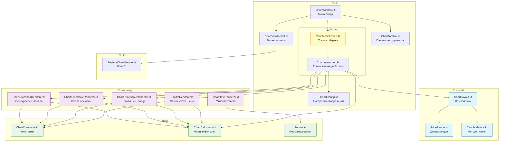

# Техническая книга модуля `feature-chart`

## Разработка биржевого графика на Kotlin + Compose Multiplatform

**Уровень:** Junior → Middle  
**Технологии:** Kotlin, Compose Multiplatform, Koin DI, Canvas 2D, Ktor  
**Версия продукта:** Nous Platform 1.0  
**Автор:** Команда Nous

---

# Оглавление

1. [Введение: Что такое feature-chart](#1-введение-что-такое-feature-chart)
2. [Архитектура KMP-модуля](#2-архитектура-kmp-модуля)
3. [Точка входа: ChartWindow и main()](#3-точка-входа-chartwindow-и-main)
4. [Dependency Injection: Как Koin собирает приложение](#4-dependency-injection-как-koin-собирает-приложение)
5. [ViewModel: Управление состоянием](#5-viewmodel-управление-состоянием)
6. [Sealed Interface ChartState](#6-sealed-interface-chartstate)
7. [CandleStickChart — сердце графика](#7-candlestickchart--сердце-графика)
8. [Система координат и компоновка (ChartLayout)](#8-система-координат-и-компоновка-chartlayout)
9. [Canvas-рендеринг: Как рисуются свечи](#9-canvas-рендеринг-как-рисуются-свечи)
10. [Сетка и шкала цен](#10-сетка-и-шкала-цен)
11. [Шкала времени](#11-шкала-времени)
12. [Система скролла (панорамирование)](#12-система-скролла-панорамирование)
13. [Система зума](#13-система-зума)
14. [Динамический PriceRange](#14-динамический-pricerange)
15. [Crosshair: Перекрестие и информационная панель](#15-crosshair-перекрестие-и-информационная-панель)
16. [Ленивая загрузка истории (Lazy Loading)](#16-ленивая-загрузка-истории-lazy-loading)
17. [ChartToolbar: Панель управления](#17-charttoolbar-панель-управления)
18. [ChartConfig и CandleStyle: Настройка внешнего вида](#18-chartconfig-и-candlestyle-настройка-внешнего-вида)
19. [Утилиты форматирования](#19-утилиты-форматирования)
20. [Путь данных: от API до экрана](#20-путь-данных-от-api-до-экрана)
21. [Заключение: Как всё работает вместе](#21-заключение-как-всё-работает-вместе)
22. [Приложение: Глоссарий](#22-приложение-глоссарий)

---

# 1. Введение: Что такое feature-chart

## 1.1. Контекст проекта

`feature-chart` — это модуль биржевого графика (японские свечи) в составе платформы **Nous Platform**. Платформа представляет собой торговый терминал для криптовалют, написанный на **Kotlin Multiplatform (KMP)** с использованием **Compose Multiplatform** для UI.

Модуль `feature-chart` является **самостоятельным feature-модулем**. Это означает, что он может запускаться как отдельное приложение (через `./gradlew :features:feature-chart:run`), так и встраиваться в основное приложение `composeApp`.

## 1.2. Что делает этот модуль?

Модуль отображает график движения цены в виде **японских свечей (Candlestick chart)**. Пользователь может:

- Просматривать исторические данные (свечи за разные периоды)
- Масштабироваться колёсиком мыши (увеличение/уменьшение)
- Панорамировать график (перетаскивать мышью)
- Включать перекрестие (crosshair) для точного определения цены в конкретной точке
- Переключать торговые пары (BTCUSDT, ETHUSDT и другие)
- Менять таймфреймы (1m, 5m, 15m, 30m, 1h, 4h, 1d, 1w)
- Автоматически подгружать историю при скролле влево

## 1.3. Стек технологий

| Технология | Назначение |
|---|---|
| Kotlin 2.3.0 | Язык программирования |
| Compose Multiplatform 1.7.0 | UI фреймворк |
| Compose Canvas 2D | Отрисовка свечей, сетки, шкал |
| Koin 3.5.6 | Dependency Injection |
| Ktor 3.4.1 | HTTP-клиент для API |
| kotlinx.coroutines | Асинхронность |
| kotlinx.serialization | JSON-сериализация |

## 1.4. Структура файлов модуля

Модуль организован по принципам **SRP (Single Responsibility Principle)**, **GRASP (Low Coupling / High Cohesion)** и **Clean Architecture**. Вместо одного монолитного файла `CandleStickChartWidget.kt` (1164 строки) код разделён на **13 файлов в 4 пакетах**:

```
features/feature-chart/
├── build.gradle.kts              # Конфигурация сборки
└── src/
    └── commonMain/
        └── kotlin/
            └── com/aandios/nous/feature/chart/
                ├── di/
                │   └── FeatureChartModule.kt       # Koin DI модуль
                ├── model/                          # Модели данных (SRP: Pure Fabrication)
                │   ├── PriceRange.kt               # Диапазон цен max/min/visible
                │   ├── CandleMetrics.kt            # Метрики свечи (width, spacing)
                │   └── ChartLayout.kt              # Компоновка областей графика
                ├── rendering/                      # Функции отрисовки Canvas (SRP: Protected Variations)
                │   ├── CandleRenderer.kt           # Свечи, сетка, линия цены
                │   ├── ChartPriceScaleRenderer.kt  # Шкала цен и badge
                │   ├── ChartTimeScaleRenderer.kt   # Шкала времени
                │   ├── ChartCrosshairRenderer.kt   # Перекрестие и инфо-панель
                │   └── ChartTextRenderer.kt        # Утилита текста
                ├── ui/
                │   ├── chart/
                │   │   ├── CandleStickChart.kt     # Тонкая обёртка (20 строк, только @Composable)
                │   │   └── ChartInteraction.kt     # Вся интерактивная логика (~14KB)
                │   ├── ChartWindow.kt              # Точка входа для изолированного запуска
                │   ├── ChartViewModel.kt           # ViewModel с бизнес-логикой
                │   ├── ChartToolbar.kt             # Панель инструментов
                │   └── ChartConfig.kt              # Конфигурация отрисовки
                └── utils/
                    ├── ChartConstants.kt           # Константы (BASE_CANDLE_WIDTH)
                    ├── ChartCalculator.kt          # Чистые функции расчёта (6 шт.)
                    └── Format.kt                   # Форматирование цен и времени
```

**Ключевые изменения:**
- `model/` — data class'ы без логики (PriceRange, CandleMetrics, ChartLayout)
- `rendering/` — все `fun DrawScope.*` extension функции, каждая в своём файле
- `ui/chart/CandleStickChart.kt` — тонкая обёртка (делегирует `CandleStickChartInteraction`)
- `ui/chart/ChartInteraction.kt` — вся сложная логика взаимодействия, layout и Canvas
- `utils/ChartCalculator.kt` — чистые функции (calculateCandleMetrics, priceToY и др.)
- Старый `CandleStickChartWidget.kt` удалён

## 1.5. Диаграмма архитектуры




# 2. Архитектура KMP-модуля

## 2.1. build.gradle.kts: Как собирается модуль

```kotlin
// features/feature-chart/build.gradle.kts
plugins {
    id("conventions.kmp-feature")     // Стандартный конвенционный плагин для feature-модулей
    alias(libs.plugins.kotlin.serialization)  // Плагин JSON-сериализации
}

kotlin {
    sourceSets {
        commonMain.dependencies {
            implementation(project(":platform-core"))       // Core-модуль
            implementation(project(":public-api:api-market")) // API рыночных данных
            implementation(project(":providers:binance-provider")) // Binance провайдер

            implementation(libs.koin.core)                  // DI
            implementation(libs.koin.compose)               // Интеграция Koin с Compose
            implementation(libs.kotlinx.coroutines.core)    // Корутины
            implementation(libs.kotlinx.serialization.json) // JSON
            implementation(libs.compose.material3)          // Material 3 UI
        }

        jvmMain.dependencies {
            implementation(compose.desktop.currentOs)       // Desktop-специфичный Compose
            implementation(libs.kotlinx.coroutines.swing)   // Swing-диспатчер
        }

        commonTest.dependencies {
            implementation(libs.kotlin.test)
            implementation(libs.junit.jupiter)
            implementation(libs.kotlinx.coroutines.test)
            implementation(libs.ktor.client.mock)           // Mock для Ktor
        }
    }
}

compose.desktop {
    application {
        mainClass = "com.aandios.nous.feature.chart.ui.ChartWindowKt"
    }
}
```

### 2.1.1. Плагин `conventions.kmp-feature`

Этот кастомный плагин из `build-logic` автоматически подключает:

```kotlin
// build-logic/src/main/kotlin/conventions/KmpFeatureConvention.kt
apply("org.jetbrains.kotlin.multiplatform")   // KMP
apply("org.jetbrains.compose")                // Compose Multiplatform
apply("org.jetbrains.kotlin.plugin.compose")  // Compose compiler plugin
```

А также добавляет базовые зависимости Compose:
```kotlin
commonMain.dependencies {
    api(project(":core:core-dependencies"))     // Базовые транзитивные зависимости
    implementation(libs.findLibrary("compose.runtime").get())
    implementation(libs.findLibrary("compose.foundation").get())
    implementation(libs.findLibrary("compose.material3").get())
    implementation(libs.findLibrary("compose.ui").get())
}
```

### 2.1.2. Блок `compose.desktop.application`

Этот блок **критически важен** — он делает из KMP-модуля запускаемое desktop-приложение:

```kotlin
compose.desktop {
    application {
        mainClass = "com.aandios.nous.feature.chart.ui.ChartWindowKt"
    }
}
```

Благодаря этому можно запустить:
```bash
./gradlew :features:feature-chart:run
```

**Для Junior**: `mainClass` указывает на файл, содержащий `fun main()` — точку входа. Имя файла — `ChartWindow.kt`, поэтому в Kotlin/JVM class-файл называется `ChartWindowKt` (Kt добавляется автоматически).

## 2.2. Ключевые особенности KMP-архитектуры

Модуль использует **Kotlin Multiplatform (KMP)**, хотя на данный момент целевая платформа только одна — **JVM (Desktop)**. Это сделано с расчётом на будущее — теоретически модуль можно собрать под Android, iOS, Web.

**Source sets**:
- `commonMain` — общий код для всех платформ (включая UI)
- `jvmMain` — JVM-специфичный код (зависимости Desktop Compose, Swing)
- `commonTest` — тесты

---

# 3. Точка входа: ChartWindow и main()

## 3.1. Файл ChartWindow.kt

Этот файл содержит две ключевые вещи:

1. **`fun main()`** — точка входа приложения
2. **`@Composable fun ChartWindow()`** — корневой Composable-компонент

## 3.2. Функция main()

```kotlin
fun main() = application {
    stopKoin()
    initKoinForPreview()

    Window(
        onCloseRequest = ::exitApplication,
        title = "Nous Platform • Chart Preview",
        state = rememberWindowState(width = 800.dp, height = 600.dp)
    ) {
        KoinContext {
            TradingTerminalTheme {
                ChartWindow()
            }
        }
    }
}
```

### 3.2.1. `application { }` — Compose Desktop entry point

Это Compose for Desktop API. Аналог `Activity` в Android. Блок `application { }` определяет жизненный цикл desktop-приложения.

### 3.2.2. `stopKoin()` и `initKoinForPreview()`

Перед запуском приложения мы переинициализируем Koin — систему Dependency Injection (DI). Подробно разберём в главе 4.

### 3.2.3. `Window(...)` — системное окно

```kotlin
Window(
    onCloseRequest = ::exitApplication,     // При закрытии окна → выход из приложения
    title = "Nous Platform • Chart Preview", // Заголовок окна
    state = rememberWindowState(             // Состояние окна
        width = 800.dp,
        height = 600.dp
    )
)
```

- `onCloseRequest` — callback при закрытии окна (нажатии на крестик)
- `rememberWindowState` — сохраняет размер и положение окна между рекомпозициями

### 3.2.4. Вложенные обёртки

```kotlin
KoinContext {               // Даёт доступ к DI-зависимостям внутри Compose-дерева
    TradingTerminalTheme {  // Тема оформления (цвета, типографика)
        ChartWindow()       // Наш главный компонент
    }
}
```

## 3.3. Функция ChartWindow()

```kotlin
@Composable
fun ChartWindow() {
    val chartViewModel: ChartViewModel = koinInject()   // ← Получаем ViewModel из DI
    val chartState by chartViewModel.chartState.collectAsState()  // ← Подписка на состояние
    // ... остальные стейты

    var crosshairEnabled by remember { mutableStateOf(false) }

    LaunchedEffect(Unit) {
        chartViewModel.loadChart()   // ← Загружаем данные при первом рендере
    }

    Box(modifier = Modifier.fillMaxSize()) {
        when (val state = chartState) {
            is ChartState.Loading -> { /* спиннер загрузки */ }
            is ChartState.Error -> { /* сообщение об ошибке */ }
            is ChartState.Success -> {
                // График + тулбар
                CandleStickChart(...)
                ChartToolbar(...)
            }
        }
    }
}
```

### 3.3.1. `koinInject()` — магия DI

`koinInject()` — это функция из библиотеки `koin-compose`. Она автоматически находит в Koin-контейнере объект нужного типа и возвращает его. Без неё нам пришлось бы вручную создавать `ChartViewModel` со всеми его зависимостями.

### 3.3.2. `collectAsState()` — мост между корутинами и Compose

```kotlin
val chartState by chartViewModel.chartState.collectAsState()
```

`chartViewModel.chartState` — это `StateFlow<ChartState>`. `collectAsState()` подписывается на этот Flow и возвращает `State<ChartState>`. При каждом новом значении из Flow Compose автоматически перерисовывает (рекомпозирует) UI.

**Для Junior**: `StateFlow` — это как радиостанция, которая постоянно передаёт новости. `collectAsState()` — это радиоприёмник, который ловит эти новости и показывает их на экране. Когда новости меняются, экран обновляется.

### 3.3.3. `when (chartState)` — state-driven UI

Весь UI строится вокруг одного из трёх состояний:

```kotlin
sealed interface ChartState {
    object Loading : ChartState      // Загрузка
    data class Success(...) : ChartState  // Успешные данные
    data class Error(message: String) : ChartState  // Ошибка
}
```

Это называется **State-Driven UI** — интерфейс всегда отражает текущее состояние данных. Никакого "UI сам по себе".

---

# 4. Dependency Injection: Как Koin собирает приложение

## 4.1. Что такое Dependency Injection (DI)?

**Dependency Injection** — это паттерн, при котором объект получает свои зависимости извне, а не создаёт их сам.

Без DI:
```kotlin
class ChartViewModel {
    private val repo = ChartRepositoryImpl(ChartAdapter(...)) // Жёсткая связь
}
```

С DI:
```kotlin
class ChartViewModel(
    private val chartRepository: ChartRepository,  // Зависимость приходит извне
    private val symbolInfoAdapter: SymbolInfoAdapter
)
```

Koin — это DI-фреймворк, который управляет созданием всех объектов.

## 4.2. Модуль `featureChartModule`

```kotlin
val featureChartModule = module {
    // 1. Конфигурация провайдера
    single<ProviderConfig> {
        ProviderConfig(
            apiKey = null,
            secretKey = null,
            isTestnet = false,
            customSettings = emptyMap()
        )
    }

    // 2. Создаём Provider напрямую через фабрику
    single<Provider> {
        val config = get<ProviderConfig>()
        val networkManager = get<NetworkManager>()
        BinanceProviderFactory().createProvider(config, networkManager)
    }

    // 3. Адаптер Chart из провайдера
    single<ChartAdapter> {
        get<Provider>().chart ?: error("Chart adapter not available")
    }

    // 4. Репозиторий Chart
    single<ChartRepository> {
        ChartRepositoryImpl(chartAdapter = get())
    }

    // 5. SymbolInfo adapter
    single<SymbolInfoAdapter> {
        get<Provider>().symbolInfo ?: error("SymbolInfo adapter not available")
    }

    // 6. ViewModel
    factory {
        ChartViewModel(
            chartRepository = get(),
            symbolInfoAdapter = get(),
        )
    }
}
```

### 4.2.1. `single { }` vs `factory { }`

- **`single { }`** — создаёт объект один раз и хранит его в контейнере. Все, кто запрашивает этот тип, получают один и тот же экземпляр.
- **`factory { }`** — создаёт новый экземпляр при каждом запросе. ViewModel обычно делают factory, чтобы каждый экран имел свой экземпляр.

### 4.2.2. Цепочка зависимостей

```
Koin-контейнер
│
├── NetworkManager (из coreModule)
│
├── ProviderConfig → Provider (BinanceProviderFactory) → ChartAdapter + SymbolInfoAdapter
│                                                              │
│                                                              ▼
│                                              ChartRepositoryImpl
│                                                              │
│                                              ┌────────────────┘
│                                              ▼
│                                        ChartViewModel
│                                              │
│                                              ▼ (отдаётся в Compose через koinInject)
│                                        ChartWindow()
```

## 4.3. Функция `initKoinForPreview()`

```kotlin
fun initKoinForPreview() {
    stopKoin()                               // Останавливаем старый Koin (если был)
    startKoin {
        modules(
            coreModule,                      // Базовый модуль (NetworkManager, HttpClient)
            featureChartModule,              // Модуль фичи Chart
        )
    }
}
```

Эта функция создаёт **изолированный** Koin-контекст для самостоятельного запуска ChartWindow. Она не включает другие feature-модули, чтобы избежать конфликтов.

---

# 5. ViewModel: Управление состоянием

## 5.1. Конструктор и Scope

```kotlin
class ChartViewModel(
    private val chartRepository: ChartRepository,
    private val symbolInfoAdapter: SymbolInfoAdapter,
) {
    private val viewModelScope = CoroutineScope(Dispatchers.Main + SupervisorJob())
    private var currentJob: Job? = null
    private var isLoadingMore = false
    // ...
}
```

### 5.1.1. `viewModelScope`

Это кастомный CoroutineScope (а не Android-специфичный `viewModelScope` из lifecycle). Создаётся вручную:

```kotlin
CoroutineScope(Dispatchers.Main + SupervisorJob())
```

- **`Dispatchers.Main`** — все корутины работают на главном потоке (UI-потоке)
- **`SupervisorJob()`** — если одна корутина упадёт с ошибкой, другие не отменятся

### 5.1.2. `currentJob`

Ссылка на текущий запущенный Job для загрузки данных. Позволяет отменить предыдущую загрузку, если пользователь быстро переключил символ/таймфрейм.

## 5.2. Состояния (StateFlows)

```kotlin
private val _chartState = MutableStateFlow<ChartState>(ChartState.Loading)
val chartState: StateFlow<ChartState> = _chartState.asStateFlow()

private val _currentSymbol = MutableStateFlow("BTCUSDT")
val currentSymbol: StateFlow<String> = _currentSymbol.asStateFlow()

private val _currentTimeframe = MutableStateFlow("1h")
val currentTimeframe: StateFlow<String> = _currentTimeframe.asStateFlow()

private val _symbols = MutableStateFlow<List<String>>(listOf("BTCUSDT", "ETHUSDT"))

private val _historyLoadCount = MutableStateFlow(0)
val historyLoadCount: StateFlow<Int> = _historyLoadCount.asStateFlow()

private val _hasMoreHistory = MutableStateFlow(true)
val hasMoreHistory: StateFlow<Boolean> = _hasMoreHistory.asStateFlow()
```

### 5.2.1. Зачем нужен `Backing property`?

Паттерн с `_chartState` (приватный mutable) и `chartState` (публичный read-only):

```kotlin
private val _chartState = MutableStateFlow<ChartState>(...)
val chartState: StateFlow<ChartState> = _chartState.asStateFlow()
```

**Зачем?** Чтобы никто снаружи не мог изменить состояние — только сама ViewModel. Это **инкапсуляция**.

## 5.3. Загрузка данных: `loadChart()`

```kotlin
fun loadChart(ticker: String = "BTCUSDT", timeframe: String = "1h") {
    // 1. Сброс состояния истории
    _hasMoreHistory.value = true
    _historyLoadCount.value = 0
    isLoadingMore = false

    viewModelScope.launch {
        _chartState.value = ChartState.Loading  // Показываем загрузку

        delay(100)                              // Небольшая задержка
        currentJob?.cancel()                    // Отменяем предыдущую загрузку

        currentJob = launch {
            try {
                chartRepository.getChart(ticker, timeframe)
                    .catch { e ->
                        _chartState.value = ChartState.Error(e.message ?: "Unknown error")
                    }
                    .collect { candles ->
                        if (candles.isNotEmpty()) {
                            val lastPrice = candles.last().close
                            _chartState.value = ChartState.Success(
                                candles = candles,
                                currentPrice = lastPrice
                            )
                        }
                    }
            } catch (e: CancellationException) {
                // Корректная отмена — не ошибка
            } catch (e: Exception) {
                _chartState.value = ChartState.Error(e.message ?: "Unknown error")
            }
        }
    }
}
```

### 5.3.1. Как работает `chartRepository.getChart()`

Возвращает `Flow<List<Candle>>`. Это означает, что данные могут обновляться в реальном времени — при каждом новом изменении цен на бирже Flow может эмитировать новый список свечей.

### 5.3.2. `CancellationException`

Отдельно обрабатывается `CancellationException` — это исключение выбрасывается, когда корутину отменяют (например, при вызове `currentJob?.cancel()`). Это **не ошибка**, поэтому мы просто игнорируем его.

## 5.4. Загрузка истории: `loadMoreHistory()`

```kotlin
fun loadMoreHistory() {
    if (isLoadingMore || !_hasMoreHistory.value) return
    isLoadingMore = true

    viewModelScope.launch {
        val state = _chartState.value
        if (state !is ChartState.Success) {
            isLoadingMore = false
            return@launch
        }

        val oldestTime = state.candles.firstOrNull()?.timestamp ?: run {
            isLoadingMore = false
            return@launch
        }

        // Загружаем свечи ДО самой старой
        val historicalCandles = chartRepository.loadHistoricalCandlesBefore(
            ticker = _currentSymbol.value,
            timeframe = _currentTimeframe.value,
            endTime = oldestTime - 1,
            limit = 200
        )

        if (historicalCandles.isEmpty()) {
            _hasMoreHistory.value = false
            isLoadingMore = false
            return@launch
        }

        // Препендим (добавляем в начало) исторические свечи
        val newCandles = historicalCandles + state.candles

        // Отменяем real-time поток, чтобы он не перезаписал наши данные
        currentJob?.cancel()

        _chartState.value = ChartState.Success(
            candles = newCandles,
            currentPrice = newCandles.last().close
        )
        _historyLoadCount.value = historicalCandles.size
        isLoadingMore = false
    }
}
```

Подробно про lazy loading — в главе 16.

---

# 6. Sealed Interface ChartState

## 6.1. Что такое sealed interface?

```kotlin
sealed interface ChartState {
    object Loading : ChartState
    data class Success(
        val candles: List<Candle>,
        val currentPrice: Float? = null
    ) : ChartState
    data class Error(val message: String) : ChartState
}
```

**Sealed interface** — это интерфейс с ограниченным набором реализаций. Компилятор знает все возможные варианты, что даёт:

1. **Безопасный `when`** — Kotlin требует обработать все варианты
2. **Невозможно создать новые реализации вне файла**

## 6.2. Почему sealed interface, а не sealed class?

`sealed interface` появился в Kotlin 1.5 и удобнее, когда реализации — data class'ы (data class не может наследоваться от sealed class, но может от sealed interface).

## 6.3. Как используется в UI

```kotlin
when (val state = chartState) {
    is ChartState.Loading -> { /* Спиннер */ }
    is ChartState.Error -> { /* Сообщение */ }
    is ChartState.Success -> { /* График */ }
}
// Не нужно else — все варианты обработаны!
```

**Для Junior**: Kotlin гарантирует, что вы не забудете обработать какое-то состояние. Если добавить новое состояние в sealed interface, компилятор укажет на все места, где нужно его обработать.

---

# 7. CandleStickChart — сердце графика

После рефакторинга старый монолитный `CandleStickChartWidget.kt` (1164 строки) разделён на **два файла** в пакете [`ui/chart/`](features/feature-chart/src/commonMain/kotlin/com/aandios/nous/feature/chart/ui/chart/):

1. [`CandleStickChart.kt`](features/feature-chart/src/commonMain/kotlin/com/aandios/nous/feature/chart/ui/chart/CandleStickChart.kt) — **тонкая обёртка** (~20 строк), только `@Composable` сигнатура
2. [`ChartInteraction.kt`](features/feature-chart/src/commonMain/kotlin/com/aandios/nous/feature/chart/ui/chart/ChartInteraction.kt) — **вся интерактивная логика** (~14KB): состояния, жесты, layout, Canvas

Это разделение следует **SRP (Single Responsibility Principle)** и **GRASP Pure Fabrication** — `CandleStickChart` отвечает только за публичный API, а `CandleStickChartInteraction` — за всю сложность взаимодействия.

## 7.1. CandleStickChart — тонкая обёртка

```kotlin
// features/feature-chart/src/commonMain/.../ui/chart/CandleStickChart.kt
@Composable
fun CandleStickChart(
    candles: List<Candle>,
    currentPrice: Float? = null,
    modifier: Modifier = Modifier,
    config: ChartConfig = DefaultChartConfig,
    showPriceScale: Boolean = true,
    priceScaleWidth: Dp = 60.dp,
    crosshairEnabled: Boolean = false,
    onCrosshairEnabledChange: (Boolean) -> Unit = {},
    onNeedMoreHistory: () -> Unit = {},
    historyLoadCount: Int = 0,
    hasMoreHistory: Boolean = true,
) {
    CandleStickChartInteraction(
        candles = candles,
        currentPrice = currentPrice,
        modifier = modifier,
        config = config,
        showPriceScale = showPriceScale,
        priceScaleWidth = priceScaleWidth,
        crosshairEnabled = crosshairEnabled,
        onCrosshairEnabledChange = onCrosshairEnabledChange,
        onNeedMoreHistory = onNeedMoreHistory,
        historyLoadCount = historyLoadCount,
        hasMoreHistory = hasMoreHistory,
    )
}
```

### Параметры:

| Параметр | Тип | По умолчанию | Описание |
|---|---|---|---|
| `candles` | `List<Candle>` | обязательный | Список свечей для отображения |
| `currentPrice` | `Float?` | `null` | Текущая цена (линия на графике) |
| `modifier` | `Modifier` | `Modifier` | Compose-модификатор |
| `config` | `ChartConfig` | `DefaultChartConfig` | Настройки отрисовки |
| `showPriceScale` | `Boolean` | `true` | Показывать шкалу цен |
| `priceScaleWidth` | `Dp` | `60.dp` | Ширина шкалы цен |
| `crosshairEnabled` | `Boolean` | `false` | Включить перекрестие |
| `onCrosshairEnabledChange` | `(Boolean) -> Unit` | `{}` | Callback изменения crosshair |
| `onNeedMoreHistory` | `() -> Unit` | `{}` | Запрос на загрузку истории |
| `historyLoadCount` | `Int` | `0` | Сколько свечей загружено исторически |
| `hasMoreHistory` | `Boolean` | `true` | Есть ещё история для загрузки |

## 7.2. CandleStickChartInteraction — вся логика

Файл [`ChartInteraction.kt`](features/feature-chart/src/commonMain/kotlin/com/aandios/nous/feature/chart/ui/chart/ChartInteraction.kt) содержит:

### 7.2.1. Внутренние состояния

```kotlin
if (candles.isEmpty()) return

var mousePosition by remember { mutableStateOf<Offset?>(null) }
var isCrosshairVisible by remember { mutableStateOf(false) }
var scrollOffset by remember { mutableFloatStateOf(0f) }
var zoomLevel by remember { mutableFloatStateOf(1f) }
var chartWidthPx by remember { mutableFloatStateOf(0f) }
var maxScroll by remember { mutableFloatStateOf(0f) }       // ← maxScroll как STATE
var isCtrlPressed by remember { mutableStateOf(false) }

val maxScrollLeft = 300f  // триггер загрузки истории
```

### 7.2.2. `mutableFloatStateOf` vs `mutableStateOf`

`mutableFloatStateOf` — это оптимизированная версия `mutableStateOf` для `Float`. Она избегает автоупаковки (boxing) Float в объект.

### 7.2.3. Структура Composable

```kotlin
BoxWithConstraints(modifier = modifier
    .fillMaxSize()
    .clickable(                        // ← focusability для onKeyEvent
        interactionSource = remember { MutableInteractionSource() },
        indication = null
    ) { /* no-op */ }
    .onKeyEvent { event ->             // ← Отслеживание Ctrl
        if (event.key == Key.CtrlLeft || event.key == Key.CtrlRight) {
            isCtrlPressed = event.type == KeyEventType.KeyDown
            true
        } else false
    }
    .pointerInput(crosshairEnabled) { ... }  // ← Drag или Crosshair
    .pointerInput(Unit) { ... }              // ← Zoom колёсиком
) {
    val layout = remember(...) { calculateLayout(...) }
    chartWidthPx = layout.chartMainArea.width

    val candleMetrics = remember(zoomLevel) { calculateCandleMetrics(zoomLevel) }
    maxScroll = max(0f, candles.size * totalW - chartWidthPx)  // ← обновление maxScroll

    // LaunchedEffect для управления скроллом
    LaunchedEffect(...) { ... }

    // Основной Canvas — делегирует rendering/ пакету
    Canvas(modifier = Modifier.fillMaxSize().clipToBounds()) {
        drawChart(...)          // CandleRenderer.kt
        drawTimeScale(...)      // ChartTimeScaleRenderer.kt
        drawPriceScale(...)     // ChartPriceScaleRenderer.kt
        drawCrosshair(...)      // ChartCrosshairRenderer.kt
    }
}
```

**Ключевые отличия от старой структуры:**
1. `maxScroll` — это `mutableFloatStateOf`, а не локальная `val`; обновляется внутри `BoxWithConstraints`
2. `clickable(indication = null)` — обязателен для focusability (без него `onKeyEvent` не срабатывает)
3. Все функции отрисовки — `DrawScope` extension из `rendering/` пакета (импортируются через `import com.aandios.nous.feature.chart.rendering.*`)

---

# 8. Система координат и компоновка (ChartLayout)

Модель [`ChartLayout`](features/feature-chart/src/commonMain/kotlin/com/aandios/nous/feature/chart/model/ChartLayout.kt) находится в пакете [`model/`](features/feature-chart/src/commonMain/kotlin/com/aandios/nous/feature/chart/model/) вместе с другими data class'ами. Это **Pure Fabrication** (GRASP) — искусственная сущность, не имеющая аналога в предметной области, но упрощающая передачу layout-параметров между компонентами.

## 8.1. Структура ChartLayout

```kotlin
// features/feature-chart/src/commonMain/.../model/ChartLayout.kt
data class ChartLayout(
    val canvasWidth: Float,
    val canvasHeight: Float,
    val priceScaleWidth: Float,
    val chartArea: Rect,           // Вся область графика
    val priceScaleArea: Rect,      // Область шкалы цен (справа)
    val chartPadding: Float = 8f,
    val timeScaleHeight: Float = 20f,
    val chartMainArea: Rect,       // Область свечей
    val timeScaleArea: Rect        // Область шкалы времени (снизу)
)
```

## 8.2. Визуальная структура окна

```
┌─────────────────────────────────────┬──────────────┐
│                                     │              │
│                                     │  Price       │
│          chartMainArea              │  Scale       │
│          (свечи)                    │              │
│                                     │  1234.5      │
│                                     │              │
│                                     │              │
├─────────────────────────────────────┴──────────────┤
│                  timeScaleArea                      │
│    12:00    13:00    14:00    15:00    16:00       │
└────────────────────────────────────────────────────┘
```

## 8.3. Расчёт layout

```kotlin
val layout = remember(priceScaleWidth, canvasWidth, canvasHeight) {
    val widthPx = with(density) { canvasWidth.toPx() }
    val heightPx = with(density) { canvasHeight.toPx() }
    val chartPadding = 8f
    
    // Высота шкалы времени — 4% от высоты, но не менее 20px и не более 40px
    val timeScaleHeight = (heightPx * 0.04f).coerceAtLeast(20f).coerceAtMost(40f)
    
    val priceScaleWidthPx = with(density) { priceScaleWidth.toPx() }
    
    // Шкала цен — справа
    val priceScaleArea = Rect(
        left = widthPx - priceScaleWidthPx,
        top = 0f,
        right = widthPx,
        bottom = heightPx
    )
    
    // Шкала времени — снизу
    val timeScaleArea = Rect(
        left = 0f,
        top = heightPx - timeScaleHeight,
        right = widthPx - priceScaleWidthPx - chartPadding,
        bottom = heightPx
    )
    
    // Основная область графика (без шкалы времени)
    val chartMainArea = Rect(
        left = 0f,
        top = 0f,
        right = widthPx - priceScaleWidthPx - chartPadding,
        bottom = heightPx - timeScaleHeight
    )
    
    ChartLayout(...)
}
```

### 8.3.1. `remember(priceScaleWidth, canvasWidth, canvasHeight)`

Layout пересчитывается только когда изменяются размеры окна или настройка шкалы цен. При скролле/зуме/смене данных layout не пересчитывается.

### 8.3.2. Перевод Dp в пиксели

```kotlin
val widthPx = with(density) { canvasWidth.toPx() }
```

`BoxWithConstraints` предоставляет размеры в `Dp` (логические единицы), но Canvas работает в пикселях. `LocalDensity.current` позволяет конвертировать.

---

# 9. Canvas-рендеринг: Как рисуются свечи

Все функции отрисовки вынесены в отдельный пакет [`rendering/`](features/feature-chart/src/commonMain/kotlin/com/aandios/nous/feature/chart/rendering/) как `fun DrawScope.*` extension-функции. Каждый файл отвечает за свою часть рендеринга (SRP):

| Файл | Ответственность |
|---|---|
| [`CandleRenderer.kt`](features/feature-chart/src/commonMain/kotlin/com/aandios/nous/feature/chart/rendering/CandleRenderer.kt) | Свечи (`drawChart`, `drawCandle`), сетка (`drawGrid`), линия цены (`drawCurrentPriceLine`) |
| [`ChartPriceScaleRenderer.kt`](features/feature-chart/src/commonMain/kotlin/com/aandios/nous/feature/chart/rendering/ChartPriceScaleRenderer.kt) | Шкала цен (`drawPriceScale`), badge (`drawCurrentPriceBadge`, `drawCurrentPriceLabel`), уровень цены (`drawPriceLevel`) |
| [`ChartTimeScaleRenderer.kt`](features/feature-chart/src/commonMain/kotlin/com/aandios/nous/feature/chart/rendering/ChartTimeScaleRenderer.kt) | Шкала времени (`drawTimeScale`) |
| [`ChartCrosshairRenderer.kt`](features/feature-chart/src/commonMain/kotlin/com/aandios/nous/feature/chart/rendering/ChartCrosshairRenderer.kt) | Перекрестие (`drawCrosshair`), инфо-панель (`drawInfoPanel`), метки на осях (`drawPriceLabelOnAxis`, `drawTimeLabelOnAxis`) |
| [`ChartTextRenderer.kt`](features/feature-chart/src/commonMain/kotlin/com/aandios/nous/feature/chart/rendering/ChartTextRenderer.kt) | Утилита текста (`drawTextLine`) |

Импорт в [`ChartInteraction.kt`](features/feature-chart/src/commonMain/kotlin/com/aandios/nous/feature/chart/ui/chart/ChartInteraction.kt):

```kotlin
import com.aandios.nous.feature.chart.rendering.drawChart
import com.aandios.nous.feature.chart.rendering.drawCrosshair
import com.aandios.nous.feature.chart.rendering.drawPriceScale
import com.aandios.nous.feature.chart.rendering.drawTimeScale
```

## 9.1. DrawScope и Canvas

```kotlin
Canvas(modifier = Modifier.fillMaxSize().clipToBounds()) {
    // this — DrawScope
    drawChart(...)      // из CandleRenderer.kt
    drawTimeScale(...)  // из ChartTimeScaleRenderer.kt
    drawPriceScale(...) // из ChartPriceScaleRenderer.kt
    drawCrosshair(...)  // из ChartCrosshairRenderer.kt
}
```

`Canvas` — это Compose-компонент, предоставляющий `DrawScope` для низкоуровневой 2D-отрисовки.

## 9.2. Функция drawChart() (CandleRenderer.kt)

```kotlin
// features/feature-chart/src/commonMain/.../rendering/CandleRenderer.kt
fun DrawScope.drawChart(
    candles: List<Candle>,
    priceRange: PriceRange,
    config: ChartConfig,
    chartArea: Rect,
    currentPrice: Float?,
    textMeasurer: TextMeasurer,
    scrollOffset: Float = 0f,
    zoomLevel: Float = 1f,
    visibleStartIndex: Int = 0,
    visibleEndIndex: Int = 0,
) {
    withTransform({
        translate(left = chartArea.left, top = chartArea.top)
        clipRect(0f, 0f, chartArea.width, chartArea.height)
    }) {
        drawGrid(config, chartArea.width, chartArea.height)
        
        val candleMetrics = calculateCandleMetrics(zoomLevel)
        val totalW = candleMetrics.width + candleMetrics.spacing
        for (i in visibleStartIndex until visibleEndIndex) {
            if (i in candles.indices) {
                val x = i * totalW - scrollOffset + candleMetrics.width / 2
                drawCandle(
                    candle = candles[i],
                    centerX = x,
                    priceRange = priceRange,
                    metrics = candleMetrics,
                    config = config,
                    chartHeight = chartArea.height
                )
            }
        }
        
        if (currentPrice != null) {
            drawCurrentPriceLine(currentPrice, priceRange, config, chartArea.height, chartArea.width)
        }
    }
}
```

### 9.2.1. `withTransform` — система координат

```kotlin
withTransform({
    translate(left = chartArea.left, top = chartArea.top)
    clipRect(0f, 0f, chartArea.width, chartArea.height)
}) { ... }
```

Сдвигает начало координат в левый верхний угол области графика и обрезает всё, что выходит за границы.

### 9.2.2. Цикл по видимым свечам

График НЕ рисует все 1400+ свечей — только те, что влезают на экран:

```kotlin
for (i in visibleStartIndex until visibleEndIndex) {
    val x = i * totalW - scrollOffset + candleMetrics.width / 2
    drawCandle(...)
}
```

**Для Junior**: `visibleStartIndex` и `visibleEndIndex` вычисляются из `scrollOffset`. Если смещение = 0, показываем свечи с начала. Если смещение = 1000px, показываем свечи, начиная с индекса, соответствующего 1000px.

## 9.3. Функция drawCandle()

Свеча состоит из трёх элементов:
1. **Верхняя тень** (high → top of body)
2. **Нижняя тень** (bottom of body → low)
3. **Тело** (open ↔ close)

```kotlin
private fun DrawScope.drawCandle(
    candle: Candle,
    centerX: Float,
    priceRange: PriceRange,
    metrics: CandleMetrics,
    config: ChartConfig,
    chartHeight: Float
) {
    // Определяем цвета
    val isBullish = candle.close >= candle.open
    val bodyColor = if (isBullish) style.bullishColor else style.bearishColor
    
    // Конвертируем цены в Y-координаты
    fun priceToYLocal(price: Float): Float {
        return priceToY(price, priceRange, chartHeight)
    }
    
    val openY = priceToYLocal(candle.open)
    val closeY = priceToYLocal(candle.close)
    val highY = priceToYLocal(candle.high)
    val lowY = priceToYLocal(candle.low)
    
    // 1. Верхняя тень
    if (style.showShadows && highY < topOfBody) {
        drawLine(
            color = shadowColor,
            start = Offset(centerX, highY),
            end = Offset(centerX, topOfBody),
            strokeWidth = style.shadowWidth
        )
    }
    
    // 2. Нижняя тень
    if (style.showShadows && lowY > bottomOfBody) { ... }
    
    // 3. Тело свечи
    if (bodyHeight > 0) {
        drawRect(
            color = bodyColor,
            topLeft = Offset(centerX - metrics.width / 2, bodyTop),
            size = Size(metrics.width, bodyHeight)
        )
    } else {
        // Для Doji свечей (open == close) — линия
        drawLine(...)
    }
}
```

### 9.3.1. Bullish vs Bearish

- **Bullish** (бычья): `close >= open` — цена выросла. Цвет — зелёный.
- **Bearish** (медвежья): `close < open` — цена упала. Цвет — красный.

```
Bullish:           Bearish:
   high              high
    |                 |
   [ ]               ( )
   [ ]               ( )
   [ ]               ( )
    |                 |
   low               low
```

### 9.3.2. Doji-свечи

Если `open == close`, тело свечи имеет нулевую высоту. Вместо пустого прямоугольника рисуется горизонтальная линия — это свеча типа Doji (неопределённость).

## 9.4. Функция priceToY()

```kotlin
private fun DrawScope.priceToY(price: Float, priceRange: PriceRange, height: Float): Float {
    return height - ((price - priceRange.visibleMin) / priceRange.range) * height
}
```

### Как это работает?

Представьте себе "растягивание" диапазона цен (`visibleMin`...`visibleMax`) на высоту области графика:

```
Y = 0 (верх)          ← visibleMax (макс. цена)
Y = height / 2        ← (visibleMin + visibleMax) / 2
Y = height (низ)      ← visibleMin (мин. цена)
```

Формула:
1. `(price - visibleMin) / range` — насколько цена близка к максимуму (0.0...1.0)
2. `* height` — переводим в пиксели
3. `height - ...` — инвертируем, потому что в градике Y растёт вниз

---

# 10. Сетка и шкала цен

Функции сетки и шкалы цен находятся в отдельных файлах пакета [`rendering/`](features/feature-chart/src/commonMain/kotlin/com/aandios/nous/feature/chart/rendering/):
- [`drawGrid()`](features/feature-chart/src/commonMain/kotlin/com/aandios/nous/feature/chart/rendering/CandleRenderer.kt:143) — в `CandleRenderer.kt`
- [`drawPriceScale()`](features/feature-chart/src/commonMain/kotlin/com/aandios/nous/feature/chart/rendering/ChartPriceScaleRenderer.kt:25), [`drawCurrentPriceBadge()`](features/feature-chart/src/commonMain/kotlin/com/aandios/nous/feature/chart/rendering/ChartPriceScaleRenderer.kt:81), [`drawPriceLevel()`](features/feature-chart/src/commonMain/kotlin/com/aandios/nous/feature/chart/rendering/ChartPriceScaleRenderer.kt:187) — в `ChartPriceScaleRenderer.kt`

## 10.1. Отрисовка сетки

```kotlin
// features/feature-chart/src/commonMain/.../rendering/CandleRenderer.kt
fun DrawScope.drawGrid(
    config: ChartConfig,
    width: Float,
    height: Float
) {
    if (!config.showGrid) return
    
    // Горизонтальные линии
    val horizontalLines = 5
    for (i in 0..horizontalLines) {
        val y = height * i / horizontalLines.toFloat()
        drawLine(color = config.gridColor, start = Offset(0f, y), end = Offset(width, y))
    }
    
    // Вертикальные линии
    val verticalLines = 10
    for (i in 0..verticalLines) {
        val x = width * i / verticalLines.toFloat()
        drawLine(...)
    }
}
```

Сетка — декоративный элемент, помогающий визуально оценивать цены. Рисуется ПЕРЕД свечами, чтобы свечи были поверх сетки.

## 10.2. Шкала цен (Price Scale)

```kotlin
// features/feature-chart/src/commonMain/.../rendering/ChartPriceScaleRenderer.kt
fun DrawScope.drawPriceScale(
    priceRange: PriceRange,
    config: ChartConfig,
    priceScaleArea: Rect,
    currentPrice: Float?,
    textMeasurer: TextMeasurer
) {
    withTransform({
        translate(left = priceScaleArea.left, top = priceScaleArea.top)
        clipRect(0f, 0f, priceScaleArea.width, priceScaleArea.height)
    }) {
        val numberOfLevels = 8
        val priceLevels = generatePriceLevels(
            min = priceRange.visibleMin,
            max = priceRange.visibleMax,
            count = numberOfLevels
        )
        
        priceLevels.forEach { price ->
            val y = priceToY(price, priceRange, priceScaleArea.height)
            drawPriceLevel(price, y, config, priceScaleArea.width, textMeasurer)
        }
        
        if (currentPrice != null) {
            val y = priceToY(currentPrice, priceRange, priceScaleArea.height)
            drawCurrentPriceBadge(currentPrice, y, ...)
        }
    }
}
```

### 10.2.1. generatePriceLevels()

```kotlin
// Частная функция внутри ChartPriceScaleRenderer.kt
private fun generatePriceLevels(min: Float, max: Float, count: Int): List<Float> {
    val range = max - min
    val step = range / (count - 1)
    return List(count) { i -> max - (step * i) }
}
```

Равномерно распределяет `count` ценовых уровней между min и max.

### 10.2.2. Badge текущей цены

Текущая цена рисуется отдельно — с зелёным фоном и жирным шрифтом, чтобы выделяться:

```kotlin
// features/feature-chart/src/commonMain/.../rendering/ChartPriceScaleRenderer.kt
fun DrawScope.drawCurrentPriceBadge(
    price: Float,
    ...
) {
    val padding = 4f
    val badgeWidth = textWidth + padding * 2
    val badgeHeight = textHeight + padding * 2
    
    drawRect(
        color = Color.Green.copy(alpha = 0.2f),
        topLeft = Offset(badgeLeft, adjustedBadgeTop),
        size = Size(badgeWidth, badgeHeight)
    )
    
    drawText(textLayoutResult = textLayoutResult, topLeft = ...)
}
```

---

# 11. Шкала времени

Функция [`drawTimeScale()`](features/feature-chart/src/commonMain/kotlin/com/aandios/nous/feature/chart/rendering/ChartTimeScaleRenderer.kt:21) находится в [`ChartTimeScaleRenderer.kt`](features/feature-chart/src/commonMain/kotlin/com/aandios/nous/feature/chart/rendering/ChartTimeScaleRenderer.kt) пакета [`rendering/`](features/feature-chart/src/commonMain/kotlin/com/aandios/nous/feature/chart/rendering/). Все вспомогательные вычисления (такие как `calculateCandleMetrics()`) вынесены в [`ChartCalculator.kt`](features/feature-chart/src/commonMain/kotlin/com/aandios/nous/feature/chart/utils/ChartCalculator.kt) пакета [`utils/`](features/feature-chart/src/commonMain/kotlin/com/aandios/nous/feature/chart/utils/).

## 11.1. Функция drawTimeScale()

```kotlin
// features/feature-chart/src/commonMain/.../rendering/ChartTimeScaleRenderer.kt
fun DrawScope.drawTimeScale(
    candles: List<Candle>,
    config: ChartConfig,
    timeScaleArea: Rect,
    textMeasurer: TextMeasurer,
    scrollOffset: Float = 0f,
    zoomLevel: Float = 1f,
) {
    // ...
    val candleMetrics = calculateCandleMetrics(zoomLevel)
    val totalW = candleMetrics.width + candleMetrics.spacing
    
    // Видимый диапазон
    val visibleStartIdx = (scrollOffset / totalW).toInt().coerceIn(...)
    val visibleEndIdx = ((scrollOffset + timeScaleArea.width) / totalW + 1).toInt().coerceIn(...)
    val visibleCount = visibleEndIdx - visibleStartIdx
    
    // Шаг меток — ~6 меток на видимой области
    val step = (visibleCount / 6).coerceAtLeast(1)
    
    for (i in firstLabelIdx until visibleEndIdx step step) {
        if (i in candles.indices) {
            val x = i * totalW - scrollOffset
            val timeText = formatTime(candles[i].timestamp)
            
            // Вертикальная черточка
            drawLine(start = Offset(x, 0f), end = Offset(x, 4f))
            
            // Текст времени
            drawText(textLayoutResult, topLeft = Offset(x - textWidth/2, ...))
        }
    }
}
```

### 11.1.1. Адаптивная частота меток

```kotlin
val step = (visibleCount / 6).coerceAtLeast(1)
```

Независимо от зума, на шкале времени показывается примерно 6 меток. Если видно 100 свечей — шаг будет ~17 свечей. Если видно 10 свечей — шаг будет 1.

---

# 12. Система скролла (панорамирование)

Вся логика скролла находится в [`ChartInteraction.kt`](features/feature-chart/src/commonMain/kotlin/com/aandios/nous/feature/chart/ui/chart/ChartInteraction.kt) пакета [`ui/chart/`](features/feature-chart/src/commonMain/kotlin/com/aandios/nous/feature/chart/ui/chart/).

## 12.1. Как работает скролл

Скролл (панорамирование) реализован через `detectDragGestures`:

```kotlin
// features/feature-chart/src/commonMain/.../ui/chart/ChartInteraction.kt
var scrollOffset by remember { mutableFloatStateOf(0f) }
var maxScroll by remember { mutableFloatStateOf(0f) }
val maxScrollLeft = 300f

// ...

.pointerInput(crosshairEnabled) {
    if (crosshairEnabled) {
        // Crosshair mode — не скроллим
        awaitEachGesture { ... }
    } else {
        // Drag mode — скроллим
        detectDragGestures(
            onDrag = { change, _ ->
                val deltaX = change.position.x - change.previousPosition.x
                scrollOffset = (scrollOffset - deltaX)
                    .coerceIn(-maxScrollLeft, maxScroll)  // ← FIX: было Float.MAX_VALUE
            },
        )
    }
}
```

### 12.1.1. Переключение между drag и crosshair

Один `pointerInput` обрабатывает два режима. Если `crosshairEnabled == true` — работает crosshair. Если `false` — drag.

### 12.1.2. Расчёт смещения

```kotlin
scrollOffset = (scrollOffset - deltaX).coerceIn(-maxScrollLeft, maxScroll)
```

Ключевое отличие от старой реализации: **`maxScroll`** — это `mutableFloatStateOf`, который пересчитывается каждый раз при изменении `zoomLevel` или размера данных:

```kotlin
maxScroll = max(0f, candles.size * totalW - chartWidthPx)
```

Это гарантирует, что:
- `coerceIn(-maxScrollLeft, maxScroll)` не даёт уйти правее последней свечи
- `maxScroll` динамически обновляется при зумe (изменении `totalW`)
- В старой версии было `coerceIn(-maxScrollLeft, Float.MAX_VALUE)` — скролл мог уйти за правый край

## 12.2. ClampedOffset

```kotlin
val clampedOffset = scrollOffset.coerceIn(-maxScrollLeft, maxScroll)
```

- `clampedOffset` — "зажатое" значение, которое не даёт графику уйти за правый/левый край
- `maxScrollLeft = 300f` — разрешаем 300px пустого места слева для триггера загрузки истории

## 12.3. Вычисление видимых свечей

```kotlin
val startIdx = (clampedOffset / totalW).toInt().coerceIn(0, max(0, candles.size - 1))
val endIdx = ((clampedOffset + chartWidthPx) / totalW + 1).toInt()
    .coerceIn(startIdx + 1, candles.size)
```

Пример: если `totalW = 12px` на свечу, а `clampedOffset = 500px`, то:
- `startIdx = 500 / 12 = 41` (показываем с 41-й свечи)
- Видимая ширина `chartWidthPx = 800px`
- `endIdx = (500 + 800) / 12 + 1 = 109`

## 12.4. Scroll-offset при загрузке данных

```kotlin
// При загрузке новых данных (смена символа/таймфрейма) показываем последние свечи
// НЕ срабатывает при prepend исторических свечей (historyLoadCount > 0)
LaunchedEffect(candles.firstOrNull()?.timestamp ?: 0L) {
    if (historyLoadCount == 0) {
        scrollOffset = maxScroll  // ← Показываем последние свечи
    }
}
```

При первой загрузке (новый символ/таймфрейм) скроллим к правому краю — показываем самые свежие данные. Не срабатывает при prepend исторических свечей, потому что `historyLoadCount > 0`.

## 12.5. Коррекция scrollOffset после prepend истории

```kotlin
LaunchedEffect(historyLoadCount, candles.size) {
    if (historyLoadCount > 0) {
        val oldScrollOffset = scrollOffset
        val added = historyLoadCount * totalW
        scrollOffset += added
        scrollOffset = scrollOffset.coerceIn(-maxScrollLeft, maxScroll)
    }
}
```

Когда новые свечи добавляются в **начало** списка (prepend), старый `scrollOffset` "отстаёт" на добавленное количество свечей. Без коррекции график бы "перепрыгивал" вперёд после загрузки истории.

---

# 13. Система зума

Вся логика зума находится в [`ChartInteraction.kt`](features/feature-chart/src/commonMain/kotlin/com/aandios/nous/feature/chart/ui/chart/ChartInteraction.kt) пакета [`ui/chart/`](features/feature-chart/src/commonMain/kotlin/com/aandios/nous/feature/chart/ui/chart/).

## 13.1. Фокус для захвата клавиатуры

Compose-компоненту нужно быть **focusable**, чтобы получать события клавиатуры. Для этого используется `clickable` с отключённой визуальной индикацией:

```kotlin
// features/feature-chart/src/commonMain/.../ui/chart/ChartInteraction.kt
.clickable(
    interactionSource = remember { MutableInteractionSource() },
    indication = null
) { /* no-op: make composable focusable for onKeyEvent */ }
```

Без этого трюка `onKeyEvent` не получал бы события Ctrl.

## 13.2. Контроль клавиши Ctrl

```kotlin
.onKeyEvent { event ->
    if (event.key == Key.CtrlLeft || event.key == Key.CtrlRight) {
        isCtrlPressed = event.type == KeyEventType.KeyDown
        true  // Потребляем событие
    } else {
        false
    }
}
```

Модификатор `onKeyEvent` отслеживает нажатие/отпускание Ctrl. Состояние хранится в `isCtrlPressed`.

## 13.3. Обнаружение скролла колёсиком

```kotlin
.pointerInput(Unit) {
    awaitPointerEventScope {
        while (true) {
            val event = awaitPointerEvent()
            val change = event.changes.firstOrNull() ?: continue
            val sd = change.scrollDelta
            
            if (event.type == PointerEventType.Scroll && sd != Offset.Zero) {
                val factor = if (sd.y < 0) 1.15f else 1f / 1.15f
                // ... расчёт нового zoomLevel и scrollOffset
            }
        }
    }
}
```

### 13.3.1. `awaitPointerEventScope`

Это более низкоуровневое API, чем `detectDragGestures`. Позволяет вручную обрабатывать события мыши. Используется для зума, потому что колёсико мыши не является жестом перетаскивания.

### 13.3.2. Фактор зума

```kotlin
val factor = if (sd.y < 0) 1.15f else 1f / 1.15f
```

- `sd.y < 0` — скролл вверх (от себя) → увеличиваем (factor > 1)
- `sd.y > 0` — скролл вниз (на себя) → уменьшаем (factor < 1)

Каждый шаг колёсика меняет масштаб на 15%.

## 13.4. Расчёт нового zoomLevel и scrollOffset

```kotlin
val oldZoom = zoomLevel
val newZoom = (oldZoom * factor).coerceIn(0.25f, 4.0f)
val actualFactor = newZoom / oldZoom

val newScrollOffset = if (isCtrlPressed) {
    // Ctrl+zoom: фиксируем свечу ПОД КУРСОРОМ
    val mouseX = change.position.x
    val virtualPos = mouseX + scrollOffset
    virtualPos * actualFactor - mouseX
} else {
    // Обычный зум: фиксируем ПРАВУЮ свечу (самую новую по времени) — TradingView-стиль
    val rightEdge = scrollOffset + chartWidthPx
    rightEdge * actualFactor - chartWidthPx
}

zoomLevel = newZoom
scrollOffset = newScrollOffset
```

### 13.4.1. Зум без Ctrl: фиксация правой свечи

```kotlin
val rightEdge = scrollOffset + chartWidthPx
rightEdge * actualFactor - chartWidthPx
```

Правая (последняя по времени) свеча остаётся на месте. Это поведение TradingView-стиля.

### 13.4.2. Зум с Ctrl: фиксация под курсором

```kotlin
val mouseX = change.position.x
val virtualPos = mouseX + scrollOffset
virtualPos * actualFactor - mouseX
```

Свеча, над которой находится курсор мыши, остаётся на месте. Позволяет "зумиться в конкретную точку".

## 13.5. Границы зума

```kotlin
val newZoom = (oldZoom * factor).coerceIn(0.25f, 4.0f)
```

- **0.25x** — минимальный зум (широкая перспектива)
- **4.0x** — максимальный зум (детальный просмотр)

## 13.6. calculateCandleMetrics()

Функция [`calculateCandleMetrics()`](features/feature-chart/src/commonMain/kotlin/com/aandios/nous/feature/chart/utils/ChartCalculator.kt) находится в [`ChartCalculator.kt`](features/feature-chart/src/commonMain/kotlin/com/aandios/nous/feature/chart/utils/ChartCalculator.kt) пакета [`utils/`](features/feature-chart/src/commonMain/kotlin/com/aandios/nous/feature/chart/utils/). Константа `BASE_CANDLE_WIDTH` — в [`ChartConstants.kt`](features/feature-chart/src/commonMain/kotlin/com/aandios/nous/feature/chart/utils/ChartConstants.kt).

```kotlin
// features/feature-chart/src/commonMain/.../utils/ChartCalculator.kt
fun calculateCandleMetrics(zoomLevel: Float): CandleMetrics {
    val width = BASE_CANDLE_WIDTH * zoomLevel          // 8px * zoom
    val spacing = width * 0.3f / 0.7f                  // 30% промежуток, 70% свеча
    return CandleMetrics(width, spacing)
}
```

При `zoomLevel = 1.0`:
- Ширина свечи = 8px
- Промежуток = 8 * 0.3/0.7 ≈ 3.43px
- Общая ширина = 11.43px

При `zoomLevel = 4.0`:
- Ширина свечи = 32px
- Промежуток ≈ 13.7px

---

# 14. Динамический PriceRange

Model [`PriceRange`](features/feature-chart/src/commonMain/kotlin/com/aandios/nous/feature/chart/model/PriceRange.kt) находится в пакете [`model/`](features/feature-chart/src/commonMain/kotlin/com/aandios/nous/feature/chart/model/). Функция [`calculatePriceRangeWithCurrentPrice()`](features/feature-chart/src/commonMain/kotlin/com/aandios/nous/feature/chart/utils/ChartCalculator.kt) — в [`ChartCalculator.kt`](features/feature-chart/src/commonMain/kotlin/com/aandios/nous/feature/chart/utils/ChartCalculator.kt) пакета [`utils/`](features/feature-chart/src/commonMain/kotlin/com/aandios/nous/feature/chart/utils/).

## 14.1. Проблема

Если рассчитывать min/max по ВСЕМ свечам, при скролле влево (к старым данным с другой волатильностью) шкала может "дёргаться" или быть неинформативной.

## 14.2. Решение

PriceRange рассчитывается только по **видимым** свечам:

```kotlin
// features/feature-chart/src/commonMain/.../ui/chart/ChartInteraction.kt
val visibleCandles = remember(startIdx, endIdx) {
    candles.subList(startIdx, endIdx.coerceAtMost(candles.size))
}

val priceRange = remember(visibleCandles, currentPrice) {
    calculatePriceRangeWithCurrentPrice(visibleCandles, currentPrice)
}
```

## 14.3. Функция calculatePriceRangeWithCurrentPrice()

```kotlin
// features/feature-chart/src/commonMain/.../utils/ChartCalculator.kt
fun calculatePriceRangeWithCurrentPrice(
    candles: List<Candle>,
    currentPrice: Float?
): PriceRange {
    val priceList = mutableListOf<Float>().apply {
        addAll(candles.map { it.high })    // Все high
        addAll(candles.map { it.low })     // Все low
        currentPrice?.let { add(it) }      // Текущая цена
    }
    
    val maxPrice = priceList.maxOrNull() ?: 0f
    val minPrice = priceList.minOrNull() ?: 0f
    val priceRange = maxPrice - minPrice
    
    // 5% padding сверху и снизу
    val padding = priceRange * 0.05f
    val visibleMax = maxPrice + padding
    val visibleMin = minPrice - padding
    
    return PriceRange(
        max = maxPrice,
        min = minPrice,
        visibleMax = visibleMax,   // Верх + 5%
        visibleMin = visibleMin,   // Низ - 5%
        range = visibleMax - visibleMin
    )
}
```

Добавление 5% padding'a сверху и снизу даёт "воздух" — свечи не упираются в края графика.

Также в `ChartCalculator.kt` находится утилита `priceToY()`, используемая во всех рендерерах для преобразования цены в Y-координату на канвасе:

```kotlin
fun priceToY(price: Float, priceRange: PriceRange, chartHeight: Float): Float {
    val ratio = (price - priceRange.visibleMin) / priceRange.range
    return chartHeight - (ratio * chartHeight)
}
```

---

# 15. Crosshair: Перекрестие и информационная панель

## 15.1. Включение crosshair

Логика crosshair находится в [`ChartInteraction.kt`](features/feature-chart/src/commonMain/kotlin/com/aandios/nous/feature/chart/ui/chart/ChartInteraction.kt). Рендеринг — в [`ChartCrosshairRenderer.kt`](features/feature-chart/src/commonMain/kotlin/com/aandios/nous/feature/chart/rendering/ChartCrosshairRenderer.kt).

В `ChartWindow` есть кнопка переключения crosshair (символ `⧉` в `ChartToolbar`):

```kotlin
var crosshairEnabled by remember { mutableStateOf(false) }
```

Когда crosshair включён, drag-панорамирование отключается (один `pointerInput` переключает режимы).

## 15.2. Обработка движения мыши

```kotlin
// features/feature-chart/src/commonMain/.../ui/chart/ChartInteraction.kt
if (crosshairEnabled) {
    awaitEachGesture {
        val down = awaitFirstDown(requireUnconsumed = false)
        isCrosshairVisible = true
        mousePosition = down.position
        do {
            val event = awaitPointerEvent()
            val change = event.changes.firstOrNull() ?: break
            if (change.pressed) {
                mousePosition = change.position
                change.consume()
            } else { break }
        } while (true)
    }
}
```

- `awaitFirstDown()` — ждём нажатия кнопки мыши
- Затем отслеживаем движение, пока кнопка нажата
- `change.consume()` — помечаем событие как обработанное

## 15.3. Отрисовка crosshair

```kotlin
// features/feature-chart/src/commonMain/.../rendering/ChartCrosshairRenderer.kt
fun DrawScope.drawCrosshair(
    mousePosition: Offset,
    candles: List<Candle>,
    priceRange: PriceRange,
    config: ChartConfig,
    chartLayout: ChartLayout,
    textMeasurer: TextMeasurer,
    scrollOffset: Float = 0f,
    zoomLevel: Float = 1f,
) {
    if (mousePosition !in chartLayout.chartMainArea) return
    
    // 1. Вертикальная линия
    drawLine(color = Color.White.copy(alpha = 0.3f),
        start = Offset(mousePosition.x, top),
        end = Offset(mousePosition.x, bottom))
    
    // 2. Горизонтальная линия
    drawLine(...)
    
    // 3. Находим ближайшую свечу
    val candleIndex = findNearestCandleIndex(
        mouseX = mousePosition.x,
        candles = candles,
        chartWidth = chartLayout.chartMainArea.width,
        scrollOffset = scrollOffset,
        zoomLevel = zoomLevel,
    )
    
    // 4. Информационная панель со свечой
    if (candleIndex in candles.indices) {
        val candle = candles[candleIndex]
        
        drawCircle(color = Color.Red, center = Offset(x, highY), radius = 3f)
        drawCircle(color = Color.Green, center = Offset(x, lowY), radius = 3f)
        
        drawInfoPanel(candle, mousePosition, chartLayout, textMeasurer, config)
        drawPriceLabelOnAxis(...)
        drawTimeLabelOnAxis(...)
    }
}
```

## 15.4. findNearestCandleIndex()

```kotlin
// features/feature-chart/src/commonMain/.../utils/ChartCalculator.kt
fun findNearestCandleIndex(
    mouseX: Float,
    candles: List<Candle>,
    chartWidth: Float,
    scrollOffset: Float = 0f,
    zoomLevel: Float = 1f,
): Int {
    val candleMetrics = calculateCandleMetrics(zoomLevel)
    val totalWidthPerCandle = candleMetrics.width + candleMetrics.spacing
    // Конвертируем экранную X в виртуальную (с учётом скролла)
    val virtualX = mouseX + scrollOffset
    val index = (virtualX / totalWidthPerCandle).toInt()
    return index.coerceIn(0, candles.size - 1)
}
```

## 15.5. Информационная панель

```kotlin
// features/feature-chart/src/commonMain/.../rendering/ChartCrosshairRenderer.kt
private fun DrawScope.drawInfoPanel(
    candle: Candle,
    mousePosition: Offset,
    chartLayout: ChartLayout,
    textMeasurer: TextMeasurer,
    config: ChartConfig
) {
    drawRect(color = Color.Black.copy(alpha = 0.8f), topLeft = ..., size = Size(120f, 80f))
    
    drawTextLine("Time: ${formatTime(candle.timestamp)}", ...)
    drawTextLine("O: ${candle.open}", ...)
    drawTextLine("H: ${candle.high}", ...)
    drawTextLine("L: ${candle.low}", ...)
}
```

---

# 16. Ленивая загрузка истории (Lazy Loading)

Вся логика lazy loading находится в [`ChartInteraction.kt`](features/feature-chart/src/commonMain/kotlin/com/aandios/nous/feature/chart/ui/chart/ChartInteraction.kt) и [`ChartViewModel.kt`](features/feature-chart/src/commonMain/kotlin/com/aandios/nous/feature/chart/ui/ChartViewModel.kt) пакета [`ui/`](features/feature-chart/src/commonMain/kotlin/com/aandios/nous/feature/chart/ui/).

## 16.1. Проблема

Биржевой график должен показывать большие объёмы данных. Загружать 100 000 свечей сразу — медленно и ресурсоёмко.

## 16.2. Решение: загрузка по требованию

Когда пользователь скроллит влево (в прошлое) и доходит до пустого места слева от первой свечи, срабатывает триггер загрузки:

```kotlin
// features/feature-chart/src/commonMain/.../ui/chart/ChartInteraction.kt
LaunchedEffect(clampedOffset, hasMoreHistory) {
    if (hasMoreHistory && clampedOffset < 0f) {
        onNeedMoreHistory()  // ← через callback в ViewModel
    }
}
```

## 16.3. Детектор скролла за пределы

```kotlin
val maxScrollLeft = 300f  // 300px пустого места слева
```

Когда `clampedOffset < 0` (мы заскроллили левее первой свечи), график показывает пустое место. Это интуитивно понятный сигнал для подгрузки.

## 16.4. Коррекция scrollOffset после prepend истории

После добавления свечей в **начало** списка, старый `scrollOffset` указывает на неправильное место. Добавляем смещение на количество новых свечей:

```kotlin
// features/feature-chart/src/commonMain/.../ui/chart/ChartInteraction.kt
LaunchedEffect(historyLoadCount, candles.size) {
    if (historyLoadCount > 0) {
        val oldScrollOffset = scrollOffset
        val added = historyLoadCount * totalW  // px добавленных свечей
        scrollOffset += added  // Корректируем смещение
        scrollOffset = scrollOffset.coerceIn(-maxScrollLeft, maxScroll)  // Фиксация правого края
    }
}
```

**Пример**: было 1000 свечей. Загрузили 200 исторических. `scrollOffset` был 500px, увеличиваем на `200 * 12px = 2400px`. Теперь `scrollOffset = 2900px`, что соответствует тому же визуальному положению.

## 16.5. Guard для LaunchedEffect

```kotlin
// Первая загрузка — показываем последние свечи
// НЕ срабатывает при prepend исторических свечей (historyLoadCount > 0)
LaunchedEffect(candles.firstOrNull()?.timestamp ?: 0L) {
    if (historyLoadCount == 0) {
        scrollOffset = maxScroll
    }
}
```

Без этого guard'а при prepend исторических свечей скролл бы сбрасывался к последним свечам.

## 16.6. Полный цикл загрузки истории

```
1. Пользователь скроллит влево
2. clampedOffset < 0  (появилось >300px пустого места)
3. LaunchedEffect → onNeedMoreHistory()
4. ViewModel.loadMoreHistory():
   a. Проверяет: isLoadingMore? hasMoreHistory?
   b. Вызывает chartRepository.loadHistoricalCandlesBefore(...)
   c. Препендирует новые свечи: historicalCandles + oldCandles
   d. Устанавливает _historyLoadCount = loadedCount
5. ChartInteraction получает новые candles, LaunchedEffect(historyLoadCount, candles.size):
   scrollOffset += loadedCount * totalW
6. График показывает новые свечи без визуального сдвига
```

---

# 17. ChartToolbar: Панель управления

## 17.1. Структура

```kotlin
@Composable
fun ChartToolbar(
    currentSymbol: String,
    currentTimeframe: String,
    availableSymbols: List<String>,
    onSymbolChange: (String) -> Unit,
    onTimeframeChange: (String) -> Unit,
    crosshairEnabled: Boolean = false,
    onCrosshairToggle: () -> Unit = {},
    modifier: Modifier = Modifier,
) {
    Row(modifier = modifier
        .background(toolbarBg, RoundedCornerShape(6.dp))
        .padding(horizontal = 8.dp, vertical = 4.dp)
    ) {
        SymbolSelector(...)        // Выбор символа (BTCUSDT, ETHUSDT...)
        CrosshairToggleButton(...) // Кнопка переключения crosshair
        TimeframeSelector(...)     // Выбор таймфрейма (1m, 5m, 1h...)
    }
}
```

## 17.2. SymbolSelector — выбор символа с поиском

```kotlin
@Composable
private fun SymbolSelector(
    currentSymbol: String,
    availableSymbols: List<String>,
    onSymbolChange: (String) -> Unit,
) {
    var expanded by remember { mutableStateOf(false) }
    var searchQuery by remember { mutableStateOf("") }
    
    // Фильтрация по поисковому запросу
    val filteredSymbols = remember(availableSymbols, searchQuery) {
        if (searchQuery.isBlank()) availableSymbols
        else availableSymbols.filter { it.contains(searchQuery, ignoreCase = true) }
    }
    
    Box {
        // Текущий символ (кнопка для открытия меню)
        Text(text = currentSymbol, modifier = Modifier.clickable { expanded = true })
        
        // Выпадающее меню
        DropdownMenu(expanded = expanded, onDismissRequest = { expanded = false }) {
            BasicTextField(value = searchQuery, ...)  // Поле поиска
            Column(verticalScroll = ...) {             // Список символов
                filteredSymbols.forEach { symbol ->
                    DropdownMenuItem(text = { Text(symbol) }, onClick = {
                        onSymbolChange(symbol)
                        expanded = false
                    })
                }
            }
        }
    }
}
```

### 17.2.1. DropdownMenu

`DropdownMenu` — Compose-компонент, который показывает выпадающий список поверх остального контента. Позиционируется относительно родительского `Box`.

## 17.3. TimeframeSelector — выбор таймфрейма

```kotlin
@Composable
private fun TimeframeSelector(
    currentTimeframe: String,
    onTimeframeChange: (String) -> Unit,
) {
    Row {
        timeframes.forEach { tf ->  // "1m", "5m", "15m", "30m", "1h", "4h", "1d", "1w"
            val isActive = tf == currentTimeframe
            Text(
                text = tf,
                color = if (isActive) activeTfColor else inactiveTfColor,
                fontWeight = if (isActive) FontWeight.Bold else FontWeight.Normal,
                modifier = Modifier.clickable { onTimeframeChange(tf) }
            )
        }
    }
}
```

**Таймфрейм** — это интервал одной свечи:
- `1m` — одна свеча = 1 минута
- `5m` — 5 минут
- `1h` — 1 час
- `1d` — 1 день
- И т.д.

---

# 18. ChartConfig и CandleStyle: Настройка внешнего вида

## 18.1. CandleStyle

```kotlin
data class CandleStyle(
    val bullishColor: Color = ChartColors.bullish,      // Зелёный для бычьих свечей
    val bearishColor: Color = ChartColors.bearish,       // Красный для медвежьих
    val shadowColor: Color = ChartColors.candleShadow,   // Цвет теней
    val bodyWidth: Float = 10f,
    val shadowWidth: Float = 1f,
    val showShadows: Boolean = true,                     // Показывать тени
    val showWicks: Boolean = true
)
```

## 18.2. ChartConfig

```kotlin
data class ChartConfig(
    val backgroundColor: Color = ChartColors.chartBackground,
    val gridColor: Color = ChartColors.gridLine,
    val axisTextColor: Color = ChartColors.axisText,
    val showGrid: Boolean = true,
    val showVolume: Boolean = true,
    val showPriceScale: Boolean = true,
    val priceScaleWidth: Dp = 60.dp,
    val candleStyle: CandleStyle = CandleStyle()
)

val DefaultChartConfig = ChartConfig()
```

### 18.2.1. ChartColors

Цвета берутся из общей темы `core.ui.theme`:

```kotlin
object ChartColors {
    val bullish = Color(0xFF26A69A)      // Зелёный
    val bearish = Color(0xFFEF5350)      // Красный
    val candleShadow = Color(0xFFCCCCCC) // Серый
    val chartBackground = Color(0xFF1E1E1E) // Тёмный фон
    val gridLine = Color(0xFF2A2A2A)     // Линии сетки
    val axisText = Color(0xFF888888)     // Текст на осях
}
```

---

# 19. Утилиты форматирования

## 19.1. formatPrice()

```kotlin
fun formatPrice(price: Float): String {
    return when {
        price >= 1000 -> String.format("%.1f", price)     // 1234.5
        price >= 100 -> String.format("%.2f", price)      // 123.45
        price >= 10 -> String.format("%.3f", price)       // 12.345
        price >= 1 -> String.format("%.4f", price)        // 1.2345
        else -> String.format("%.6f", price)              // 0.001234
    }
}
```

Адаптивное количество знаков после запятой в зависимости от цены. Для BTC (~67000) достаточно 1 знака, для альткоинов нужно больше.

## 19.2. formatTime()

```kotlin
fun formatTime(timestamp: Long): String {
    val date = Date(timestamp)
    val formatter = SimpleDateFormat("HH:mm")
    return formatter.format(date)
}
```

**Для Junior**: `timestamp` — это Unix-время в миллисекундах (количество миллисекунд с 1 января 1970 года). `SimpleDateFormat` конвертирует его в читаемое время.

---

# 20. Путь данных: от API до экрана

## 20.1. Полная диаграмма потока данных

```
Binance API (HTTP WebSocket)
       │
       ▼
BinanceChartAdapter (в binance-provider)
       │
       ▼
ChartRepositoryImpl (в platform-core)
       │
       ▼  (Flow<List<Candle>>)
ChartViewModel
       │
       ▼  (StateFlow<ChartState>)
ChartWindow (CandleStickChart)
       │
       ▼  (Canvas)
Пиксели на экране
```

## 20.2. ChartRepository

```kotlin
// domain/repository/ChartRepository.kt (интерфейс)
interface ChartRepository {
    fun getChart(ticker: String, timeframe: String): Flow<List<Candle>>
    suspend fun loadHistoricalCandlesBefore(
        ticker: String, timeframe: String,
        endTime: Long, limit: Int
    ): List<Candle>
}
```

```kotlin
// data/repository/ChartRepositoryImpl.kt (реализация)
class ChartRepositoryImpl(
    private val chartAdapter: ChartAdapter
) : ChartRepository {
    override fun getChart(ticker: String, timeframe: String): Flow<List<Candle>> {
        return chartAdapter.getCandles(ticker, timeframe)
    }
    
    override suspend fun loadHistoricalCandlesBefore(...): List<Candle> {
        return chartAdapter.getHistoricalCandles(ticker, timeframe, endTime, limit)
    }
}
```

## 20.3. Тип Candle

```kotlin
// public-api/api-market/.../Candle.kt
data class Candle(
    val timestamp: Long,   // Unix-время в мс
    val open: Float,       // Цена открытия
    val high: Float,       // Максимум
    val low: Float,        // Минимум
    val close: Float,      // Цена закрытия (последняя)
    val volume: Float      // Объём
)
```

## 20.4. Особенность: Flow вместо suspend

`chartRepository.getChart()` возвращает `Flow`, а не `List`. Почему?

Потому что цена постоянно меняется. Flow будет эмитировать новый список свечей при каждом обновлении цены. ViewModel подписывается на этот Flow и обновляет `ChartState.Success`, что вызывает рекомпозицию графика.

---

# 21. Заключение: Как всё работает вместе

## 21.1. Последовательность запуска

```
1. main() в ChartWindow.kt
   │
2. stopKoin() → initKoinForPreview()
   │   Создаёт DI-контейнер с фабриками
   │
3. Window(...) { KoinContext { Theme { ChartWindow() } } }
   │
4. ChartWindow():
   │
   ├── koinInject() → ChartViewModel
   │   │
   │   └── ChartViewModel получает ChartRepository из Koin
   │       │
   │       └── ChartRepository → ChartRepositoryImpl → ChartAdapter
   │
   ├── LaunchedEffect(Unit) → chartViewModel.loadChart()
   │   │
   │   └── ViewModel подписывается на Flow<List<Candle>>
   │       │
   │       └── chartState → ChartState.Loading → Success(candles)
   │
   └── when(chartState):
       │
       └── Success → CandleStickChart(candles)
           │
           ├── BoxWithConstraints → вычисляет layout
           ├── Canvas → отрисовывает свечи, сетку, шкалы
           ├── pointerInput → drag/scroll
           └── pointerInput → zoom
```

## 21.2. Взаимодействие между компонентами

```
Человек                 UI                    ViewModel            Repository/API
  │                      │                       │                     │
  │  Выбор символа       │                       │                     │
  │─────────────────────>│                       │                     │
  │                      │  selectSymbol("ETHUSDT")                    │
  │                      │──────────────────────>│                     │
  │                      │                       │  loadChart()        │
  │                      │                       │ ───────────────────>│
  │                      │                       │                     │
  │                      │  StateFlow.Update      │                     │
  │                      │<─────────────────────│                     │
  │                      │                       │                     │
  │  Hover+Click (cross) │  crosshairEnabled = true                   │
  │─────────────────────>│                       │                     │
  │                      │  pointerInput crosshair                     │
  │                      │  → drawCrosshair()    │                     │
  │                      │                       │                     │
  │  Scroll left         │                       │                     │
  │─────────────────────>│  clampedOffset < 0     │                     │
  │                      │  → onNeedMoreHistory() │                     │
  │                      │──────────────────────>│                     │
  │                      │                       │  loadMoreHistory()  │
  │                      │                       │ ───────────────────>│
  │                      │                       │                     │
  │  Видит новые свечи   │  StateFlow.Update      │                     │
  │<─────────────────────│<─────────────────────│                     │
```

## 21.3. Ключевые концепции для Junior-разработчика

1. **State-Driven UI**: интерфейс — просто отражение состояния (`ChartState`). Никакой UI-логики вне `when()`.

2. **Unidirectional Data Flow**: данные текут в одном направлении: API → Repository → ViewModel → UI → Canvas. UI не меняет данные напрямую.

3. **Canvas — низкоуровневая графика**: Compose Canvas даёт полный контроль над каждым пикселем. График рисуется "руками", без готовых библиотек.

4. **Compose — декларативный UI**: вы описываете, КАК должно выглядеть, а не КАК нарисовать. Compose сам решает, что и когда перерисовывать.

5. **Рекомпозиция**: при изменении State Compose перезапускает `@Composable` функции. `remember` сохраняет значения между рекомпозициями.

6. **Koin DI**: зависимости создаются автоматически. Вы описываете "как создать" в модуле и "что нужно" в конструкторе, а Koin соединяет.

7. **Kotlin Flow**: реактивный стрим данных. `collectAsState()` — мост между миром корутин и миром Compose.

---

# 22. Приложение: Глоссарий

| Термин | Значение |
|---|---|
| **Candle** | Японская свеча — графический элемент, показывающий open/high/low/close за период |
| **Bullish** | Бычий (растущий) — цена закрытия выше цены открытия |
| **Bearish** | Медвежий (падающий) — цена закрытия ниже цены открытия |
| **Doji** | Свеча с open ≈ close — признак неопределённости |
| **Crosshair** | Перекрестие — две пересекающиеся линии для точного позиционирования |
| **Timeframe** | Таймфрейм — временной интервал одной свечи (1m, 5m, 1h...) |
| **Scroll offset** | Смещение скролла в пикселях |
| **Zoom level** | Уровень масштабирования (0.25x — 4.0x) |
| **Clamped offset** | "Зажатый" scroll offset, не выходящий за границы |
| **Lazy loading** | Ленивая загрузка — подгрузка данных по требованию |
| **Price range** | Диапазон цен (min...max) для расчёта Y-координат |
| **Canvas** | Область для низкоуровневой 2D-отрисовки в Compose |
| **DrawScope** | Контекст рисования в Compose Canvas |
| **StateFlow** | Реактивный стейт-холдер из kotlinx.coroutines |
| **LaunchedEffect** | Compose-эффект для запуска корутин в ответ на изменения |
| **remember** | Сохранение значения между рекомпозициями |
| **Koin** | Фреймворк Dependency Injection для Kotlin |
| **Rекомпозиция** | Перезапуск @Composable функций при изменении State |
| **Dp / Pixel** | Density-independent pixel (логический) vs физический пиксель |
| **coerceIn** | Ограничение значения диапазоном (min..max) |
| **MutableStateFlow** | Mutable-версия StateFlow (изменяемая внутри класса) |
| **sealed interface** | Ограниченный интерфейс — известны все реализации |
| **Provider** | Поставщик рыночных данных (Binance, Bybit...)
