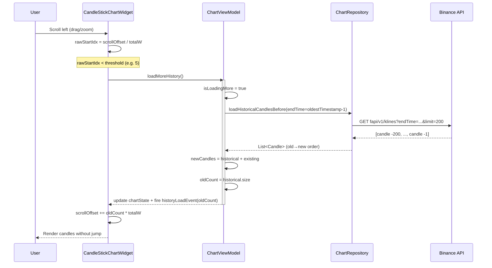

# Lazy Load Historical Candles (Infinite Scroll Backwards)

## Проблема

Сейчас при скролле/зуме влево (к началу временной шкалы) появляется пустое место слева от первой свечи (индекс 0). Исторические свечи не догружаются.

## Текущая архитектура

```
CandleStickChartWidget  ←  ChartViewModel  ←  ChartRepository(platform-core)
                                                  ↓
                                            ChartAdapter(public-api)
                                                  ↓
                                          BinanceChartAdapter(provider)
                                                  ↓
                                   Binance API fapi/v1/klines
```

- `ChartViewModel.chartState` хранит `List<Candle>` в `ChartState.Success`
- `CandleStickChartWidget` вычисляет `startIdx = (scrollOffset / totalW).toInt()`
- Когда `scrollOffset` большой, `startIdx` может быть < 0 (пустое место)
- `ChartAdapter.getCandles(symbol, interval, limit)` — всегда загружает последние N свечей (без `endTime`)

## План изменений

---

### Шаг 1: ChartAdapter — новый метод getCandlesBefore

**Файл**: [`public-api/api-market/src/commonMain/kotlin/com.aandios.nous.api.market/adapters/ChartAdapter.kt`](../../public-api/api-market/src/commonMain/kotlin/com.aandios.nous.api.market/adapters/ChartAdapter.kt)

Добавить метод с default-реализацией (чтобы не сломать другие реализации):

```kotlin
suspend fun getCandlesBefore(
    symbol: String,
    interval: String,
    endTime: Long,
    limit: Int = 500
): List<Candle> = getCandles(symbol, interval, limit)
```

---

### Шаг 2: BinanceChartAdapter — реализация getCandlesBefore

**Файл**: [`providers/binance-provider/src/commonMain/kotlin/com/aandios/nous/provider/binance/adapter/BinanceChartAdapter.kt`](../../providers/binance-provider/src/commonMain/kotlin/com/aandios/nous/provider/binance/adapter/BinanceChartAdapter.kt)

Binance API `fapi/v1/klines` поддерживает параметр `endTime`. Если передать `endTime` = timestamp самой первой свечи - 1ms, API вернёт свечи ДО этой даты.

```kotlin
override suspend fun getCandlesBefore(
    symbol: String,
    interval: String,
    endTime: Long,
    limit: Int
): List<Candle> {
    val response: List<List<String>> = client.get("https://fapi.binance.com/fapi/v1/klines") {
        url {
            parameters.append("symbol", symbol)
            parameters.append("interval", interval)
            parameters.append("endTime", endTime.toString())
            parameters.append("limit", limit.toString())
        }
    }.body()
    return response.map { ... }.reversed() // reversed: от новых к старым
}
```

**Важно**: Binance возвращает свечи от старой к новой. Для prepend'a в начало списка нам удобнее получить reversed — от новой (самой близкой к endTime) к старой. Либо возвращаем как есть и prepend'им по одной.

Решение: возвращаем `reversed()` — от ближайшей к endTime (самая правая) к самой старой (самая левая). При prepend'е мы их будем добавлять одну за другой в начало списка, начиная с самой старой. Нет, это неудобно.

Лучше: оставить как есть (старые → новые), а prepend делать в обратном порядке.

---

### Шаг 3: ChartRepository (платформа) — добавить метод

**Файл**: Создать или дополнить интерфейс `ChartRepository` в `platform-core`

Сейчас есть `getChart(ticker, timeframe): Flow<List<Candle>>`. Добавим:

```kotlin
suspend fun loadHistoricalCandlesBefore(
    ticker: String,
    timeframe: String,
    endTime: Long,
    limit: Int = 200
): List<Candle>
```

**Файл**: [`platform-core/src/commonMain/kotlin/com/aandios/nous/core/data/repository/ChartRepositoryImpl.kt`](../../platform-core/src/commonMain/kotlin/com/aandios/nous/core/data/repository/ChartRepositoryImpl.kt)

Реализация:

```kotlin
override suspend fun loadHistoricalCandlesBefore(
    ticker: String,
    timeframe: String,
    endTime: Long,
    limit: Int
): List<Candle> {
    val symbol = ticker.replace("/", "")
    return chartAdapter.getCandlesBefore(symbol, mapTimeframe(timeframe), endTime, limit)
}
```

---

### Шаг 4: ChartViewModel — логика догрузки

**Файл**: [`features/feature-chart/src/commonMain/kotlin/com/aandios/nous/feature/chart/ui/ChartViewModel.kt`](../../features/feature-chart/src/commonMain/kotlin/com/aandios/nous/feature/chart/ui/ChartViewModel.kt)

Добавить:
- Поле `private var isLoadingMore = false` (флаг, чтобы не плодить запросы)
- Поле `private var oldestTimestamp: Long = Long.MAX_VALUE` — timestamp самой старой свечи
- Метод `fun loadMoreHistory()`:

```kotlin
fun loadMoreHistory() {
    if (isLoadingMore) return
    isLoadingMore = true
    
    viewModelScope.launch {
        try {
            val state = _chartState.value
            if (state !is ChartState.Success) return@launch
            
            val oldestTime = state.candles.firstOrNull()?.timestamp ?: return@launch
            
            val historicalCandles = chartRepository.loadHistoricalCandlesBefore(
                ticker = _currentSymbol.value,
                timeframe = _currentTimeframe.value,
                endTime = oldestTime - 1,
                limit = 200
            )
            
            if (historicalCandles.isEmpty()) {
                isLoadingMore = false
                return@launch
            }
            
            val newCandles = historicalCandles + state.candles
            oldestTimestamp = newCandles.first().timestamp
            
            _chartState.value = state.copy(candles = newCandles)
        } catch (e: Exception) {
            println("Failed to load more history: ${e.message}")
        } finally {
            isLoadingMore = false
        }
    }
}
```

Также нужно передать количество загруженных свечей обратно в Widget, чтобы скорректировать `scrollOffset`. Варианты:
1. Возвращать `Pair<List<Candle>, Int>` (количество новых свечей)
2. Использовать callback `onHistoryLoaded(newCandlesCount: Int)` — передать в Widget

Выберем вариант 2: добавить callback.

Изменим сигнатуру `loadMoreHistory`:

```kotlin
fun loadMoreHistory(onResult: (loadedCount: Int) -> Unit = {})
```

Но это не очень чисто. Лучше сделать событие:

```kotlin
private val _historyLoadEvent = MutableSharedFlow<Int>()
val historyLoadEvent: SharedFlow<Int> = _historyLoadEvent.asSharedFlow()
```

И в Widget'е слушать это событие и корректировать scrollOffset.

Или ещё проще: пусть ViewModel сама принимает `onHistoryLoaded` лямбду, или возвращает количество через callback:

Упростим: Метод `loadMoreHistory` возвращает `Int` (количество загруженных свечей) через результат, а в Widget'е вызываем так:

```kotlin
viewModel.loadMoreHistory { count ->
    scrollOffset += count * totalW
}
```

---

### Шаг 5: CandleStickChartWidget — детекция пустого места

**Файл**: [`features/feature-chart/src/commonMain/kotlin/com/aandios/nous/feature/chart/ui/CandleStickChartWidget.kt`](../../features/feature-chart/src/commonMain/kotlin/com/aandios/nous/feature/chart/ui/CandleStickChartWidget.kt)

Сейчас `startIdx` вычисляется:

```kotlin
val startIdx = (clampedOffset / totalW).toInt().coerceIn(0, max(0, candles.size - 1))
```

Когда `clampedOffset / totalW > 0`, мы смещены вправо (показываем более новые свечи). Когда `clampedOffset` маленький или ноль — мы у самого начала (самые старые свечи).

Чтобы детектировать что нужно догрузить историю:

```kotlin
// Порог: если осталось меньше 10 свечей до начала, догружаем
val SCROLL_THRESHOLD = 10

val rawStartIdx = (scrollOffset / totalW).toInt()
val startIdx = rawStartIdx.coerceIn(0, max(0, candles.size - 1))

// Если виртуальный индекс < порога — нужно догрузить
if (rawStartIdx < SCROLL_THRESHOLD && !isLoadingMore && hasMoreHistory) {
    onNeedMoreHistory()
}
```

Но это будет срабатывать на каждой композиции. Нужно:
1. Использовать `LaunchedEffect` с ключом `rawStartIdx`
2. Или флаг `needsLoad`

Проблема: `rawStartIdx` меняется при скролле очень часто. `LaunchedEffect` на каждый rawStartIdx будет перезапускаться.

Лучшее решение: вынести логику загрузки в `snapshotFlow`:

```kotlin
// Отслеживаем когда нужно загрузить больше истории
val isLoadingMore = remember { mutableStateOf(false) }
val hasMoreHistory = remember { mutableStateOf(true) }

if (hasMoreHistory.value && !isLoadingMore.value) {
    LaunchedEffect(Unit) {
        snapshotFlow { scrollOffset }
            .map { offset -> (offset / totalW).toInt() }
            .distinctUntilChanged()
            .collect { rawIdx ->
                if (rawIdx < SCROLL_THRESHOLD && hasMoreHistory.value) {
                    isLoadingMore.value = true
                    viewModel.loadMoreHistory { count ->
                        if (count > 0) {
                            scrollOffset += count * totalW
                        } else {
                            hasMoreHistory.value = false
                        }
                        isLoadingMore.value = false
                    }
                }
            }
    }
}
```

---

### Шаг 6: UI — прогресс/индикатор загрузки в пустом месте

Пока история загружается, на пустом месте можно показывать:
- Серый прямоугольник с текстом "Loading more history..."
- Или просто спиннер

Это опциональный UX-шаг, можно сделать отдельно. Для MVP — достаточно чтобы свечи догружались без индикатора.

---

### Шаг 7: ChartWindow — проброс onNeedMoreHistory

**Файл**: [`features/feature-chart/src/commonMain/kotlin/com/aandios/nous/feature/chart/ui/ChartWindow.kt`](../../features/feature-chart/src/commonMain/kotlin/com/aandios/nous/feature/chart/ui/ChartWindow.kt)

ChartWidget принимает колбэк `onNeedMoreHistory`, который вызывает `chartViewModel.loadMoreHistory`.

---

## Sequence Diagram



## Изменяемые файлы

| # | Файл | Изменение |
|---|------|-----------|
| 1 | `public-api/api-market/.../ChartAdapter.kt` | Добавить `getCandlesBefore` с default impl |
| 2 | `providers/binance-provider/.../BinanceChartAdapter.kt` | Реализовать `getCandlesBefore` с `endTime` |
| 3 | `platform-core/.../repository/ChartRepository.kt` | Добавить `loadHistoricalCandlesBefore` |
| 4 | `platform-core/.../repository/ChartRepositoryImpl.kt` | Реализовать `loadHistoricalCandlesBefore` |
| 5 | `features/feature-chart/.../ChartViewModel.kt` | Добавить `loadMoreHistory`, `isLoadingMore` |
| 6 | `features/feature-chart/.../CandleStickChartWidget.kt` | Детекция пустого места, вызов `loadMoreHistory`, коррекция `scrollOffset` |
| 7 | `features/feature-chart/.../ChartWindow.kt` | Проброс колбэка/события |
