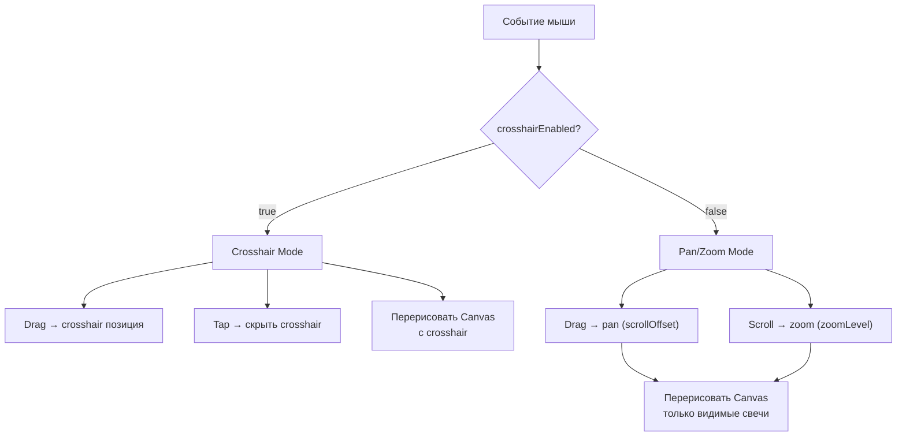

# План: Pan, Zoom и Crosshair Toggle для feature-chart

## Цель
Добавить в `CandleStickChart` панарамическое пролистывание свечей мышкой, зум колёсиком мыши, и переключаемый crosshair через кнопку в тулбаре — базовое TradingView-подобное поведение.

---

## Изменяемые файлы

### 1. [`CandleStickChartWidget.kt`](../features/feature-chart/src/commonMain/kotlin/com/aandios/nous/feature/chart/ui/CandleStickChartWidget.kt)

#### Что меняется:

**A. Новые параметры `CandleStickChart` composable:**
- `crosshairEnabled: Boolean = false` — включён ли режим crosshair (по умолч. выкл)
- `onCrosshairEnabledChange: (Boolean) -> Unit = {}` — колбэк для тулбара

Старый `showCrosshair: Boolean` убирается.

**B. Внутреннее состояние (внутри composable):**
- `scrollOffset: Float` — пиксельный сдвиг влево (0 = правый край, самые новые свечи)
- `zoomLevel: Float` — множитель ширины свечи (0.3..5.0, по умолч. 1.0)
- `maxScrollOffset: Float` — максимальный скролл (полная виртуальная ширина − ширина чарта)

**C. Инициализация скролла после загрузки данных:**
- При обновлении `candles` → `scrollOffset = maxScrollOffset` (показываем последние свечи)

**D. Обработка жестов:**

| Действие | Crosshair выкл (по умолч.) | Crosshair вкл |
|-----------|---------------------------|---------------|
| **Drag (ЛКМ)** | Pan: `scrollOffset -= delta.x` | Crosshair (текущее поведение) |
| **Tap** | Ничего | Скрыть crosshair |
| **Scroll wheel** | Zoom: `zoomLevel *= factor` | Zoom: `zoomLevel *= factor` |

- Используем `detectDragGestures` с ветвлением по `crosshairEnabled`
- Для scroll wheel: `Modifier.pointerInput` с `awaitPointerEvent(PointerEventType.Scroll)` или `detectTransformGestures`

**E. Рендеринг (Canvas):**
- `calculateCandleMetrics` вызывается с `chartArea.width * zoomLevel` как виртуальная ширина
- Вычисляется `visibleStartIndex` и `visibleEndIndex` на основе `scrollOffset`, `zoomLevel` и ширины области
- Только свечи в видимом диапазоне рисуются (оптимизация)
- `scrollOffset` ограничен `[0, maxScrollOffset]`

**F. Crosshair rendering:**
- Условие отрисовки crosshair: `crosshairEnabled && isCrosshairVisible && mousePosition != null`
- (Вместо `showCrosshair`)

#### Псевдокод ключевого composable:
```kotlin
@Composable
fun CandleStickChart(
    candles: List<Candle>,
    currentPrice: Float? = null,
    modifier: Modifier = Modifier,
    config: ChartConfig = DefaultChartConfig,
    showPriceScale: Boolean = true,
    priceScaleWidth: Dp = 60.dp,
    crosshairEnabled: Boolean = false,        // NEW
    onCrosshairEnabledChange: (Boolean) -> Unit = {}, // NEW
) {
    var mousePosition by remember { mutableStateOf<Offset?>(null) }
    var isCrosshairVisible by remember { mutableStateOf(false) }
    var scrollOffset by remember { mutableFloatStateOf(0f) }
    var zoomLevel by remember { mutableFloatStateOf(1f) }

    val priceRange = remember(candles, currentPrice) { calculatePriceRangeWithCurrentPrice(candles, currentPrice) }

    // Инициализация скролла при новых данных
    LaunchedEffect(candles) {
        val virtualWidth = candles.size * (chartArea.width / candles.size.coerceAtLeast(1)) * zoomLevel
        maxScrollOffset = max(0f, virtualWidth - chartArea.width)
        scrollOffset = maxScrollOffset  // показываем последние свечи
    }

    BoxWithConstraints(
        modifier
            .fillMaxSize()
            .background(...)
            .pointerInput(crosshairEnabled) {
                if (crosshairEnabled) {
                    detectTapGestures(onTap = { isCrosshairVisible = false })
                    detectDragGestures(
                        onDragStart = { isCrosshairVisible = true; mousePosition = it },
                        onDrag = { change, _ -> mousePosition = change.position },
                    )
                } else {
                    detectDragGestures(
                        onDrag = { change, _ ->
                            scrollOffset = (scrollOffset - change.positionChange().x)
                                .coerceIn(0f, maxScrollOffset)
                        },
                    )
                }
            }
            .pointerInput(Unit) {
                // Scroll wheel for zoom
                awaitPointerEventScope {
                    while (true) {
                        val event = awaitPointerEvent(PointerEventType.Scroll)
                        val scrollDelta = event.changes.first().scrollDelta
                        val factor = if (scrollDelta.y > 0) 1.1f else 1/1.1f
                        zoomLevel = (zoomLevel * factor).coerceIn(0.3f, 5.0f)
                    }
                }
            }
    ) {
        // ... layout calculation ...
        
        Canvas(modifier.fillMaxSize().clipToBounds()) {
            // Рисуем только видимые свечи
            val candleMetrics = calculateCandleMetrics(candles.size, chartArea.width * zoomLevel)
            val totalW = candleMetrics.width + candleMetrics.spacing
            
            val startIdx = (scrollOffset / totalW).toInt().coerceIn(0, candles.size - 1)
            val endIdx = ((scrollOffset + chartArea.width) / totalW).toInt() + 1
            
            for (i in startIdx..minOf(endIdx, candles.size - 1)) {
                val x = i * totalW - scrollOffset + candleMetrics.width / 2
                drawCandle(candles[i], centerX = x, ...)
            }
            
            // Crosshair
            if (crosshairEnabled && isCrosshairVisible && mousePosition != null) {
                drawCrosshair(...)
            }
        }
    }
}
```

---

### 2. [`ChartToolbar.kt`](../features/feature-chart/src/commonMain/kotlin/com/aandios/nous/feature/chart/ui/ChartToolbar.kt)

#### Что меняется:

**A. Новые параметры `ChartToolbar`:**
- `crosshairEnabled: Boolean = false`
- `onCrosshairToggle: () -> Unit = {}`

**B. Добавляется кнопка crosshair:**
- Unicode символ `☩` (CROSS OF JERUSALEM) или `⊕` или `✚`
- Стиль: полупрозрачная круглая/скруглённая кнопка
- Активное состояние: `accentColor` (голубой), неактивное: `Color.White.copy(alpha = 0.45f)`
- Расположение: справа от таймфреймов

```kotlin
@Composable
fun ChartToolbar(
    currentSymbol: String,
    currentTimeframe: String,
    availableSymbols: List<String>,
    onSymbolChange: (String) -> Unit,
    onTimeframeChange: (String) -> Unit,
    crosshairEnabled: Boolean = false,     // NEW
    onCrosshairToggle: () -> Unit = {},     // NEW
    modifier: Modifier = Modifier,
)
```

---

### 3. [`ChartWindow.kt`](../features/feature-chart/src/commonMain/kotlin/com/aandios/nous/feature/chart/ui/ChartWindow.kt)

#### Что меняется:

**A. State для crosshair:**
```kotlin
var crosshairEnabled by remember { mutableStateOf(false) }
```

**B. Прокидываем в `CandleStickChart`:**
```kotlin
CandleStickChart(
    candles = state.candles,
    currentPrice = state.currentPrice,
    modifier = Modifier.fillMaxSize(),
    crosshairEnabled = crosshairEnabled,
    onCrosshairEnabledChange = { crosshairEnabled = it },
)
```

**C. Прокидываем в `ChartToolbar`:**
```kotlin
ChartToolbar(
    ...
    crosshairEnabled = crosshairEnabled,
    onCrosshairToggle = { crosshairEnabled = !crosshairEnabled },
)
```

---

## Порядок выполнения (TODO)

1. **CandleStickChartWidget.kt** — добавить `crosshairEnabled`/`onCrosshairEnabledChange` параметры, убрать `showCrosshair`
2. **CandleStickChartWidget.kt** — добавить `scrollOffset`, `zoomLevel` состояния, логику пана (drag), зума (scroll)
3. **CandleStickChartWidget.kt** — изменить рендеринг: только видимые свечи, с учётом scrollOffset и zoomLevel
4. **CandleStickChartWidget.kt** — ветвление жестов по `crosshairEnabled`
5. **ChartToolbar.kt** — добавить кнопку crosshair с иконкой
6. **ChartWindow.kt** — добавить crosshair state, прокинуть в toolbar и chart
7. Собрать и запустить (`./gradlew :features:feature-chart:run`)

---

## Диаграмма потока жестов



---

## После реализации

Пользователь получит:
- **Pan**: перетаскивание графика влево/вправо для просмотра истории свечей
- **Zoom**: колёсико мыши для приближения/отдаления
- **Crosshair toggle**: кнопка `☩` в тулбаре — включает режим кроссхаира (отключён по умолчанию)
- **Оптимизация**: рисуются только свечи, попадающие в видимую область
