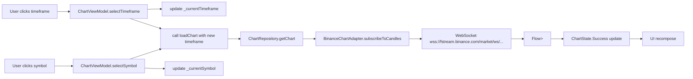

# План: Toolbar для Chart (Timeframes + Symbol Selector)

## 1. Создать `ChartToolbar.kt`

**Файл:** [`features/feature-chart/src/commonMain/kotlin/com/aandios/nous/feature/chart/ui/ChartToolbar.kt`](features/feature-chart/src/commonMain/kotlin/com/aandios/nous/feature/chart/ui/ChartToolbar.kt)

### Компоненты:

#### `TimeframeSelector`
- **Ряд** маленьких прозрачных кнопок для: `1m`, `5m`, `15m`, `30m`, `1h`, `4h`, `1d`, `1w`
- Текущий активный timeframe выделен (например, подчёркивание или белый текст vs серый)
- `Modifier.background(Color.Black.copy(alpha = 0.3f))` — полупрозрачный фон
- Маленький padding, compact layout

#### `SymbolSelector`
- Отображает текущий символ (например, "BTCUSDT") слева от кнопок таймфреймов
- При клике — открывается `DropdownMenu` с `TextField` для поиска
- При вводе текста фильтруется список: `symbols.filter { it.contains(query, ignoreCase = true) }`
- При клике на элемент из списка — `onSymbolChange(symbol)` и dropdown закрывается
- Список символов загружается из `SymbolInfoAdapter.getAllSymbolsInfo()` — показываем только символы со статусом `"TRADING"`
- Отображаем в формате `"BTCUSDT"` (raw symbol) или `"BTC / USDT"` (с пробелом)

#### `ChartToolbar` (главный composable)
```kotlin
@Composable
fun ChartToolbar(
    currentSymbol: String,
    currentTimeframe: String,
    availableSymbols: List<String>,   // отфильтрованный список "TRADING" symbols
    onSymbolChange: (String) -> Unit,
    onTimeframeChange: (String) -> Unit,
    modifier: Modifier = Modifier
)
```

**Layout:**
```
┌─────────────────────────────────────────────────┐
│ [ BTCUSDT ▼ ]  [1m] [5m] [15m] [30m] [1h] ...  │
└─────────────────────────────────────────────────┘
  ^-- SymbolSelector         ^-- TimeframeSelector
```

- `Row` с `verticalAlignment = Alignment.CenterVertically`
- SymbolSelector слева, небольшой отступ, затем TimeframeSelector

---

## 2. Обновить `ChartViewModel.kt`

**Файл:** [`features/feature-chart/src/commonMain/kotlin/com/aandios/nous/feature/chart/ui/ChartViewModel.kt`](features/feature-chart/src/commonMain/kotlin/com/aandios/nous/feature/chart/ui/ChartViewModel.kt)

### Изменения:

1. **Добавить параметр `symbolInfoAdapter: SymbolInfoAdapter` в конструктор**
   ```kotlin
   class ChartViewModel(
       private val chartRepository: ChartRepository,
       private val symbolInfoAdapter: SymbolInfoAdapter
   )
   ```

2. **Добавить состояния:**
   ```kotlin
   private val _currentSymbol = MutableStateFlow("BTCUSDT")
   val currentSymbol: StateFlow<String> = _currentSymbol.asStateFlow()

   private val _currentTimeframe = MutableStateFlow("1h")
   val currentTimeframe: StateFlow<String> = _currentTimeframe.asStateFlow()

   private val _symbols = MutableStateFlow<List<String>>(emptyList())
   val symbols: StateFlow<List<String>> = _symbols.asStateFlow()
   ```

3. **Загрузка списка символов при инициализации:**
   ```kotlin
   init {
       loadSymbols()
   }

   private fun loadSymbols() {
       viewModelScope.launch {
           try {
               val allSymbols = symbolInfoAdapter.getAllSymbolsInfo()
               val tradingSymbols = allSymbols
                   .filter { it.status == "TRADING" }
                   .map { it.symbol }    // или "it.baseAsset / it.quoteAsset"
                   .sorted()
               _symbols.value = tradingSymbols
           } catch (e: Exception) {
               println("Failed to load symbols: ${e.message}")
               _symbols.value = listOf("BTCUSDT", "ETHUSDT") // fallback
           }
       }
   }
   ```

4. **Методы `selectSymbol` и `selectTimeframe`:**
   ```kotlin
   fun selectSymbol(symbol: String) {
       _currentSymbol.value = symbol
       loadChart(ticker = symbol, timeframe = _currentTimeframe.value)
   }

   fun selectTimeframe(timeframe: String) {
       _currentTimeframe.value = timeframe
       loadChart(ticker = _currentSymbol.value, timeframe = timeframe)
   }
   ```

---

## 3. Обновить `FeatureChartModule.kt` (DI)

**Файл:** [`features/feature-chart/src/commonMain/kotlin/com/aandios/nous/feature/chart/di/FeatureChartModule.kt`](features/feature-chart/src/commonMain/kotlin/com/aandios/nous/feature/chart/di/FeatureChartModule.kt)

### Изменения:

1. **Добавить import для `SymbolInfoAdapter`**
   ```kotlin
   import com.aandios.nous.api.market.adapters.SymbolInfoAdapter
   ```

2. **Добавить бин `SymbolInfoAdapter`:**
   ```kotlin
   // 3a. SymbolInfo adapter из провайдера
   single<SymbolInfoAdapter> {
       get<Provider>().symbolInfo ?: error("SymbolInfo adapter not available")
   }
   ```

3. **Обновить фабрику `ChartViewModel`:**
   ```kotlin
   factory {
       ChartViewModel(
           chartRepository = get(),
           symbolInfoAdapter = get()
       )
   }
   ```

---

## 4. Обновить `ChartWindow.kt`

**Файл:** [`features/feature-chart/src/commonMain/kotlin/com/aandios/nous/feature/chart/ui/ChartWindow.kt`](features/feature-chart/src/commonMain/kotlin/com/aandios/nous/feature/chart/ui/ChartWindow.kt)

### Изменения:

1. **Добавить collector для новых состояний:**
   ```kotlin
   val currentSymbol by chartViewModel.currentSymbol.collectAsState()
   val currentTimeframe by chartViewModel.currentTimeframe.collectAsState()
   val symbols by chartViewModel.symbols.collectAsState()
   ```

2. **Добавить `ChartToolbar` поверх графика:**
   - Используем `Column` или `Box` с overlay
   - Toolbar располагается в верхней части окна, накладываясь полупрозрачно на график
   
   ```kotlin
   Box(modifier = Modifier.fillMaxSize()) {
       // Chart (full size)
       when (val state = chartState) {
           is ChartState.Success -> {
               CandleStickChart(
                   candles = state.candles,
                   currentPrice = state.currentPrice,
                   modifier = Modifier.fillMaxSize()
               )
           }
           // ... loading, error states
       }

       // Toolbar overlay (top-left)
       ChartToolbar(
           currentSymbol = currentSymbol,
           currentTimeframe = currentTimeframe,
           availableSymbols = symbols,
           onSymbolChange = { chartViewModel.selectSymbol(it) },
           onTimeframeChange = { chartViewModel.selectTimeframe(it) },
           modifier = Modifier
               .align(Alignment.TopStart)
               .padding(8.dp)
       )
   }
   ```

---

## 5. Изменения в `ChartState.Success` (опционально)

Если нужно передавать текущие symbol/timeframe для заголовка окна или других целей — можно расширить `ChartState.Success`, но не обязательно, так как они уже есть в отдельных `StateFlow`.

---

## Диаграмма потока данных



---

## Сводка файлов для изменения/создания

| Файл | Действие |
|------|----------|
| `features/feature-chart/src/commonMain/.../ui/ChartToolbar.kt` | **Создать** — компонент toolbar |
| `features/feature-chart/src/commonMain/.../ui/ChartViewModel.kt` | **Изменить** — добавить SymbolInfoAdapter, состояния, методы |
| `features/feature-chart/src/commonMain/.../di/FeatureChartModule.kt` | **Изменить** — добавить бин SymbolInfoAdapter, обновить конструктор ViewModel |
| `features/feature-chart/src/commonMain/.../ui/ChartWindow.kt` | **Изменить** — вставить ChartToolbar overlay |

**composeApp и другие модули не трогаем.**
