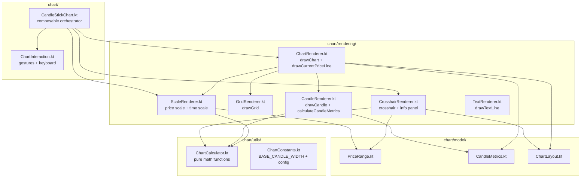

# Рефакторинг CandleStickChartWidget.kt

## Текущее состояние

Файл [`CandleStickChartWidget.kt`](features/feature-chart/src/commonMain/kotlin/com/aandios/nous/feature/chart/ui/CandleStickChartWidget.kt) содержит **1195 строк** в одном файле пакета `ui`. Всё — data classes, composable, обработка жестов, рендеринг — в одном файле.

## Целевая архитектура



## Детальная структура файлов

### 1. [`features/feature-chart/src/commonMain/kotlin/com/aandios/nous/feature/chart/model/PriceRange.kt`](features/feature-chart/src/commonMain/kotlin/com/aandios/nous/feature/chart/model/PriceRange.kt)

**SRP:** Модель диапазона цен

```kotlin
package com.aandios.nous.feature.chart.model

data class PriceRange(
    val max: Float,
    val min: Float,
    val visibleMax: Float,
    val visibleMin: Float,
    val range: Float
)
```

**Переносим из:** CandleStickChartWidget.kt строки 48-54

---

### 2. [`features/feature-chart/src/commonMain/kotlin/com/aandios/nous/feature/chart/model/CandleMetrics.kt`](features/feature-chart/src/commonMain/kotlin/com/aandios/nous/feature/chart/model/CandleMetrics.kt)

**SRP:** Модель метрик свечи

```kotlin
package com.aandios.nous.feature.chart.model

data class CandleMetrics(
    val width: Float,
    val spacing: Float
)
```

**Переносим из:** CandleStickChartWidget.kt строки 56-59

---

### 3. [`features/feature-chart/src/commonMain/kotlin/com/aandios/nous/feature/chart/model/ChartLayout.kt`](features/feature-chart/src/commonMain/kotlin/com/aandios/nous/feature/chart/model/ChartLayout.kt)

**SRP:** Модель layout графика

```kotlin
package com.aandios.nous.feature.chart.model

import androidx.compose.ui.geometry.Rect

data class ChartLayout(
    val canvasWidth: Float,
    val canvasHeight: Float,
    val priceScaleWidth: Float,
    val chartArea: Rect,
    val priceScaleArea: Rect,
    val chartPadding: Float = 8f,
    val timeScaleHeight: Float = 20f,
    val chartMainArea: Rect,
    val timeScaleArea: Rect
)
```

**Переносим из:** CandleStickChartWidget.kt строки 61-71

---

### 4. [`features/feature-chart/src/commonMain/kotlin/com/aandios/nous/feature/chart/utils/ChartConstants.kt`](features/feature-chart/src/commonMain/kotlin/com/aandios/nous/feature/chart/utils/ChartConstants.kt)

**SRP:** Константы графика

```kotlin
package com.aandios.nous.feature.chart.utils

const val BASE_CANDLE_WIDTH = 8f
const val MAX_SCROLL_LEFT = 300f
const val ZOOM_MIN = 0.25f
const val ZOOM_MAX = 4.0f
const val ZOOM_FACTOR_IN = 1.15f
const val ZOOM_FACTOR_OUT = 1f / 1.15f
```

**Переносим из:** CandleStickChartWidget.kt строки 99, 1066 (и хардкод значений из зума)

---

### 5. [`features/feature-chart/src/commonMain/kotlin/com/aandios/nous/feature/chart/utils/ChartCalculator.kt`](features/feature-chart/src/commonMain/kotlin/com/aandios/nous/feature/chart/utils/ChartCalculator.kt)

**SRP:** Чистые математические функции (без DrawScope)

```kotlin
package com.aandios.nous.feature.chart.utils

import com.aandios.nous.api.market.model.Candle
import com.aandios.nous.feature.chart.model.CandleMetrics
import com.aandios.nous.feature.chart.model.PriceRange
import kotlin.math.abs

fun calculateCandleMetrics(zoomLevel: Float): CandleMetrics { ... }

fun calculatePriceRangeWithCurrentPrice(
    candles: List<Candle>,
    currentPrice: Float?
): PriceRange { ... }

fun findNearestCandleIndex(
    mouseX: Float,
    candles: List<Candle>,
    chartWidth: Float,
    scrollOffset: Float = 0f,
    zoomLevel: Float = 1f,
): Int { ... }

fun priceFromY(
    y: Float,
    priceRange: PriceRange,
    chartHeight: Float
): Float { ... }

fun priceToY(
    price: Float,
    priceRange: PriceRange,
    height: Float
): Float { ... }

fun generatePriceLevels(min: Float, max: Float, count: Int): List<Float> { ... }
```

**Переносим из:** CandleStickChartWidget.kt: 
- `findNearestCandleIndex()` — 474-490
- `priceFromY()` — 493-499
- `calculatePriceRangeWithCurrentPrice()` — 1007-1038
- `priceToY()` — 1041-1043
- `calculateCandleMetrics()` — 1070-1075 (вызов BASE_CANDLE_WIDTH)
- `generatePriceLevels()` — 1185-1195

**Важно:** `priceToY()` сейчас — extension на DrawScope, станет чистой функцией, т.к. не использует DrawScope.

---

### 6. [`features/feature-chart/src/commonMain/kotlin/com/aandios/nous/feature/chart/ui/chart/ChartInteraction.kt`](features/feature-chart/src/commonMain/kotlin/com/aandios/nous/feature/chart/ui/chart/ChartInteraction.kt)

**SRP:** Обработка пользовательского ввода (клавиатура + жесты)

```kotlin
package com.aandios.nous.feature.chart.ui.chart

// Содержит:
// 1. chartKeyboardModifier() — onKeyEvent для Ctrl
// 2. chartPointerInputModifier() — pan + crosshair + zoom
```

**Аргументы:** все стейты, callback'и

**Переносим из:** CandleStickChartWidget.kt:
- `.onKeyEvent { }` блок — строки 113-120
- `.pointerInput(crosshairEnabled) { }` — строки 122-149
- `.pointerInput(Unit) { }` (zoom) — строки 151-181

---

### 7. [`features/feature-chart/src/commonMain/kotlin/com/aandios/nous/feature/chart/ui/chart/CandleStickChart.kt`](features/feature-chart/src/commonMain/kotlin/com/aandios/nous/feature/chart/ui/chart/CandleStickChart.kt)

**SRP:** Основной composable, оркестратор. Остаётся ~150-200 строк.

**Переносим из:** CandleStickChartWidget.kt:
- Сигнатура `CandleStickChart()` — строки 73-86
- Состояния — строки 89-99
- `BoxWithConstraints` — строки 105-183
- Тело (layout, LaunchedEffects, Canvas) — строки 184-362

Старый файл `CandleStickChartWidget.kt` удаляется (rename).

---

### 8. [`features/feature-chart/src/commonMain/kotlin/com/aandios/nous/feature/chart/rendering/TextRenderer.kt`](features/feature-chart/src/commonMain/kotlin/com/aandios/nous/feature/chart/rendering/TextRenderer.kt)

**SRP:** Отрисовка текста

```kotlin
package com.aandios.nous.feature.chart.rendering

import androidx.compose.ui.graphics.Color
import androidx.compose.ui.graphics.drawscope.DrawScope
import androidx.compose.ui.text.TextMeasurer
import androidx.compose.ui.text.drawText

fun DrawScope.drawTextLine(
    text: String,
    x: Float,
    y: Float,
    textMeasurer: TextMeasurer,
    color: Color
) { ... }
```

**Переносим из:** CandleStickChartWidget.kt строки 659-681

---

### 9. [`features/feature-chart/src/commonMain/kotlin/com/aandios/nous/feature/chart/rendering/GridRenderer.kt`](features/feature-chart/src/commonMain/kotlin/com/aandios/nous/feature/chart/rendering/GridRenderer.kt)

**SRP:** Отрисовка сетки

```kotlin
package com.aandios.nous.feature.chart.rendering

import androidx.compose.ui.graphics.drawscope.DrawScope
import com.aandios.nous.feature.chart.ui.ChartConfig

fun DrawScope.drawGrid(
    config: ChartConfig,
    width: Float,
    height: Float
) { ... }
```

**Переносим из:** CandleStickChartWidget.kt строки 1078-1110

---

### 10. [`features/feature-chart/src/commonMain/kotlin/com/aandios/nous/feature/chart/rendering/CandleRenderer.kt`](features/feature-chart/src/commonMain/kotlin/com/aandios/nous/feature/chart/rendering/CandleRenderer.kt)

**SRP:** Отрисовка свечей

```kotlin
package com.aandios.nous.feature.chart.rendering

fun DrawScope.drawCandle(
    candle: Candle,
    centerX: Float,
    priceRange: PriceRange,
    metrics: CandleMetrics,
    config: ChartConfig,
    chartHeight: Float
) { ... }
```

**Переносим из:** CandleStickChartWidget.kt строки 1113-1182

---

### 11. [`features/feature-chart/src/commonMain/kotlin/com/aandios/nous/feature/chart/rendering/ChartRenderer.kt`](features/feature-chart/src/commonMain/kotlin/com/aandios/nous/feature/chart/rendering/ChartRenderer.kt)

**SRP:** Оркестратор отрисовки графика (chart area — свечи + сетка + цена)

```kotlin
package com.aandios.nous.feature.chart.rendering

fun DrawScope.drawChart(
    candles: List<Candle>,
    priceRange: PriceRange,
    config: ChartConfig,
    chartArea: Rect,
    currentPrice: Float?,
    textMeasurer: TextMeasurer,
    scrollOffset: Float = 0f,
    zoomLevel: Float = 1f,
    visibleStartIndex: Int = 0,
    visibleEndIndex: Int = 0,
) { ... }

fun DrawScope.drawCurrentPriceLine(
    currentPrice: Float,
    priceRange: PriceRange,
    config: ChartConfig,
    chartHeight: Float,
    chartWidth: Float
) { ... }
```

**Переносим из:** CandleStickChartWidget.kt:
- `drawChart()` — строки 683-731
- `drawCurrentPriceLine()` — строки 1046-1063

---

### 12. [`features/feature-chart/src/commonMain/kotlin/com/aandios/nous/feature/chart/rendering/ScaleRenderer.kt`](features/feature-chart/src/commonMain/kotlin/com/aandios/nous/feature/chart/rendering/ScaleRenderer.kt)

**SRP:** Отрисовка шкал (цен + времени)

```kotlin
package com.aandios.nous.feature.chart.rendering

fun DrawScope.drawPriceScale(...) { ... }
fun DrawScope.drawPriceLevel(...) { ... }
fun DrawScope.drawCurrentPriceBadge(...) { ... }
fun DrawScope.drawCurrentPriceLabel(...) { ... }
fun DrawScope.drawTimeScale(...) { ... }
fun DrawScope.drawTimeLabelOnAxis(...) { ... }
```

**Переносим из:** CandleStickChartWidget.kt:
- `drawPriceScale()` — 734-784
- `drawCurrentPriceBadge()` — 786-840
- `drawTimeScale()` — 842-924
- `drawCurrentPriceLabel()` — 926-978
- `drawPriceLevel()` — 981-1006
- `drawTimeLabelOnAxis()` — 613-656

---

### 13. [`features/feature-chart/src/commonMain/kotlin/com/aandios/nous/feature/chart/rendering/CrosshairRenderer.kt`](features/feature-chart/src/commonMain/kotlin/com/aandios/nous/feature/chart/rendering/CrosshairRenderer.kt)

**SRP:** Отрисовка перекрестия

```kotlin
package com.aandios.nous.feature.chart.rendering

fun DrawScope.drawCrosshair(...) { ... }
fun DrawScope.drawInfoPanel(...) { ... }
fun DrawScope.drawPriceLabelOnAxis(...) { ... }
```

**Переносим из:** CandleStickChartWidget.kt:
- `drawCrosshair()` — 366-472
- `drawInfoPanel()` — 502-570
- `drawPriceLabelOnAxis()` — 573-610

---

## Порядок рефакторинга (безопасность)

### Шаг 1: Создать model/ пакет
1. Создать [`model/`](features/feature-chart/src/commonMain/kotlin/com/aandios/nous/feature/chart/model/) директорию
2. Создать `PriceRange.kt`, `CandleMetrics.kt`, `ChartLayout.kt`
3. Удалить data classes из `CandleStickChartWidget.kt`
4. Собрать проект — проверить

### Шаг 2: Создать utils/ пакет
1. Создать [`utils/`](features/feature-chart/src/commonMain/kotlin/com/aandios/nous/feature/chart/utils/) — но там уже есть `Format.kt`, так что добавить
2. Создать `ChartConstants.kt`, `ChartCalculator.kt`
3. Удалить перенесённые функции из `CandleStickChartWidget.kt`
4. Собрать проект — проверить

### Шаг 3: Создать rendering/ пакет
1. Создать [`rendering/`](features/feature-chart/src/commonMain/kotlin/com/aandios/nous/feature/chart/rendering/)
2. Создать все рендереры, скопировав код
3. Удалить все `private fun DrawScope.*` из `CandleStickChartWidget.kt`
4. `drawChart()` и `drawCurrentPriceLine()` станут public (или internal)
5. Собрать проект — проверить

### Шаг 4: Выделить ChartInteraction.kt
1. Создать [`ui/chart/`](features/feature-chart/src/commonMain/kotlin/com/aandios/nous/feature/chart/ui/chart/) директорию
2. Создать `ChartInteraction.kt` с функциями-расширениями для модификаторов
3. Вставить их в `CandleStickChartWidget.kt` (переименовать в `CandleStickChart.kt`)
4. Собрать проект — проверить

### Шаг 5: Финальная очистка
1. Удалить старый файл `CandleStickChartWidget.kt`
2. Переименовать composable обратно в `CandleStickChart` (название уже совпадает)
3. Проверить импорты в `ChartWindow.kt` (там используется `CandleStickChart`)
4. Собрать финально

## Итого: новые файлы

| # | Файл | Строки | Назначение |
|---|------|--------|------------|
| 1 | `model/PriceRange.kt` | ~8 | Data class |
| 2 | `model/CandleMetrics.kt` | ~8 | Data class |
| 3 | `model/ChartLayout.kt` | ~12 | Data class |
| 4 | `utils/ChartConstants.kt` | ~10 | Константы |
| 5 | `utils/ChartCalculator.kt` | ~60 | Чистые функции |
| 6 | `rendering/TextRenderer.kt` | ~25 | Рендеринг текста |
| 7 | `rendering/GridRenderer.kt` | ~35 | Сетка |
| 8 | `rendering/CandleRenderer.kt` | ~70 | Свечи |
| 9 | `rendering/ChartRenderer.kt` | ~55 | График (оркестратор) |
| 10 | `rendering/ScaleRenderer.kt` | ~200 | Шкалы |
| 11 | `rendering/CrosshairRenderer.kt` | ~170 | Перекрестие |
| 12 | `ui/chart/ChartInteraction.kt` | ~90 | Жесты + клавиатура |
| 13 | `ui/chart/CandleStickChart.kt` | ~200 | Основной composable |

**Итого:** 13 файлов вместо 1, ~950 строк кода (минус дубликация импортов)

## Важные моменты

- `private fun DrawScope.*` станут `fun DrawScope.*` (internal по умолчанию для package)
- Все rendering функции — extension на DrawScope, остаются в commonMain
- `priceToY()` перестаёт быть extension на DrawScope и становится чистой функцией в `ChartCalculator.kt`
- `ChartWindow.kt` использует `import com.aandios.nous.feature.chart.ui.CandleStickChart` — после перемещения в `ui.chart` пакет, импорт изменится на `com.aandios.nous.feature.chart.ui.chart.CandleStickChart`
- `ChartConfig` остаётся в `ui/`, не переносится
