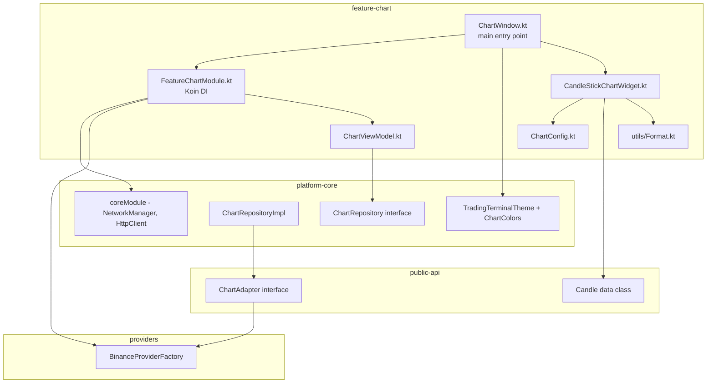

# План: Создание feature:feature-chart по аналогии с feature:feature-dom

## Контекст

- **composeApp** — legacy, **НЕ ТРОГАЕМ**. В нём есть рабочий chart-код.
- **feature:feature-dom** — эталон. Имеет самостоятельный `DomWindow.kt` с `main()`, свою DI, доменную модель.
- **feature:feature-chart** — существует как пустая директория. Нет `build.gradle.kts`, нет кода, не зарегистрирован в `settings.gradle.kts`.
- **platform-core** — уже содержит `ChartRepository` (интерфейс) и `ChartRepositoryImpl` (на `ChartAdapter`), `coreModule` (Koin), `TradingTerminalTheme` с `ChartColors`.
- **public-api:api-market** — содержит `Candle` (data class) и `ChartAdapter` (интерфейс).

## Архитектура (схема)



## Пошаговый план

### Шаг 1: Регистрация модуля в settings.gradle.kts

Добавить строку:
```kotlin
include(":features:feature-chart")
```

### Шаг 2: Создать build.gradle.kts

**Файл:** `features/feature-chart/build.gradle.kts`

По аналогии с `feature-dom/build.gradle.kts`, но **без** зависимости на `:composeApp`:

```kotlin
plugins {
    id("conventions.kmp-feature")
    alias(libs.plugins.kotlin.serialization)
}

kotlin {
    sourceSets {
        commonMain.dependencies {
            implementation(project(":platform-core"))
            implementation(project(":public-api:api-market"))
            implementation(project(":providers:binance-provider"))

            implementation(libs.koin.core)
            implementation(libs.koin.compose)
            implementation(libs.kotlinx.coroutines.core)
            implementation(libs.kotlinx.serialization.json)
            implementation(libs.compose.material3)
            implementation(compose.desktop.currentOs)
        }
        commonTest.dependencies {
            implementation(libs.kotlin.test)
            implementation(libs.junit.jupiter)
            implementation(libs.kotlinx.coroutines.test)
            implementation(libs.ktor.client.mock)
        }
    }
}
```

### Шаг 3: Создать FeatureChartModule.kt (DI)

**Файл:** `features/feature-chart/src/commonMain/kotlin/com/aandios/nous/feature/chart/di/FeatureChartModule.kt`

По аналогии с `FeatureDomModule.kt`:
- `initKoinForPreview()` — останавливает старый Koin контекст, стартует новый с `coreModule` + `featureChartModule`
- `featureChartModule` — предоставляет:
  - `ProviderConfig` (testnet)
  - `Provider` (через `BinanceProviderFactory`)
  - `ChartAdapter` (из провайдера)
  - `ChartRepository` (из `platform-core` → `ChartRepositoryImpl`)
  - `ChartViewModel` (factory)

**Важное отличие от feature-dom:** chart-фиче не нужны `DomAdapter`, `BookTickerAdapter`, `SymbolInfoAdapter`, `DomRepository`. Ей нужны `ChartAdapter`, `ChartRepository`.

### Шаг 4: Создать ChartViewModel.kt

**Файл:** `features/feature-chart/src/commonMain/kotlin/com/aandios/nous/feature/chart/ui/ChartViewModel.kt`

По аналогии с composeApp'ским `ChartViewModel.kt`, но:
- Пакет: `com.aandios.nous.feature.chart.ui`
- Импорт `Candle` из `com.aandios.nous.api.market.model.Candle`
- Зависимость: `ChartRepository` (из `com.aandios.nous.core.domain.repository`)
- Те же sealed states (`ChartState`)

### Шаг 5: Скопировать ChartConfig.kt

**Файл:** `features/feature-chart/src/commonMain/kotlin/com/aandios/nous/feature/chart/ui/ChartConfig.kt`

Скопировать из composeApp, но:
- Пакет: `com.aandios.nous.feature.chart.ui`
- Импорт `ChartColors` из `com.aandios.nous.core.ui.theme` (а не из composeApp)

### Шаг 6: Скопировать и адаптировать CandleStickChartWidget.kt

**Файл:** `features/feature-chart/src/commonMain/kotlin/com/aandios/nous/feature/chart/ui/CandleStickChartWidget.kt`

Скопировать из composeApp, изменить:
- Пакет: `com.aandios.nous.feature.chart.ui`
- Импорт `Candle` → `com.aandios.nous.api.market.model.Candle`
- Импорт `formatPrice`, `formatTime` → `com.aandios.nous.feature.chart.utils`
- Импорт `ChartColors` → `com.aandios.nous.core.ui.theme.ChartColors`

### Шаг 7: Создать ChartWindow.kt с main()

**Файл:** `features/feature-chart/src/commonMain/kotlin/com/aandios/nous/feature/chart/ui/ChartWindow.kt`

По аналогии с `DomWindow.kt`:

```kotlin
fun main() = application {
    stopKoin()
    initKoinForPreview()

    Window(
        onCloseRequest = ::exitApplication,
        title = "Nous Platform • Chart",
        state = rememberWindowState(width = 1200.dp, height = 800.dp)
    ) {
        KoinContext {
            TradingTerminalTheme {
                ChartWindow()
            }
        }
    }
}

@Composable
fun ChartWindow() {
    val chartViewModel: ChartViewModel = koinInject()
    val chartState by chartViewModel.chartState.collectAsState()

    // Загружаем данные при старте
    LaunchedEffect(Unit) {
        chartViewModel.loadChart("BTCUSDT", "1h")
    }

    // UI с CandleStickChartWidget
    when (val state = chartState) {
        is ChartState.Loading -> { /* Loading indicator */ }
        is ChartState.Success -> {
            CandleStickChartWidget(
                candles = state.candles,
                currentPrice = state.currentPrice,
                modifier = Modifier.fillMaxSize()
            )
        }
        is ChartState.Error -> { /* Error display */ }
    }
}
```

### Шаг 8: Создать utils/Format.kt

**Файл:** `features/feature-chart/src/commonMain/kotlin/com/aandios/nous/feature/chart/utils/Format.kt`

Скопировать из composeApp:
- Пакет: `com.aandios.nous.feature.chart.utils`
- Те же функции `formatPrice()`, `formatTime()`

### Шаг 9 (бонус): Чистка старых пустых директорий

- `feature-chart/src/commonMain/kotlin/com/aandios/nous/feature/chart/data/repository/` — осталась пустая, можно удалить (теперь будет `utils/` и `di/`)
- `feature-chart/src/jvmMain/kotlin/` — пустая, можно оставить или удалить

## Что НЕ нужно делать

1. **НЕ трогать composeApp** — он остаётся как legacy
2. **НЕ переписывать CandleStickChartWidget.kt** — только смена package/imports
3. **НЕ создавать новый ChartRepository в feature-chart** — в platform-core уже есть готовый
4. **НЕ затрагивать feature-dom** — он работает и не требует изменений

## Проверка

После реализации проверить:
1. `./gradlew :features:feature-chart:build` — успешная сборка
2. `./gradlew :features:feature-chart:run` — запуск ChartWindow (если настроен application plugin)
3. График загружается и отображает свечи BTC/USDT
