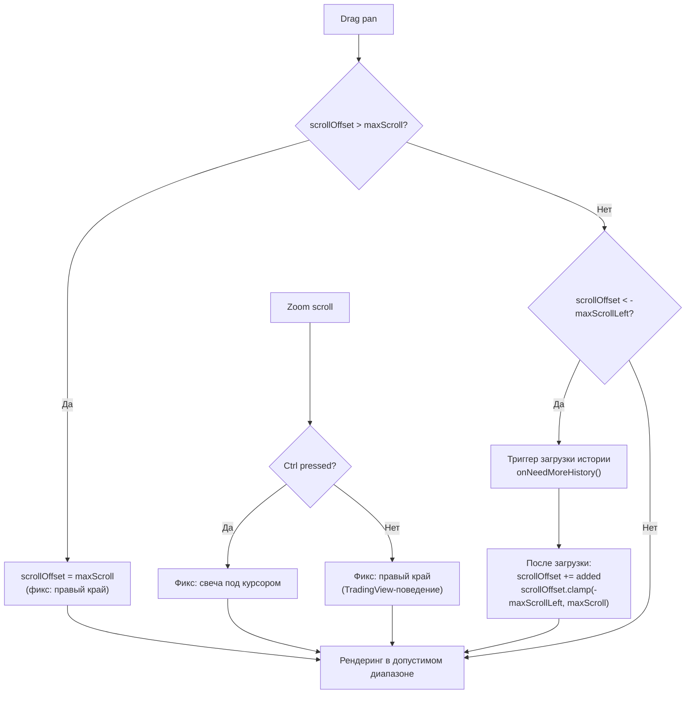

# План: Исправление скролла и зума для feature-chart (TradingView-подобное поведение)

## Анализ текущего состояния

Я проанализировал код в [`CandleStickChartWidget.kt`](features/feature-chart/src/commonMain/kotlin/com/aandios/nous/feature/chart/ui/CandleStickChartWidget.kt) и все сопутствующие планы. Вот что уже реализовано, а что требует доработки.

### ✅ Что УЖЕ реализовано корректно:
1. **Pan via drag** — работает (строки 121-127), drag перемещает график
2. **Zoom via scroll wheel** — работает (строки 130-162), с разветвлением по Ctrl:
   - **Без Ctrl**: зум фиксирует правый край (строка 151-152) — TradingView-поведение ✅
   - **С Ctrl**: зум фиксирует свечу под курсором (строка 145-148) ✅
3. **Zoom limits** — 0.25x..4.0x (строка 139) ✅
4. **Dynamic price range по видимым свечам** — Y-ось масштабируется под видимый диапазон при зуме/пане (строки 253-258) ✅
5. **Crosshair toggle** — кнопка в тулбаре со state в ChartWindow (строки 72-91) ✅
6. **Historical loading** — lazy load при скролле левее первой свечи (строки 262-268, 271-279) ✅
7. **Initial scroll to right edge** — при загрузке данных скролл показывает последние свечи (строка 241) ✅

### ❌ Проблема #1 (Критическая): Пан не ограничен справа
**Файл:** [`CandleStickChartWidget.kt`](features/feature-chart/src/commonMain/kotlin/com/aandios/nous/feature/chart/ui/CandleStickChartWidget.kt:124)

```kotlin
// Строка 124 — ТЕКУЩИЙ КОД:
scrollOffset = (scrollOffset - deltaX).coerceIn(-maxScrollLeft, Float.MAX_VALUE)
```

Используется `Float.MAX_VALUE` как верхняя граница вместо `maxScroll`. Это позволяет пользователю проскроллить БЕСКОНЕЧНО вправо — в пустое пространство за самыми новыми свечами.

**TradingView-поведение:** скролл вправо упирается в правый край (самые новые свечи). Нельзя уехать правее последней свечи.

**Решение:** 
1. Вынести `maxScroll` в `remember` state (как уже сделано с `chartWidthPx`), чтобы он был доступен и внутри `pointerInput` для drag
2. Заменить `Float.MAX_VALUE` на `maxScroll` в `coerceIn`

### ❌ Проблема #2 (Связанная): `maxScroll` — локальная переменная внутри BoxWithConstraints, недоступна в pointerInput

**Файл:** [`CandleStickChartWidget.kt`](features/feature-chart/src/commonMain/kotlin/com/aandios/nous/feature/chart/ui/CandleStickChartWidget.kt:235)

```kotlin
// Строка 235 — внутри BoxWithConstraints, недоступно снаружи:
val maxScroll = max(0f, candles.size * totalW - chartWidthPx)
```

А `pointerInput` для drag (строки 101-127) определён на внешнем `Modifier` и не имеет доступа к этой переменной.

**Решение:** Вынести `maxScroll` в `var maxScroll by remember { mutableFloatStateOf(0f) }` на уровне composable (рядом с `chartWidthPx`), обновлять внутри BoxWithConstraints.

### ❌ Проблема #3 (Потенциальная): После коррекции scrollOffset при загрузке истории может быть breach maxScroll

**Файл:** [`CandleStickChartWidget.kt`](features/feature-chart/src/commonMain/kotlin/com/aandios/nous/feature/chart/ui/CandleStickChartWidget.kt:276)

После prepend'а исторических свечей `scrollOffset += added` (строка 276) — новый `scrollOffset` может превысить пересчитанный `maxScroll`. Нужно клиппить и после коррекции.

**Решение:** После коррекции (строка 276) добавить `scrollOffset = scrollOffset.coerceIn(-maxScrollLeft, maxScroll)`, но ТОЛЬКО если `maxScroll` уже пересчитан (новый `maxScroll` известен).

### ⚠️ Зум с Ctrl от свечи под курсором — реализовано через onKeyEvent

**Проблема:** `change.keyboardModifiers.isCtrlPressed` НЕ работает в commonMain Compose Multiplatform 1.7.0 — `KeyboardModifiers` не имеет `isCtrlPressed`.

**Решение:** Используем `Modifier.onKeyEvent { ... }` для отслеживания состояния Ctrl в `remember { mutableStateOf(false) }` переменную. `onKeyEvent` компилируется и работает без `Modifier.focusable()` (который также отсутствует в commonMain).

**Код:**
```kotlin
var isCtrlPressed by remember { mutableStateOf(false) }

Modifier
    .fillMaxSize()
    .background(config.backgroundColor)
    .onKeyEvent { event ->
        if (event.key == Key.CtrlLeft || event.key == Key.CtrlRight) {
            isCtrlPressed = event.type == KeyEventType.KeyDown
            true
        } else {
            false
        }
    }
    // ... остальные модификаторы

// Внутри pointerInput для zoom:
val newScrollOffset = if (isCtrlPressed) {
    val virtualPos = mouseX + scrollOffset
    virtualPos * actualFactor - mouseX
} else {
    val rightEdge = scrollOffset + chartWidthPx
    rightEdge * actualFactor - chartWidthPx
}
```

---

## План исправлений

### Шаг 1: Вынести `maxScroll` в состояние composable

**Файл:** [`CandleStickChartWidget.kt`](features/feature-chart/src/commonMain/kotlin/com/aandios/nous/feature/chart/ui/CandleStickChartWidget.kt)

После строки 88 (`var chartWidthPx by remember { mutableFloatStateOf(0f) }`), добавить:

```kotlin
var maxScroll by remember { mutableFloatStateOf(0f) }
```

Внутри BoxWithConstraints, строка 235, изменить:
```kotlin
// Было:
val maxScroll = max(0f, candles.size * totalW - chartWidthPx)

// Стало:
maxScroll = max(0f, candles.size * totalW - chartWidthPx)
```

### Шаг 2: Исправить верхнюю границу пана

**Файл:** [`CandleStickChartWidget.kt`](features/feature-chart/src/commonMain/kotlin/com/aandios/nous/feature/chart/ui/CandleStickChartWidget.kt:124)

```kotlin
// Было:
scrollOffset = (scrollOffset - deltaX).coerceIn(-maxScrollLeft, Float.MAX_VALUE)

// Стало:
scrollOffset = (scrollOffset - deltaX).coerceIn(-maxScrollLeft, maxScroll)
```

### Шаг 3: Клиппить scrollOffset после коррекции исторической загрузки

**Файл:** [`CandleStickChartWidget.kt`](features/feature-chart/src/commonMain/kotlin/com/aandios/nous/feature/chart/ui/CandleStickChartWidget.kt:276)

После строки 276 (`scrollOffset += added`), добавить:

```kotlin
scrollOffset = scrollOffset.coerceIn(-maxScrollLeft, maxScroll)
```

### Шаг 4: Собрать и проверить

```bash
./gradlew :features:feature-chart:compileKotlinJvm
./gradlew :features:feature-chart:run
```

### Порядок применения (checklist)

| # | Изменение | Файл | Строки |
|---|-----------|------|--------|
| 1 | Добавить `var maxScroll by remember { mutableFloatStateOf(0f) }` | CandleStickChartWidget.kt | после 88 |
| 2 | Изменить `val maxScroll =` на `maxScroll =` (присвоение state) | CandleStickChartWidget.kt | 235 |
| 3 | Исправить `coerceIn` — `Float.MAX_VALUE` → `maxScroll` | CandleStickChartWidget.kt | 124 |
| 4 | Добавить клиппинг после коррекции scrollOffset при загрузке истории | CandleStickChartWidget.kt | после 276 |

---

## Диаграмма потока жестов после исправлений



---

## После реализации

Пользователь получит:
- **Скролл как в TradingView**: правый край графика — это самые новые свечи, уехать правее нельзя
- **Зум от правого края** (без Ctrl): правая (самая новая) свеча остаётся на месте при зуме
- **Зум от курсора** (с Ctrl): свеча под курсором остаётся на месте
- **История догружается** при скролле влево, без скачков позиции
