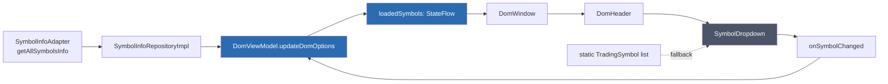

# План: Динамический поиск символов через SymbolInfoAdapter в feature-dom

## Текущая ситуация

- `SymbolDropdown` в `feature-dom` использует **статический список** `TradingSymbol.getSymbolsForProvider(provider)` — жёстко закодированные ~10 символов
- `ChartViewModel` в `feature-chart` использует **динамический список** через `symbolInfoAdapter.getAllSymbolsInfo()` → фильтр `status == "TRADING"` → сортировка
- `DomViewModel` уже имеет `symbolInfoRepository: SymbolInfoRepository?` в конструкторе, но использует его только для `fetchSymbolTickSize()`
- DI (`AppModule`, `FeatureDomModule`) уже предоставляет `SymbolInfoRepository` (→ `SymbolInfoRepositoryImpl(symbolInfoAdapter)`)
- `SymbolInfoRepository` имеет метод `getAllSymbolsInfo(): List<SymbolInfo>`, как и `SymbolInfoAdapter`

## Архитектура изменений

### 1. DomViewModel — загрузка символов через SymbolInfoRepository

Добавить в `DomViewModel`:

```kotlin
private val _loadedSymbols = MutableStateFlow<List<TradingSymbol>>(emptyList())
val loadedSymbols: StateFlow<List<TradingSymbol>> = _loadedSymbols.asStateFlow()
```

В `init`:

```kotlin
viewModelScope.launch {
    try {
        val allSymbols = symbolInfoRepository?.getAllSymbolsInfo() ?: emptyList()
        val tradingSymbols = allSymbols
            .filter { it.status == "TRADING" }
            .map { mapSymbolInfoToTradingSymbol(it) }
            .sortedBy { it.symbol }
        _loadedSymbols.value = tradingSymbols
    } catch (e: Exception) {
        println("Failed to load symbols: ${e.message}")
    }
}
```

Где `mapSymbolInfoToTradingSymbol`:

```kotlin
private fun mapSymbolInfoToTradingSymbol(info: SymbolInfo): TradingSymbol {
    val displayName = if (info.quoteAsset.isNotEmpty() && info.baseAsset.isNotEmpty()) {
        "${info.baseAsset}/${info.quoteAsset}"
    } else {
        info.symbol
    }
    return TradingSymbol(
        symbol = info.symbol,
        displayName = displayName,
        provider = _domOptions.value.provider // или будет переопределено при выборе
    )
}
```

**Важно**: `TradingSymbol.provider` — это контекстный провайдер из `DomOptions`, не из SymbolInfo. Поэтому при маппинге используем `_domOptions.value.provider`.

### 2. DomWindow — проброс loadedSymbols в DomHeader

Добавить в [`DomWindow.kt`](features/feature-dom/src/commonMain/kotlin/com/aandios/nous/feature/dom/ui/DomWindow.kt):

```kotlin
val loadedSymbols by domViewModel.loadedSymbols.collectAsState()
```

Передать в `DomHeader`:

```kotlin
DomHeader(
    domOptions = domOptions,
    symbolTickSize = symbolTickSize,
    loadedSymbols = loadedSymbols,
    onDomOptionsChanged = { newOptions -> domViewModel.updateDomOptions(newOptions) }
)
```

### 3. DomHeader — проброс в SymbolDropdown

Добавить параметр `loadedSymbols: List<TradingSymbol>` в [`DomHeader.kt`](features/feature-dom/src/commonMain/kotlin/com/aandios/nous/feature/dom/ui/header/DomHeader.kt) и [`ExpandedDomHeader`](features/feature-dom/src/commonMain/kotlin/com/aandios/nous/feature/dom/ui/header/DomHeader.kt).

Передать в `SymbolDropdown`:

```kotlin
SymbolDropdown(
    currentSymbol = domOptions.symbol,
    provider = domOptions.provider,
    availableSymbols = loadedSymbols,  // <-- новый параметр
    onSymbolChanged = { newSymbol ->
        onDomOptionsChanged(domOptions.copy(symbol = newSymbol))
    },
    modifier = Modifier.weight(1.4f)
)
```

### 4. SymbolDropdown — использование динамического списка

Изменить сигнатуру:

```kotlin
@Composable
fun SymbolDropdown(
    currentSymbol: TradingSymbol,
    provider: TradingProvider,
    availableSymbols: List<TradingSymbol>,  // <-- новый параметр
    onSymbolChanged: (TradingSymbol) -> Unit,
    modifier: Modifier = Modifier.Companion
)
```

Заменить:

```kotlin
val symbols = remember(provider) { TradingSymbol.getSymbolsForProvider(provider) }
```

На:

```kotlin
val symbols = remember(provider, availableSymbols) {
    if (availableSymbols.isNotEmpty()) availableSymbols
    else TradingSymbol.getSymbolsForProvider(provider)  // fallback
}
```

### 5. TradingSymbol — хелпер для создания из SymbolInfo (опционально)

Можно добавить фабричный метод в `TradingSymbol.Companion`:

```kotlin
fun fromSymbolInfo(info: SymbolInfo, provider: TradingProvider): TradingSymbol {
    val displayName = if (info.baseAsset.isNotEmpty() && info.quoteAsset.isNotEmpty()) {
        "${info.baseAsset}/${info.quoteAsset}"
    } else {
        info.symbol
    }
    return TradingSymbol(
        symbol = info.symbol,
        displayName = displayName,
        provider = provider
    )
}
```

## Схема потока данных



## Файлы для изменения

| Файл | Изменение |
|------|-----------|
| [`features/feature-dom/src/commonMain/kotlin/com/aandios/nous/feature/dom/ui/DomViewModel.kt`](features/feature-dom/src/commonMain/kotlin/com/aandios/nous/feature/dom/ui/DomViewModel.kt) | Добавить `_loadedSymbols` StateFlow, загрузку в `init`, хелпер `mapSymbolInfoToTradingSymbol` |
| [`features/feature-dom/src/commonMain/kotlin/com/aandios/nous/feature/dom/ui/DomWindow.kt`](features/feature-dom/src/commonMain/kotlin/com/aandios/nous/feature/dom/ui/DomWindow.kt) | Пробросить `loadedSymbols` через `collectAsState()` в `DomHeader` |
| [`features/feature-dom/src/commonMain/kotlin/com/aandios/nous/feature/dom/ui/header/DomHeader.kt`](features/feature-dom/src/commonMain/kotlin/com/aandios/nous/feature/dom/ui/header/DomHeader.kt) | Добавить параметр `loadedSymbols`, передать в `SymbolDropdown` |
| [`features/feature-dom/src/commonMain/kotlin/com/aandios/nous/feature/dom/ui/header/SymbolDropdown.kt`](features/feature-dom/src/commonMain/kotlin/com/aandios/nous/feature/dom/ui/header/SymbolDropdown.kt) | Добавить параметр `availableSymbols`, использовать его вместо/перед статическим списком |
| [`features/feature-dom/src/commonMain/kotlin/com/aandios/nous/feature/dom/domain/TradingSymbol.kt`](features/feature-dom/src/commonMain/kotlin/com/aandios/nous/feature/dom/domain/TradingSymbol.kt) (опционально) | Добавить `fromSymbolInfo()` фабричный метод |

## Что НЕ меняется

- Сигнатура `SymbolDropdown` (добавляется только новый параметр)
- `TradingProvider`, `DomOptions` — без изменений
- DI модули — `symbolInfoRepository` уже есть, ничего добавлять не надо
- `DomHeaderCompact` — можно оставить как есть, если не требуется поиск в compact-режиме
