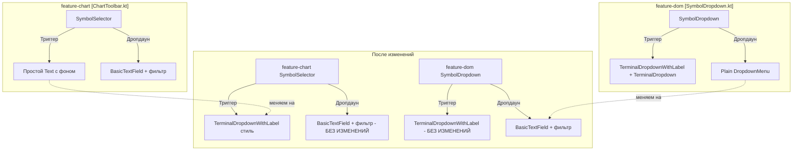

# План: Перекрёстный рефакторинг SymbolDropdown

## Текущее состояние

### feature-chart: `SymbolSelector` (private, `ChartToolbar.kt:94-215`)
**Триггер** — простой `Text` с `background(0.10f white, RoundedCornerShape(4.dp))`:
```
┌──────────┐
│ BTC/USDT │
└──────────┘
```
**Дропдаун** — полный автокомплит: `BasicTextField` поиск + `Column` с отфильтрованным списком `String` символов.

### feature-dom: `SymbolDropdown` (`SymbolDropdown.kt:15-33`)
**Триггер** — `TerminalDropdownWithLabel` + `TerminalDropdown`:
```
┌─────────────────────────┐
│ Sym │ BTC/USDT       ▼ │
└─────────────────────────┘
```
**Дропдаун** — плоский список `DropdownMenuItem` на `TradingSymbol`, **без автокомплита**.

---

## Что нужно изменить

### 1. feature-chart — визуал триггера под стиль feature-dom
Файл: `features/feature-chart/src/commonMain/kotlin/com/aandios/nous/feature/chart/ui/ChartToolbar.kt`

- Заменить текущий триггер (`Text` + `background`) на `TerminalDropdownWithLabel` из `platform-core`
- Добавить: label "Sym", вертикальный разделитель, иконку `ArrowDropDown`
- **Dropdown контент оставить как есть** — поиск `BasicTextField` + фильтрованный список

Итоговый вид:
```
┌─────────────────────────┐
│ Sym │ BTC/USDT       ▼ │
└─────────────────────────┘
  ├─ Search symbol...     │
  ├─ ─────────────────── │
  ├─ BTC/USDT             │
  ├─ ETH/USDT             │
  └─ ...                  │
```

### 2. feature-dom — автокомплит в дропдаун
Файл: `features/feature-dom/src/commonMain/kotlin/com/aandios/nous/feature/dom/ui/header/SymbolDropdown.kt`

- **Оставить** `TerminalDropdownWithLabel` wrapper (рамка, label "Sym", разделитель)
- **Заменить** внутренний `TerminalDropdown(...)` на кастомный composable:
  - Тот же визуал триггера: `Surface` + `Row` с `displayText` + `ArrowDropDown`
  - Дропдаун: `DropdownMenu` с `BasicTextField` поиском + фильтрованный список `TradingSymbol`
  - Фильтрация по `symbol` и `displayName` через `ignoreCase`

Сигнатура остаётся прежней:
```kotlin
@Composable
fun SymbolDropdown(
    currentSymbol: TradingSymbol,
    provider: TradingProvider,
    onSymbolChanged: (TradingSymbol) -> Unit,
    modifier: Modifier = Modifier
)
```

---

## Диаграмма изменений



---

## Порядок выполнения

1. **feature-chart** (`ChartToolbar.kt`):
   - Добавить импорты: `Surface`, `BorderStroke`, `Icons.Default.ArrowDropDown`, `Icon`
   - В `SymbolSelector`: обернуть триггер в `TerminalDropdownWithLabel(label = "Sym")` 
   - Триггер внутри: `Row` с `Text(currentSymbol)` + `Spacer(weight)` + `Icon(ArrowDropDown)`, обёрнутый в `Surface`/`clickable`
   - Dropdown контент (`BasicTextField` + `Column`) — без изменений

2. **feature-dom** (`SymbolDropdown.kt`):
   - Убрать `import com.aandios.nous.core.ui.component.TerminalDropdown`
   - Добавить импорты: `BasicTextField`, `DropdownMenu`, `DropdownMenuItem`, `Column`, `verticalScroll`, `mutableStateOf`, `remember`, `RoundedCornerShape`, `Icons.Default.ArrowDropDown`, `Surface`, `Icon`
   - Внутри `TerminalDropdownWithLabel`, вместо `TerminalDropdown(...)`, написать inline composable:
     - `var expanded by remember { mutableStateOf(false) }`
     - `var searchQuery by remember { mutableStateOf("") }`
     - Триггер: `Surface` + `clickable { expanded = true }` → `Row` с `Text(displayText)` + `Icon(ArrowDropDown)`
     - Дропдаун: `DropdownMenu` → `BasicTextField(search)` + разделитель + `Column(verticalScroll)` с `filteredSymbols.forEach`

3. **Проверка**:
   - Убедиться, что `ChartWindow` и `DomWindow` компилируются
   - Проверить, что `DomHeader` (компактный режим) не использует SymbolDropdown — не используется, компактный режим использует `DomHeaderCompact`
   - Проверить, что другие `TerminalDropdown` (TradingProvider, DepthLimit, AggregationLevel) не затронуты
