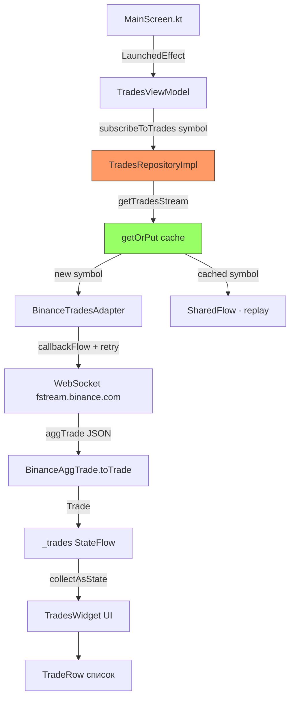

# План диагностики и исправления: Trades не отображаются

## 1. Текущая ситуация

В окне Trades отображается "Ожидание данных..." — сделки не приходят.

## 2. Анализ цепочки данных

```
MainScreen.kt
  → LaunchedEffect(selectedSymbol) вызывает tradesViewModel.subscribeToTrades("BTCUSDT")
    → TradesViewModel.subscribeToTrades(symbol)
      → tradesRepository.getTradesStream(symbol)       [TradesRepositoryImpl]
        → через flatMapLatest + StateFlow<Map<...>>    ⚠️ ПРОБЛЕМА
          → tradesAdapter.subscribeToTrades(symbol)     [BinanceTradesAdapter]
            → WebSocket callbackFlow → fstream.binance.com
              → BinanceAggTrade → Trade
```

## 3. Найденные проблемы

### Проблема 1 (КРИТИЧЕСКАЯ): Race condition в TradesRepositoryImpl

**Файл:** [`platform-core/.../TradesRepositoryImpl.kt`](platform-core/src/commonMain/kotlin/com/aandios/nous/core/data/repository/TradesRepositoryImpl.kt:17)

Используется паттерн `MutableStateFlow<Map<String, Flow<Trade>>>` + `flatMapLatest`, который изменяет StateFlow ВНУТРИ лямбды `flatMapLatest`:

```kotlin
return activeSubscriptions.flatMapLatest { flows ->
    flows[key] ?: createTradesFlow(symbol).also { flow ->
        activeSubscriptions.value += (key to flow)  // ⚠️ мутация внутри flatMapLatest
    }
}
```

**Что происходит при подписке:**
1. `flatMapLatest` получает пустую map `{}`
2. Создаёт новый Flow (открывается WebSocket)
3. `also` блок обновляет `activeSubscriptions.value` с новым Flow
4. Это триггерит НОВОЕ значение в StateFlow
5. `flatMapLatest` перезапускается — отменяет первый Flow (WebSocket закрывается)
6. Второй раз находит Flow в map и начинает коллектить его
7. WebSocket открывается снова

**Итог:** WebSocket открывается → сразу закрывается → открывается заново. Первое соединение обрывается до получения данных. Второе соединение работает, но между переподключением можно потерять данные.

**Сравнение с DOM:** [`DomRepositoryImpl`](features/feature-dom/src/commonMain/kotlin/com/aandios/nous/feature/dom/data/repository/DomRepositoryImpl.kt:31) использует прямой `callbackFlow` с `while(true)` + retry logic — никаких `flatMapLatest` и мутаций StateFlow.

### Проблема 2 (ПОТЕНЦИАЛЬНАЯ): Ошибки WebSocket молча проглатываются

**Файл:** [`TradesViewModel.kt`](features/feature-trades/src/commonMain/kotlin/com/aandios/nous/feature/trades/ui/TradesViewModel.kt:33)

```kotlin
.catch { e ->
    println("Trades subscription error: ${e.message}")  // только в консоль
}
```

Если WebSocket упал с ошибкой — пользователь не видит никакого фидбека в UI, только "Ожидание данных...".

### Проблема 3 (ПОТЕНЦИАЛЬНАЯ): Нет механизма переподключения

В отличие от [`DomRepositoryImpl`](features/feature-dom/src/commonMain/kotlin/com/aandios/nous/feature/dom/data/repository/DomRepositoryImpl.kt:34), у Trades нет:
- Retry logic при падении WebSocket
- Exponential backoff
- Ограничения на число попыток

Если WebSocket соединение упадёт (что неизбежно в долгоживущем приложении), сделки просто перестанут приходить навсегда.

## 4. План исправления

### Шаг 1: Переписать TradesRepositoryImpl

**Цель:** Убрать race condition, упростить логику.

**Действия:**
- Заменить `StateFlow<Map<...>>` + `flatMapLatest` на простую `ConcurrentMap` или `mutableMapOf` с synchronised access
- Использовать `getOrPut` для кеширования потоков
- Каждый вызов `getTradesStream(symbol)` возвращает одни и тот же shared flow

**Примерный код:**

```kotlin
class TradesRepositoryImpl(
    private val tradesAdapter: TradesAdapter
) : TradesRepository {

    private val flows = mutableMapOf<String, Flow<Trade>>()

    override fun getTradesStream(symbol: String): Flow<Trade> {
        return flows.getOrPut(symbol) {
            createTradesFlow(symbol).shareIn(
                scope = CoroutineScope(Dispatchers.Default + SupervisorJob()),
                started = SharingStarted.Eagerly,
                replay = 0
            )
        }
    }

    private fun createTradesFlow(symbol: String): Flow<Trade> = flow {
        println("📊 Trades: Starting stream for $symbol")
        tradesAdapter.subscribeToTrades(symbol).collect { trade ->
            emit(trade)
        }
    }
}
```

Либо ещё проще — хранить один Job и не кешировать ничего:

```kotlin
class TradesRepositoryImpl(
    private val tradesAdapter: TradesAdapter
) : TradesRepository {

    override fun getTradesStream(symbol: String): Flow<Trade> {
        return tradesAdapter.subscribeToTrades(symbol)
    }
}
```

### Шаг 2: Добавить retry/reconnect в BinanceTradesAdapter

**Файл:** [`BinanceTradesAdapter.kt`](providers/binance-provider/src/commonMain/kotlin/com/aandios/nous/provider/binance/adapter/BinanceTradesAdapter.kt:25)

**Действия:**
- Добавить retry на уровне `callbackFlow` (как в DomRepositoryImpl)
- Использовать exponential backoff при переподключении

### Шаг 3: Добавить обработку ошибок в UI

**Файл:** [`TradesViewModel.kt`](features/feature-trades/src/commonMain/kotlin/com/aandios/nous/feature/trades/ui/TradesViewModel.kt:28)

**Действия:**
- Добавить `StateFlow<String?>` для ошибок
- Отображать ошибку в `TradesWidget` вместо "Ожидание данных..."
- Не проглатывать исключения

### Шаг 4: Добавить UI состояние (loading/error/data)

**Файл:** [`TradesViewModel.kt`](features/feature-trades/src/commonMain/kotlin/com/aandios/nous/feature/trades/ui/TradesViewModel.kt:23)

**Действия:**
- Заменить `StateFlow<List<Trade>>` на sealed class/state:
  ```kotlin
  sealed class TradesState {
      object Loading : TradesState()
      data class Error(val message: String) : TradesState()
      data class Data(val trades: List<Trade>) : TradesState()
  }
  ```

### Шаг 5: Обновить TradesWidget

**Файл:** [`TradesWidget.kt`](features/feature-trades/src/commonMain/kotlin/com/aandios/nous/feature/trades/ui/TradesWidget.kt:37)

**Действия:**
- Отображать состояние Loading/Error/Data
- При ошибке показывать сообщение и кнопку "Повторить"

## 5. Mermaid диаграмма: поток данных после исправления



## 6. Приоритет выполнения

| Приоритет | Шаг | Описание |
|-----------|-----|----------|
| P0 | Шаг 1 | Исправить race condition в TradesRepositoryImpl |
| P0 | Шаг 2 | Добавить retry в BinanceTradesAdapter |
| P1 | Шаг 3 | Обработка ошибок в ViewModel |
| P1 | Шаг 4 | UI состояние (Loading/Error/Data) |
| P2 | Шаг 5 | Обновить виджет |

## 7. Критерии успеха

1. При запуске приложения сделки начинают отображаться в окне Trades
2. При обрыве WebSocket соединение автоматически восстанавливается
3. При ошибке пользователь видит сообщение в UI
4. При смене символа подписка переключается на новый символ
