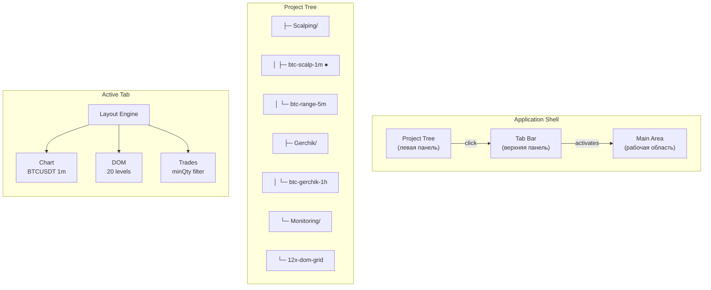
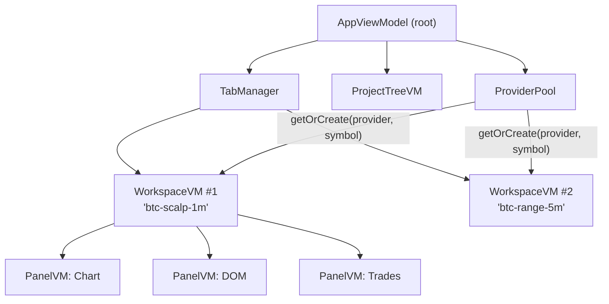
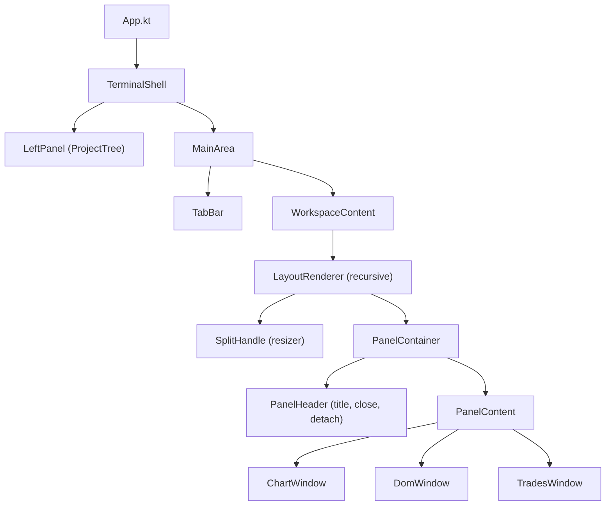

# Nous Platform: Workspace & Tab Management System

> **Статус**: Plan  
> **Версия**: 1.0  
> **Дата**: 2026-06-21  

---

## Оглавление

1. [Концепция](#1-концепция)
2. [Модель данных](#2-модель-данных)
3. [Хранение](#3-хранение)
4. [Архитектура ViewModel](#4-архитектура-viewmodel)
5. [UI-компоненты](#5-ui-компоненты)
6. [Layout Engine](#6-layout-engine)
7. [Tab Manager](#7-tab-manager)
8. [Provider Pool](#8-provider-pool)
9. [Стартовый экран](#9-стартовый-экран)
10. [Формат workspace-файла](#10-формат-workspace-файла)
11. [Фазы реализации](#11-фазы-реализации)

---

## 1. Концепция

Пользователь работает с **Workspace** — аналогом "файла проекта" в IDE. Каждый workspace описывает полный контекст: биржу, инструмент, набор панелей (chart, DOM, trades), их расположение, настройки индикаторов, объекты рисования.

Workspace'ы сгруппированы в **Project Tree** слева, открываются в **Tab Bar** вверху, могут быть detached в отдельное окно. Панели внутри workspace можно перетаскивать между workspace'ами и detach в floating window.



### Ключевые принципы

| Принцип | Описание |
|---------|----------|
| **Workspace = файл** | Всё состояние хранится в одном workspace-файле (JSON). Как `.idea/workspace.xml` или `.code-workspace` в VS Code |
| **Project Tree** | Иерархический список workspace'ов. Группы — это просто папки. Можно drag-and-drop переупорядочивать |
| **Tab = workspace** | Открытый workspace = вкладка. Закрыл вкладку — состояние сохранилось, можно открыть снова |
| **Detach** | Любой таб можно вытащить в отдельное окно (Compose `Window`) |
| **Split внутри workspace** | Рекурсивная сетка H/V сплитов. Панели можно перетаскивать между сплитами |
| **Multiple providers** | Один workspace может использовать несколько бирж/провайдеров одновременно |

---

## 2. Модель данных

### 2.1 WorkspaceConfig — корневой документ

```kotlin
@Serializable
data class WorkspaceConfig(
    val id: String,                          // UUID
    val name: String,                        // "BTC Scalp 1m"
    val group: String = "",                  // "Scalping" — путь в дереве
    val icon: String? = null,                // иконка в дереве (опционально)
    
    val providers: List<ProviderRef>,        // список бирж/провайдеров
    val layout: LayoutNode,                  // корневой узел сплит-дерева
    val panels: List<PanelConfig>,           // конфигурация каждой панели
    val drawings: List<DrawingObject> = emptyList(),   // линии, уровни (future)
    val indicators: List<IndicatorConfig> = emptyList(), // индикаторы (future)
    val references: List<Reference> = emptyList(),       // ссылки на дневник, скрипты
    
    val createdAt: Long = now(),
    val updatedAt: Long = now(),
    val order: Int = 0                       // позиция в группе
    val metadata: Map<String, String> = emptyMap()  // произвольные теги
)
```

### 2.2 ProviderRef — ссылка на провайдера

```kotlin
@Serializable
data class ProviderRef(
    val id: String,                          // "binance-main" — уникален в рамках workspace
    val name: String,                        // "Binance"
    val config: ProviderConfig,              // apiKey, secretKey, isTestnet
    val symbols: List<String> = emptyList()  // подписка на символы
)
```

Один workspace может иметь несколько провайдеров. Например:
- `binance-btc` + `bybit-btc` для кросс-биржевого анализа
- `binance-spot` + `binance-futures` для разных рынков

### 2.3 LayoutNode — рекурсивный сплит

```kotlin
@Serializable
sealed class LayoutNode {
    
    @Serializable @SerialName("split")
    data class Split(
        val direction: Direction,            // HORIZONTAL, VERTICAL
        val ratio: Float = 0.5f,             // доля первого ребёнка (0..1)
        val children: List<LayoutNode>       // 2+ потомка
    ) : LayoutNode()
    
    @Serializable @SerialName("leaf")
    data class Leaf(
        val panelId: String                  // ссылка на PanelConfig.id
    ) : LayoutNode()
    
    enum class Direction { HORIZONTAL, VERTICAL }
}
```

### 2.4 PanelConfig — конфигурация панели

```kotlin
@Serializable
data class PanelConfig(
    val id: String,                          // "chart-main"
    val type: PanelType,                     // CHART, DOM, TRADES
    val providerRef: String,                 // ссылка на ProviderRef.id
    val symbol: String,                      // "BTCUSDT"
    val state: PanelState                    // type-specific state
)

enum class PanelType { CHART, DOM, TRADES }

@Serializable
sealed class PanelState {
    @Serializable @SerialName("chart")
    data class Chart(
        val timeframe: String = "1m",
        val chartMode: ChartMode = ChartMode.CANDLESTICK,
        val indicators: List<String> = emptyList()
    ) : PanelState()
    
    @Serializable @SerialName("dom")
    data class Dom(
        val depth: Int = 20,
        val aggregation: String = "1x",
        val collapsed: Boolean = false
    ) : PanelState()
    
    @Serializable @SerialName("trades")
    data class Trades(
        val minSize: String? = null,
        val highlightLarge: Boolean = true
    ) : PanelState()
}
```

### 2.5 Объекты будущего (заглушки)

```kotlin
@Serializable
sealed class DrawingObject {
    val id: String = uuid()
    val panelId: String
    
    @Serializable @SerialName("trendline")
    data class TrendLine(val startPrice: Double, val startTime: Long,
                         val endPrice: Double, val endTime: Long) : DrawingObject()
    
    @Serializable @SerialName("horizontal")
    data class HorizontalLevel(val price: Double, val label: String? = null) : DrawingObject()
}

@Serializable
data class IndicatorConfig(
    val name: String, val panelId: String,
    val params: Map<String, String> = emptyMap()
)

@Serializable
sealed class Reference {
    @Serializable @SerialName("journal")
    data class Journal(val entryId: String) : Reference()
    @Serializable @SerialName("script")
    data class Script(val path: String, val name: String) : Reference()
}

@Serializable
data class AppConfig(
    val openWorkspaces: List<String> = emptyList(),
    val activeWorkspace: String? = null,
    val floatingWindows: List<FloatingWindowConfig> = emptyList(),
    val theme: String = "dark",
    val lastKnownVersion: String? = null
)
```

---

## 3. Хранение

### 3.1 SQLite через SQLDelight

```sql
CREATE TABLE workspaces (
    id TEXT PRIMARY KEY,
    name TEXT NOT NULL,
    group_path TEXT NOT NULL DEFAULT '',
    config_json TEXT NOT NULL,
    order_index INTEGER DEFAULT 0,
    is_open INTEGER DEFAULT 0,
    is_active INTEGER DEFAULT 0,
    created_at INTEGER NOT NULL,
    updated_at INTEGER NOT NULL
);

CREATE INDEX idx_workspaces_group ON workspaces(group_path, order_index);

CREATE TABLE app_state (
    key TEXT PRIMARY KEY,
    value_json TEXT NOT NULL
);
```

### 3.2 Файловая структура

```
~/.nous/
├── storage.db                    # SQLite (workspaces + app state)
├── settings.json                 # UI настройки
├── workspaces/                   # опциональный экспорт .workspace.json
│   ├── Scalping/
│   │   └── btc-scalp-1m.workspace.json
│   └── Gerchik/
│       └── btc-gerchik-1h.workspace.json
├── plugins/
└── cache/
```

### 3.3 Почему JSON, а не Kotlin DSL

| Критерий | JSON + SQLite | Kotlin DSL |
|----------|---------------|------------|
| Объекты рисования (линии и т.д.) | ✅ Встроено в документ | ❓ Где хранить? |
| Индикаторы + скрипты | ✅ Часть JSON | ❓ Отдельный DSL-блок |
| Ссылки на дневник | ✅ Поле `references` | ❓ Неочевидно |
| Редактирование без компиляции | ✅ Любой редактор | ❌ Только в IDE |
| Миграции при обновлении | ✅ Добавить поле с default | ❌ Править парсер |
| Атомарность сохранения | ✅ SQLite транзакция | ❌ Файловая система |

**Решение**: JSON как основной формат хранения. В будущем — UI-форма для создания workspace (не нужно писать DSL вручную). Экспорт в `.workspace.json` для шаринга.

---

## 4. Архитектура ViewModel



### 4.1 AppViewModel

```kotlin
class AppViewModel(private val stateStore: StateStore) {
    val tabManager = TabManager()
    val projectTree = ProjectTreeVM(stateStore)
    val providerPool = ProviderPool()
    val appConfig = MutableStateFlow(AppConfig())
    
    init { restoreSession() }
    fun saveSession() { stateStore.putString("app_config", appConfig.value.toJson()) }
}
```

### 4.2 WorkspaceViewModel

```kotlin
class WorkspaceViewModel(
    val config: WorkspaceConfig,
    private val providerPool: ProviderPool
) {
    val providers: Map<String, Provider> = config.providers.associate { ref ->
        ref.id to providerPool.getOrCreate(ref)
    }
    
    val panels: Map<String, PanelViewModel> = config.panels.associate { pc ->
        val provider = providers[pc.providerRef] ?: error("Unknown provider: ${pc.providerRef}")
        pc.id to createPanelVM(pc, provider)
    }
    
    fun addPanel(panel: PanelConfig) { ... }
    fun removePanel(panelId: String) { ... }
    fun splitPanel(panelId: String, direction: Direction, newPanel: PanelConfig) { ... }
}
```

### 4.3 PanelViewModel

```kotlin
sealed class PanelViewModel {
    abstract val id: String; abstract val type: PanelType
    
    class Chart(id: String, adapter: ChartAdapter, symbol: String, state: PanelState.Chart)
        : PanelViewModel() { val chartVM = ChartViewModel(adapter, symbol, state) }
    
    class Dom(id: String, adapter: DomAdapter, symbol: String, state: PanelState.Dom)
        : PanelViewModel() { val domVM = DomViewModel(adapter, symbol, state) }
    
    class Trades(id: String, adapter: TradesAdapter, symbol: String, state: PanelState.Trades)
        : PanelViewModel() { val tradesVM = TradesViewModel(adapter, symbol, state) }
}
```

### 4.4 TabManager

```kotlin
class TabManager {
    private val _workspaces = MutableStateFlow<List<WorkspaceViewModel>>(emptyList())
    val workspaces: StateFlow<List<WorkspaceViewModel>> = _workspaces
    
    private val _activeIndex = MutableStateFlow(0)
    val activeIndex: StateFlow<Int> = _activeIndex
    
    fun openWorkspace(config: WorkspaceConfig): WorkspaceViewModel { ... }
    fun closeWorkspace(id: String) { ... }
    fun detachToWindow(id: String) { ... }
}
```

---

## 5. UI-компоненты



### 5.1 TerminalShell (главный layout)

```kotlin
@Composable
fun TerminalShell(appVM: AppViewModel) {
    Row(Modifier.fillMaxSize()) {
        AnimatedVisibility(visible = leftPanelExpanded) {
            ProjectTree(
                treeVM = appVM.projectTree,
                onWorkspaceClick = { appVM.tabManager.openWorkspace(it) }
            )
        }
        Column(Modifier.weight(1f)) {
            TabBar(
                workspaces = appVM.tabManager.workspaces,
                activeIndex = appVM.tabManager.activeIndex,
                onTabClick = { appVM.tabManager.activeIndex.value = it },
                onTabClose = { appVM.tabManager.closeWorkspace(it) },
                onTabDetach = { appVM.tabManager.detachToWindow(it) }
            )
            appVM.tabManager.activeWorkspace?.let { WorkspaceContent(it) }
        }
    }
}
```

### 5.2 WorkspaceContent + LayoutRenderer

```kotlin
@Composable
fun LayoutRenderer(node: LayoutNode, panels: Map<String, PanelViewModel>, modifier: Modifier) {
    when (node) {
        is LayoutNode.Leaf -> PanelContainer(panels[node.panelId])
        is LayoutNode.Split -> {
            val ratio = remember { mutableFloatStateOf(node.ratio) }
            if (node.direction == Direction.HORIZONTAL) {
                Row(modifier) {
                    node.children.forEachIndexed { i, child ->
                        LayoutRenderer(child, panels, Modifier.weight(if (i == 0) ratio else 1f))
                        if (i < node.children.lastIndex) SplitHandle(node.direction, onResize = { ... })
                    }
                }
            } else { /* Column — аналогично */ }
        }
    }
}
```

### 5.3 PanelContainer

```kotlin
@Composable
fun PanelContainer(panel: PanelViewModel) {
    Box(Modifier.background(Color(0xFF121212)).border(1.dp, Color(0xFF333333))) {
        Column {
            PanelHeader(panel.type.name, panel.symbol)
            when (panel) {
                is PanelViewModel.Chart -> ChartPanel(panel.chartVM)
                is PanelViewModel.Dom -> DomPanel(panel.domVM)
                is PanelViewModel.Trades -> TradesPanel(panel.tradesVM)
            }
        }
    }
}
```

---

## 6. Layout Engine

```kotlin
object LayoutEngine {
    fun split(root: LayoutNode, targetPanelId: String, 
              direction: Direction, newPanelId: String): LayoutNode
    fun removePanel(root: LayoutNode, panelId: String): LayoutNode?
    fun replacePanel(root: LayoutNode, oldId: String, newId: String): LayoutNode
    fun collectPanelIds(root: LayoutNode): List<String>
    fun findParentSplit(root: LayoutNode, panelId: String): LayoutNode.Split?
}
```

---

## 7. Provider Pool

```kotlin
class ProviderPool {
    private val providers = ConcurrentHashMap<String, ProviderEntry>()
    
    data class ProviderEntry(
        val provider: Provider,
        val refCount: MutableIntState,
        val symbols: MutableSet<String>
    )
    
    fun getOrCreate(ref: ProviderRef): Provider {
        val key = "${ref.name}:${ref.symbols.sorted().joinToString(",")}"
        return providers.computeIfAbsent(key) {
            ProviderEntry(ProviderFactoryRegistry.create(ref), mutableIntStateOf(0), ...)
        }.also { it.refCount.value++ }.provider
    }
    
    fun release(ref: ProviderRef) {
        providers[key]?.let { if (--it.refCount <= 0) { it.provider.disconnect(); providers.remove(key) } }
    }
}
```

**Когда шарить, когда нет:**

| Сценарий | ProviderRef | Шаринг |
|----------|-------------|--------|
| BTC chart + DOM в одном WS | Оба `"binance-main"` | ✅ Да |
| BTC + ETH в одном WS | Разные: `"binance-btc"` / `"binance-eth"` | ❌ Нет |
| Два WS с BTC | Оба `"binance-main"` | ✅ Да |

---

## 8. Стартовый экран (MVP)

```kotlin
@Composable
fun WelcomeScreen(onCreate: (WorkspaceConfig) -> Unit) {
    Column(Modifier.fillMaxSize().background(Color(0xFF0A0A0A))) {
        Text("Nous Platform v1.0", color = Color(0xFF00C853))
        
        // Шаблоны
        FlowRow {
            TemplateCard("Scalping", "Chart + DOM + Trades, 1m") { onCreate(Templates.scalping()) }
            TemplateCard("DOM Grid", "12 DOM panels") { onCreate(Templates.domGrid(12)) }
            TemplateCard("Order Flow", "Footprint + Trades") { onCreate(Templates.orderFlow()) }
            TemplateCard("Empty", "Blank workspace") { onCreate(Templates.empty()) }
        }
        
        // Недавние
        RecentWorkspacesList(onOpenRecent = onCreate)
    }
}
```

---

## 9. Формат workspace-файла (JSON)

Полный пример:

```json
{
    "$schema": "https://nous.app/workspace/v1",
    "id": "uuid-1234",
    "name": "BTC Scalp 1m",
    "group": "Scalping",
    "providers": [
        {
            "id": "binance-main",
            "name": "Binance",
            "config": { "isTestnet": false },
            "symbols": ["BTCUSDT"]
        }
    ],
    "layout": {
        "type": "split", "direction": "horizontal", "ratio": 0.7,
        "children": [
            {
                "type": "split", "direction": "vertical",
                "children": [
                    { "type": "leaf", "panelId": "chart-1" },
                    { "type": "leaf", "panelId": "trades-1" }
                ]
            },
            { "type": "leaf", "panelId": "dom-1" }
        ]
    },
    "panels": [
        { "id": "chart-1",  "type": "chart",  "providerRef": "binance-main", "symbol": "BTCUSDT",
          "state": { "type": "chart",  "timeframe": "1m" } },
        { "id": "dom-1",    "type": "dom",    "providerRef": "binance-main", "symbol": "BTCUSDT",
          "state": { "type": "dom",    "depth": 20, "aggregation": "10x" } },
        { "id": "trades-1", "type": "trades", "providerRef": "binance-main", "symbol": "BTCUSDT",
          "state": { "type": "trades", "minSize": null } }
    ],
    "drawings": [
        { "type": "trendline", "id": "d1", "panelId": "chart-1",
          "startPrice": 65000, "startTime": 1700000000000,
          "endPrice": 67000, "endTime": 1700086400000 }
    ],
    "indicators": [
        { "name": "SMA", "panelId": "chart-1", "params": { "period": "9" } }
    ],
    "references": [
        { "type": "journal", "entryId": "trade-abc-123" },
        { "type": "script", "path": "scripts/rsi-divergence.kt", "name": "RSI Divergence" }
    ]
}
```

---

## 10. Фазы реализации

### Фаза 1: Foundation (Models + Storage)

- [ ] `WorkspaceConfig`, `PanelConfig`, `LayoutNode`, `ProviderRef` — `@Serializable` модели
- [ ] SQLDelight: таблицы `workspaces`, `app_state`
- [ ] `WorkspaceRepository`: CRUD
- [ ] `AppStateRepository`: save/restore AppConfig
- [ ] `Templates`: 4 шаблона (scalping, domGrid, orderFlow, empty)
- [ ] Тесты сериализации/десериализации

### Фаза 2: Core (ViewModels)

- [ ] `ProviderPool` с reference counting
- [ ] `WorkspaceViewModel`: создание Provider + PanelVM
- [ ] `PanelViewModel`: обёртка над существующими ChartVM/DomVM/TradesVM
- [ ] `TabManager`: open/close/active
- [ ] `ProjectTreeVM`: группы + список
- [ ] `AppViewModel`: restoreSession/saveSession

### Фаза 3: UI (Layout + Panels)

- [ ] `TerminalShell`: левая панель + табы + контент
- [ ] `ProjectTree`: Composable дерево
- [ ] `TabBar`: вкладки с close/detach
- [ ] `WorkspaceContent` + `LayoutRenderer`: рекурсивный рендеринг сплитов
- [ ] `SplitHandle`: ресайз-ручки
- [ ] `PanelContainer` + `PanelHeader`

### Фаза 4: UI (Interaction)

- [ ] Compose Drag & Drop между табами/окнами
- [ ] Floating Window (detach)
- [ ] WelcomeScreen (шаблоны + недавние)
- [ ] Контекстное меню (rename, delete, export)
- [ ] Сохранение/восстановление сессии

### Фаза 5: Интеграция

- [ ] Заменить `MainScreen` в `composeApp` на `TerminalShell`
- [ ] Обернуть существующие VM в `PanelViewModel`
- [ ] Убрать хардкод-символы из composeApp
